<h1 align="center">
  Tutorial
</h1>
<h2 align="center">
  Covid-19 Tracker App 
</h2>

Welcome! <br/>
This tutorial will guide you in creating an awesome app with Innovaccer Design System. Here is a [preview](https://covid19-tracker.info/) of the app that we are going to build. This tutorial also has an accompanying [github repository](https://github.com/sandeshchoudhary/covid).

## Audience
This tutorial is intended for people with all amounts of web development experience. If you want to jump straight to code, you may want to skip this tutorial and go to the [developer guidelines](https://github.com/aregee/design-system/blob/master/CONTRIBUTING.md) page.

## Prerequisites
* Node JS
* Git

## Getting Started
Each step in this guideline illustrates a different aspect of developing web applications with Innovaccer design system. Refer the following sections below to get familiar with this project:
* [Initializing App](#APP_INIT)
* [Installing component Library](#COMPONENT_LIBRARY)
* [Creating page grid](#BUILDING_LANDING_PAGE)
* [Building Drilled Page](#BUILDING_DRILLED_PAGE)


## <a name="APP_INIT"></a>Initializing App
We will start with `Create React App`.
```jsx
npx create-react-app covid
cd covid
npm start
```
Next, you need to install Innovaccer design system in your project using the following command :
```bash
npm install @innovaccer/design-system
```
Follow [developer guidelines](https://github.com/aregee/design-system/blob/master/README.md) to install style.

## <a name="COMPONENT_LIBRARY"></a>Installing component Library
A preview of what you will build:

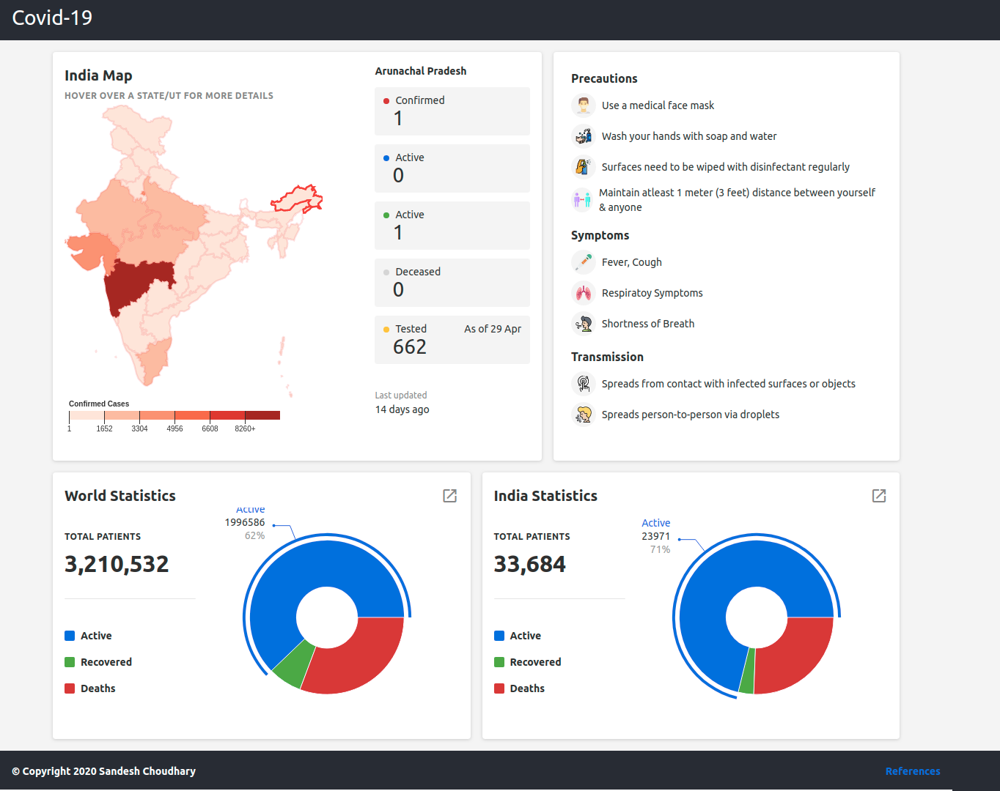
Lets begin by creating the basic Header and Footer components. We will be adding *Heading.js* and *Footer.js* in our src folder.
```jsx
src
├──Header.js
├──Footer.js
```
Here is a preview of Header component:

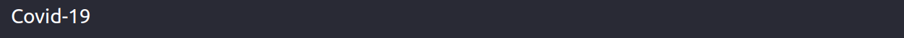

So, we will be needing *Heading* component from our design-system package.
```jsx
import { Heading } from 'design-system';
```
Heading component can be used in the following way:
```jsx
<header>
    <Heading size="l" appearance="white">
        Covid-19
    </Heading>
</header>
```
Now we will create a Footer for our app. Here is a preview of Footer component:

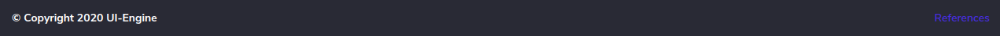

For the footer, we are going to use *Heading* and *Text* component. In *Footer.js*, add these lines:
```jsx
import { Link, Text } from 'design-system';
```
We can use Text and Link inside footer element in the following way:
```jsx
<footer className="App-footer">
    <Text appearance="white" weight="strong">
        &copy; Copyright {year} UI-Engine
    </Text>
    <Link onClick={() => history.push('/references')}>References</Link>
</footer>
```
### Add Routing
We’ve updated our app to render, but now we need to add routing functionality to handle our drilled states. To do this we first need to install react-router-dom.
```jsx
npm install --save react-router-dom
```
Now, we need to wrap our app in the Router component. In the root *index.js*, add the import:
```jsx
import { HashRouter as Router, Switch, Route } from 'react-router-dom';
```
Then, update the render() function to include the Router.
```jsx
<div>
    <Header />
    <Router basename={/}>
        <Footer />
    </Router>
</div>
```
## <a name="BUILDING_LANDING_PAGE"></a>Creating page grid
We are now going to build our `landing page`. Let's begin by adding grid to our page. So, create a React component called Home. In the src directory, create a Home directory. Create the following files inside *src/Home/index.js* and *src/Home/Home.css*:
```jsx
src/Home
├──index.js
├──Home.css
```
We will break our landing page into two rows. The first row looks like it has two columns of different widths and the second row has two columns of equal width. Now that we’re building the page with grid, we need to import grid from our *design-system* package to *Home/index.js*.
```jsx
import { Row, Column } from 'design-system';
```
We can continue to make rows by adding a *<Row>*, as well as make columns within those rows by adding *<Column>*.
```jsx
<div>
    <Row>
        <Column size={12} sizeXL={7}>...</Column>
        <Column size={12} sizeXL={5}>...</Column>
    </Row>
    <Row>
        <Column size={6} sizeM={12} sizeXS={12}>...</Column>
        <Column size={6} sizeM={12} sizeXS={12}>...</Column>
    </Row>
</div>
```
Now, we want to route this Home component, so add the following lines inside *Router* element in *index/js*:
```jsx
<Switch>
    <Route exact path="/">
        <Home />
    </Route>
</Switch>
```
Coming back to our Home component, we want to maintain modularity in our app, so we can further divide the columns content into components. In the src directory, create Map, CovidInfo and Summary. 
```jsx
src
├──Home
    ├──index.js
    ├──Home.css
├──Map
    ├──index.js
    ├──Map.css
├──Summary
    ├──index.js
    ├──Summary.css
├──CovidInfo
    ├──index.js
    ├──CovidInfo.css
```
Map and Summary components will be populated with data from API while CovidInfo would be a static component. We will now build a basic layout using `Cards` and `Heading` components. Here is the preview of what you will build:

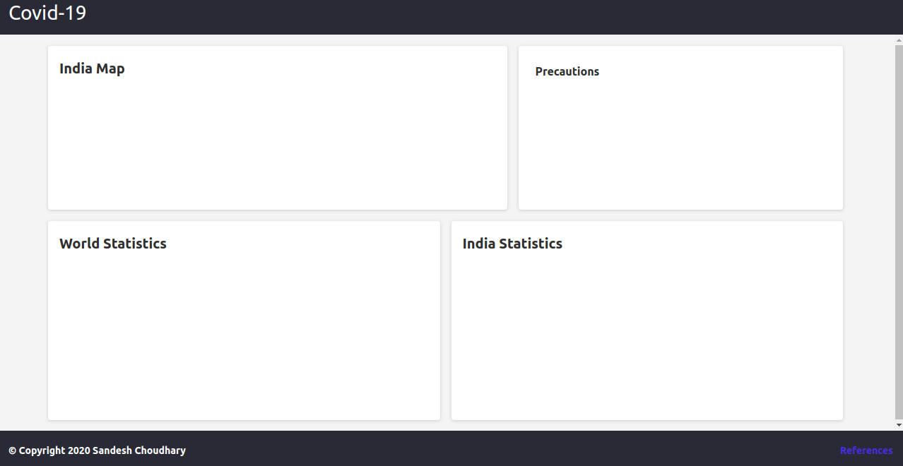

First, let’s import the components we need. Because we’ll be importing several components for this page, we’ll import them directly from the *design-system* package instead of the direct path for each one. In our *Map/index.js*, *Summary/index.js* and *CovidInfo/index.js*, we need to add:
```jsx
import { Heading, Card } from 'design-system';
```
In *Map/index.js*, we can wrap *Heading* inside *Card* component like this: 
```jsx
<Card
    shadow="light"
    style={{
        backgroundColor: 'white'
    }}
>
    <Heading size="m"> Map </Heading>
</Card>
```
Now that Summary and CovidInfo components would have a similar pattern, we would set them up in the same way.

### Building Static Component
Now it’s time to build a static component CovidInfo. API call is not required at this step because the component will be populated by static data. Here is a preview of what you will build: 

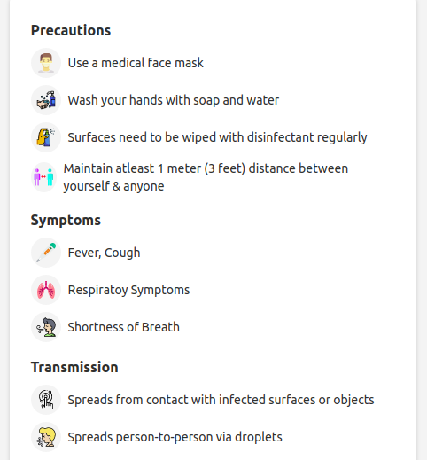

As we have already added the *Heading* component in previous steps, we will now be adding *Text* component. In *CovidInfo/index.js* :
```jsx
import { Text } from 'design-system';
```
We can use *Text* component like this:
```jsx
<div>
    <Text>Use a medical face mask</Text>
    <Text>Wash your hands with soap and water</Text>
</div>
```
Similarly, Symptoms can be added in the following way:
```jsx
<div>
    <Heading>Symptoms</Heading>
    <div>
        <Text>Fever, Cough</Text>
        <Text>Respiratoy Symptoms</Text>
    </div>
</div>
```
You can style the CovidInfo component by adding CSS in *CovidInfo.css*

### Building Dynamic Components
This step takes our components and populates them with data from the  GraphQL API – loading states and all. To do so, we’ll be using Apollo Client, the front-end component of the [Apollo Platform](https://www.apollographql.com/docs/intro/platform). Apollo Client is a sophisticated GraphQL client that manages data and state in an application.
You need to follow these steps to fetch data from API:
* ###### Install dependencies
    
    We’ll need to install three new dependencies to incorporate Apollo into our application namely `apollo-boost`, `graphQl` and `react-apollo`
* ###### Connect to Apollo
    Create a new directory src/api.
    ```jsx
    src
    ├──api
    ├──index.js
    ```
    Inside *api/index.js*, you can make your client by providing a URI :
    ```jsx
    import ApolloClient from 'apollo-boost';
    export const client = new ApolloClient({
        uri: 'https://covid-tracker-news-graphql.now.sh/'
    });
    ```
    Now we need to wrap our application with ApolloProvider. So, inside *src/index.js* :
    ```jsx
    import { ApolloProvider } from '@apollo/react-hooks';
    import { client } from './api';
    ReactDOM.render(
        <ApolloProvider client={client}>
            <Router>...</Router>
        </ApolloProvider>
    )
    ```
* ###### Fetch data
    Next we’ll assemble our GraphQL using the gql helper. The gql helper lets you write GraphQL queries using interpolated strings (backticks) in JavaScript. In addition, we’ll be using the Query component from react-apollo which gives us some great information about our query’s loading state in addition to the data. [Click here](https://github.com/sandeshchoudhary/covid/blob/master/src/query.js) for more details. 

Finally, you can get the data, loading and error states in your component using `useQuery` from `@apollo/react-hooks`. For example: 
```jsx
const { loading, error, data } = useQuery(query.data);
```

### Building Visualization Components Using API Data
Now that we have fetched the required data, we can easily render them in our component. Now its time to build `Map component` using the fetched API data. Here is the preview of what you will build:

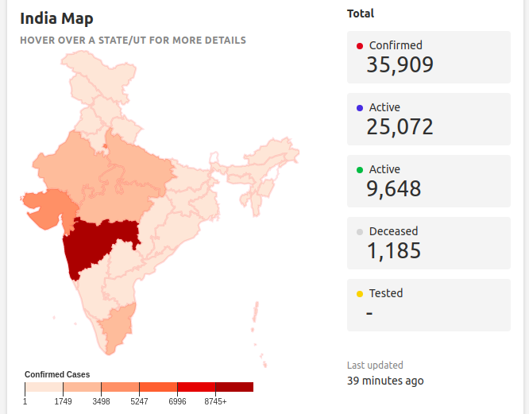

As we have already added *Card* inside Map component, our next task is to add layout in this component. The component looks like it has *heading*, *subheading* and *[ChoroplethMap](https://github.com/sandeshchoudhary/covid/blob/master/src/Map/choropleth.js)* in first column and info cards with *text* component in second column. So, inside *Map/index.js*, we need to add:
```jsx
import ChoroplethMap from './choropleth';
import { Row, Column, Heading, Subheading, Text } from 'design-system';
```
For the first column, we need to add:
```jsx
<Column>
    <Heading size="m">India Map</Heading>
    <Subheading appearance="subtle" size="s">
        Hover for more details
    </Subheading>
    <ChoroplethMap
        statistic={statistic}
        mapMeta={currentMap}
        mapData={currentMapData}
        setHoveredRegion={setHoveredRegion}
        changeMap={switchMapToState}
        selectedRegion={selectedRegion}
        setSelectedRegion={setSelectedRegion}
    />
</Column>
```
Note that we are fetching *currentMap*, *currentMapData* etc. from API. Now moving to our second column, we can add map info cards in the following way:
```jsx
 <div className="Map-info-item">
    <div>
        <div className="InfoLegend"></div>
        <Text>Confirmed</Text>
    </div>
    <div className="pt-3 pl-5">
    <Text>
        {formatNumber(currentHoveredRegion.confirmed)}
    </Text>
</div>
```
Here *currentHoveredRegion* is fetched from API. We can make similar info cards for Active, Recovered, Deceased and Tested parameters. Also, styling for this column can be added in *Map.css*.
Moving on to next dynamic component i.e `Summary`, here is a preview of what you will build:

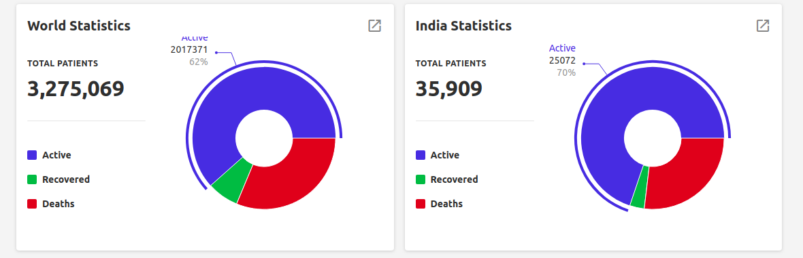

The two columns seems to have same layout but different statistics which can be handled through API in the following way:
```jsx
const { loading, error, data: indiaStats } = useQuery(query.indiaStats);
const { loading: worldLoading, error: worldError, data: worldData } = useQuery(query.world);
```
So, we will be making same component for both the columns and will handle the numbers through API data. So in *Home/index.js*:
```jsx
// For World Statistics
<Summary
    entity="world"
    showLink={true}
    stats={worldData}
/>
// For India Statistics
<Summary
    entity="india"
    showLink={true}
    stats={indiaStats}
/>
```
Moving on to Summary component, we have already wrapped *Card* inside Summary component in previous steps, so we will now add other components in the following way:
```jsx
import { Subheading, Row, Column, Legend, Icon, DonutChart } from 'design-system';
```
*Icon* in the header of Summary component corresponds to a drill state. So we will be adding a click handler to icon in the following way:
```jsx
<div className="Summary-heading">
    <Heading size="m">India Statistics</Heading>
    <Icon name="open_in_new" appearance="subtle" size="24" onClick={() => handleMore(entity)} />
</div>
```
Now, we will be adding *Legend* and *Donut Chart* components in different columns:
```jsx
<Column>
    <div className="Summary-details">
        <Legend labelWeight="medium" iconAppearance="primary" label="Active" />
        <Legend labelWeight="medium" iconAppearance="alert" label="Deaths" />
    </div>
</Column>
<Column>
    <DonutChart
        data={data}
        withCenterText={false}
        donutWidth={60}
        colors={['primary', 'success', 'alert']}
    />
</Column>
```
## <a name="BUILDING_DRILLED_PAGE"></a>Building Drilled Page
Till now, we have updated our app to render our landing page, now its time to add drilled states. Lets make a new component IndiaStats inside our src directory.
```jsx
src/IndiaStats
├──index.js
├──Stats.css
```
Here is a preview of what you will build:

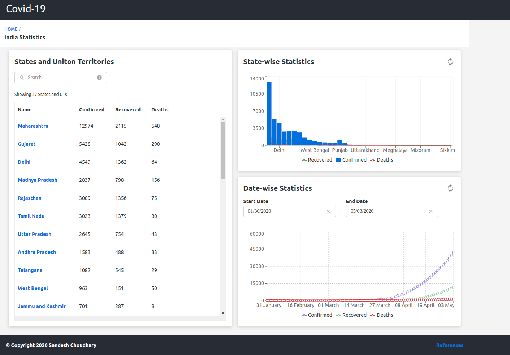

Lets add a basic grid.
```jsx
import {Row, Column} from 'design-system';
```
```jsx
<Row>
    <Column>...</Column>
    <Column>
        <Row>
            <Column>...</Column>
            <Column>...</Column>
        </Row>
    </Column>
</Row>
```
Now, we need to add this component inside our Router. So, inside *src/index.js*, add another route like this:
```jsx
<Route path="/india">
    <IndiaStats entity="india" queryType="india" />
</Route>
```
Coming back to our IndiaStats component, we will first build a header of our new page. Here is a preview of what you will build:

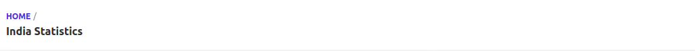

For building a header, we want *Breadcrumb* component from our design-system package. So, in *IndiaStats/index.js*, add these lines:
```jsx
import { Breadcrumb, BreadcrumbsWrapper } from 'design-system';
```
Inside render, add:
```jsx
<header>
    <BreadcrumbsWrapper heading='India Statistics'>
        <Breadcrumb>
            <Link onClick={() => history.push('/')}>HOME</Link>
        </Breadcrumb>
    </BreadcrumbsWrapper>
</header>
```
After building header, its time to add Cards inside Column components. Here is a preview of what you will build now:

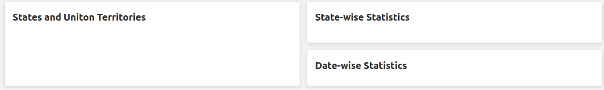

So inside *IndiaStats/index.js*, add these lines:
```jsx
import { Card, Heading } from 'design-system';
```
Now we will add Heading and Card inside individual column:
```jsx
<Card>
    <Heading size="m">States and Uniton Territories</Heading>
</Card>
```
After building a basic layout, lets move on to our first column. Here is a preview of what you will build now:

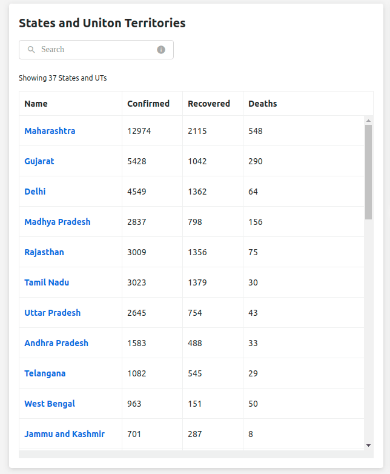

So for our first column, we need Input, Table and Text. So, let's import these components inside *IndiaStats/index.js*:
```jsx
import { Input, Table, Text } from 'design-system':
```
Inside first column, add these lines:
```jsx
<Input
    clearButton={true}
    value={searchQuery}
    icon="search"
    name="input"
    placeholder="Search"
    onChange={(ev) => handleSearch(ev.target.value)}
    onClear={() => handleSearch('')}
/>
<Text small={true}>Showing 37 States and UTs</Text>
<Table
    loading={loading}
    buffer={10}
    schema={schema}
    data={data}
/>
```
Note that searchQuery is the state of component and is updated by handleSearch function while loading and data is fetched from API. For the internal padding between individual components, you can wrap these components in a div and can add their styling in *Stats.css*.
Moving on to our next column, there are two cards corresponding to two graphs. Lets look at them individually. Here is a preview of what we will build:

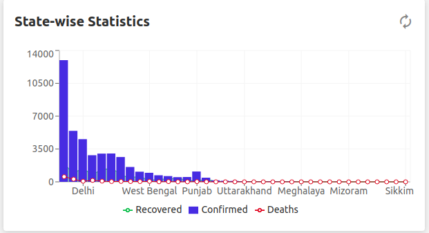

For the above card, we need to add Heading, Icon and graph. As we  have already added Heading in our previous steps, its time to add Icon and graph. We are using [recharts](https://recharts.org/en-US/) library to build the graphs. So, lets import the graphs and Icon in *IndiaStats/index.js* in the following way:
```jsx
import {
  ComposedChart, LineChart, XAxis, YAxis, Tooltip,
  Legend, CartesianGrid, Area, Bar, Line,
  ResponsiveContainer
} from 'recharts';
import { Icon } from 'design-system':
```
To add Icon, add these lines:
```jsx
<div className="Stats-heading">
    <Heading size="m">State-wise Statistics</Heading>
    <Icon name="autorenew" appearance="subtle" size="24" />
</div>
```
To add Graph:
```jsx
 <ResponsiveContainer width={'100%'} height={250}>
    <ComposedChart data={getData(entity, data)}>
        ...
    </ComposedChart>
</ResponsiveContainer>
```
Moving on to our next card, here is a preview of what you will build:

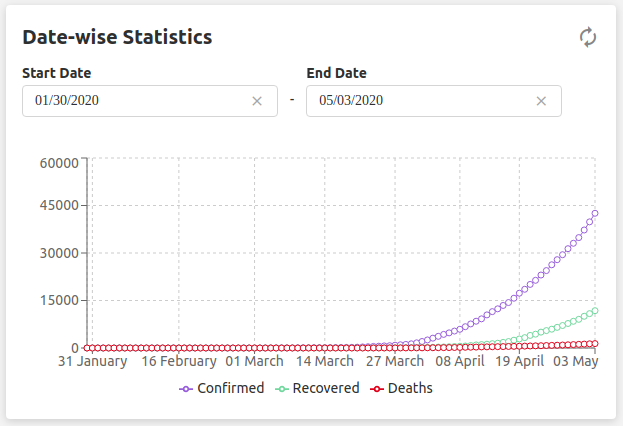

We need RangePicker and Line Chart to build this card. So lets import these components in *IndiaStats/index.js*:
```jsx
import { RangePicker } from design-system;
```
RangePicker and graph can be added like this:
```jsx
<RangePicker
    withInput={true}
    disabledBefore={disabledDate.before}
    disabledAfter={disabledDate.after}
    onRangeChange={onRangeChange}
/>
<ResponsiveContainer width={'100%'} height={250}>
    <LineChart data={timeStampsData}>
        ...
    </LineChart>
</ResponsiveContainer>
```
Here disabledDate is handled through state while onRangeChange is the callback function.

## Wrapping Up
Thanks for completing the tutorial and helping us improve it along the way.
