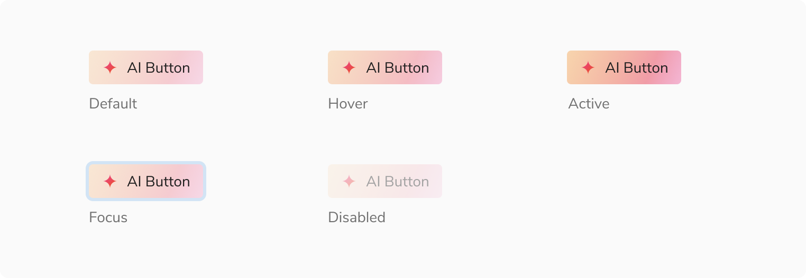
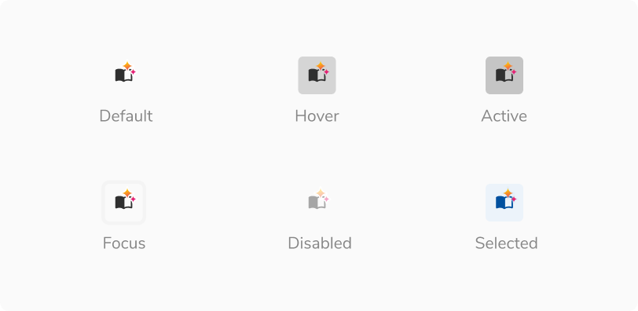
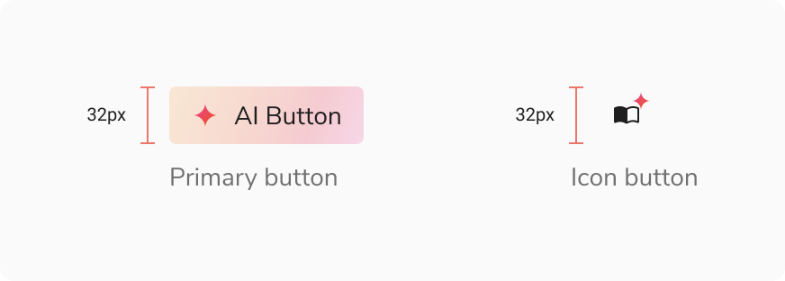
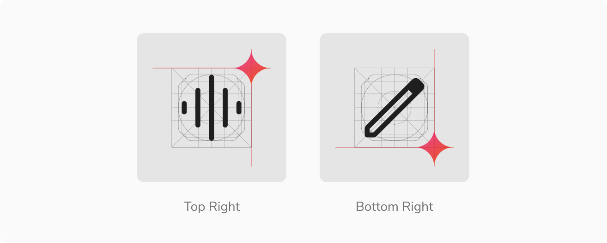

### Types

 

#### AI Button

AI Button looks like a Button but features a magic sparkle icon on left. It supports two appearances - basic and primary. 

<Preview name='components-aibutton--appearance' libName='mds-ai' />

 

#### AI Icon Button

AI Icon Button can be used for AI actions when there is a space constraint and the meaning of the icon is universal. It features a magic sparkle icon that can be positioned on top right or bottom right of the icon button.

<Preview name='components-aiiconbutton--default' libName='mds-ai' />

### Appearances

 
 

#### AI Button

AI button comes in **2 appearances** basis on their intent – basic and primary.

##### Basic Button

It is the default appearance of button and should be used for most AI actions that aren't the main call to action for a page or area.

<Preview name='components-aibutton--basic' libName='mds-ai' />

##### Primary Button

It is used to highlight the most important action on a page, in this case it being an AI powered action. It is recommended to have only one primary button per page.

<Preview name='components-aibutton--primary' libName='mds-ai' />

### States

#### AI Button

AI button supports **5 states** - default, hover, active, focus and disabled.

<Caption>States - AI Button</Caption>

#### AI Icon Button

Icon buttons supports **6 states** - default, hover, active, focus, disabled and selected.

<Caption>States - AI Icon Button</Caption>

### Structure

#### AI buttons

 

<table style={{width: "100%"}}>
  <tbody>
    <tr>
      <th style={{width:"50%",  textAlign: "left"}}>Property</th>
      <th style={{width:"50%",  textAlign: "left"}}>Value(s)</th>
    </tr>
    <tr style={{verticalAlign: "top"}}>
      <td>Height</td>
      <td>32px</td>
    </tr>
    <tr style={{verticalAlign: "top"}}>
      <td>Corner radius</td>
      <td>4 px</td>
    </tr>
  </tbody>
</table>

 
 

<Caption>Structure - AI buttons</Caption>

### Configurations

#### AI Button

 

<table style={{width: "100%"}}>
  <tbody>
    <tr>
      <th style={{width:"33%",  textAlign: "left"}}>Property</th>
      <th style={{width:"33%",  textAlign: "left"}}>Value(s)</th>
      <th style={{width:"33%",  textAlign: "left"}}>Default value</th>
    </tr>
    <tr style={{verticalAlign: "top"}}>
      <td>Appearance</td>
      <td>
          <ul>
              <li>Primary</li>
              <li>Basic</li>
          </ul>
      </td>
      <td>Primary</td>
    </tr>
  </tbody>
</table>
 

#### AI Icon Button

 

<table style={{width: "100%"}}>
  <tbody>
    <tr>
      <th style={{width:"33%",  textAlign: "left"}}>Property</th>
      <th style={{width:"33%",  textAlign: "left"}}>Value(s)</th>
      <th style={{width:"33%",  textAlign: "left"}}>Default value</th>
    </tr>
    <tr style={{verticalAlign: "top"}}>
      <td>Large Icon</td>
      <td>
          <ul>
              <li>True</li>
              <li>False</li>
          </ul>
      </td>
      <td>False</td>
    </tr>
    <tr style={{verticalAlign: "top"}}>
      <td>Sparkle position</td>
      <td>
          <ul>
              <li>Top</li>
              <li>Bottom</li>
          </ul>
      </td>
      <td>Bottom</td>
    </tr>
  </tbody>
</table>
 

### Usage

#### Position of magic sparkle icon in an icon button

The magic sparkle icon can be either positioned at top-right or bottom-right in the icon button. The sparkles are position to align with the edges of icon container.

<Caption>Position of magic sparkle icon in an icon button</Caption>
