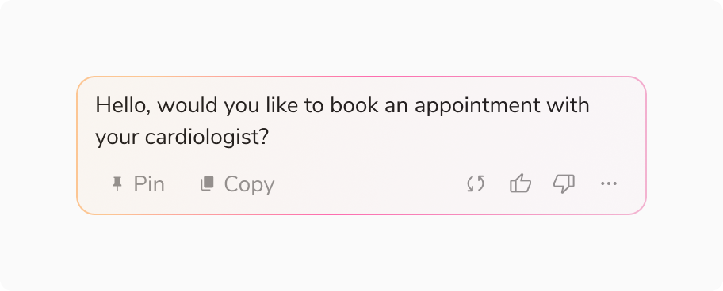
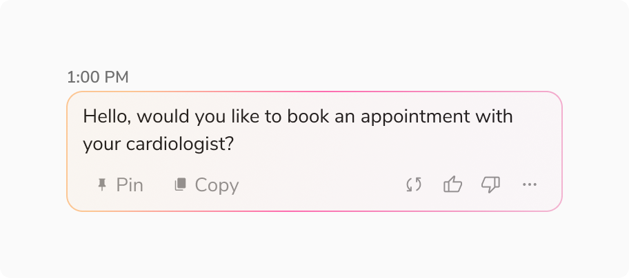
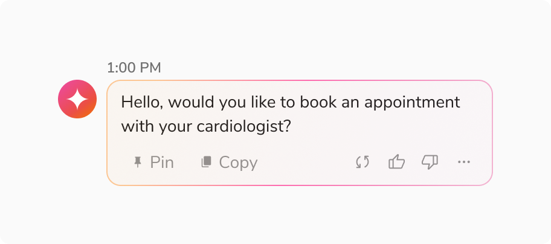
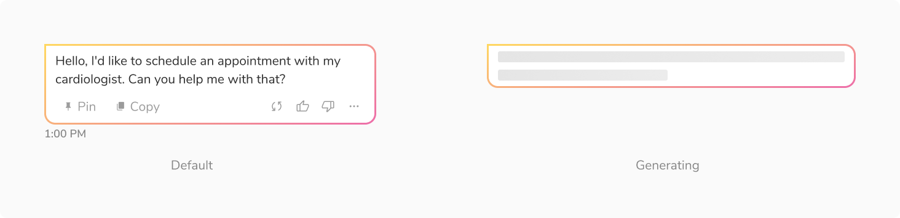
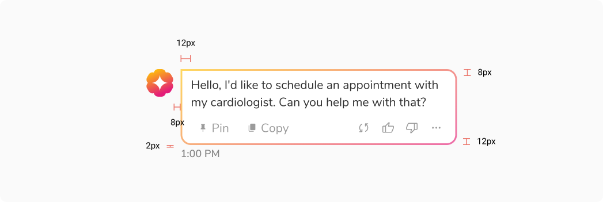
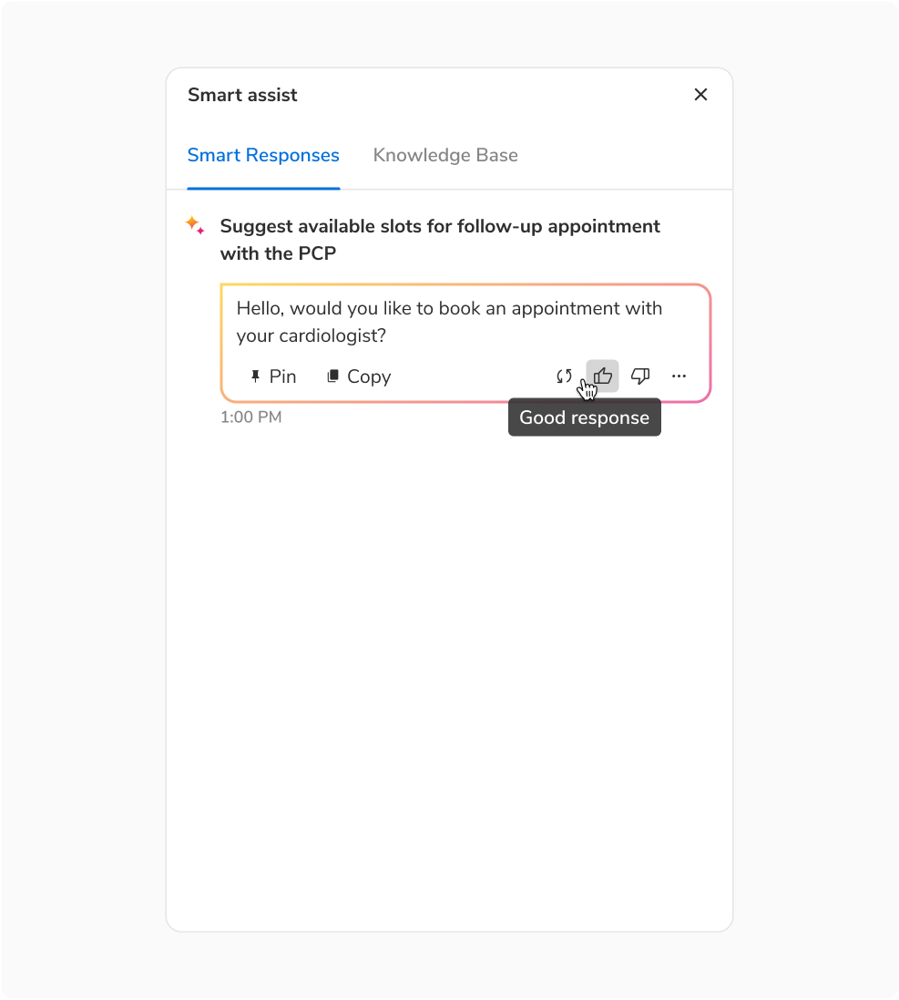
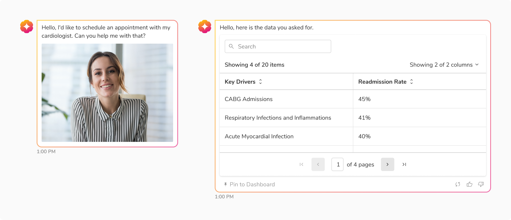
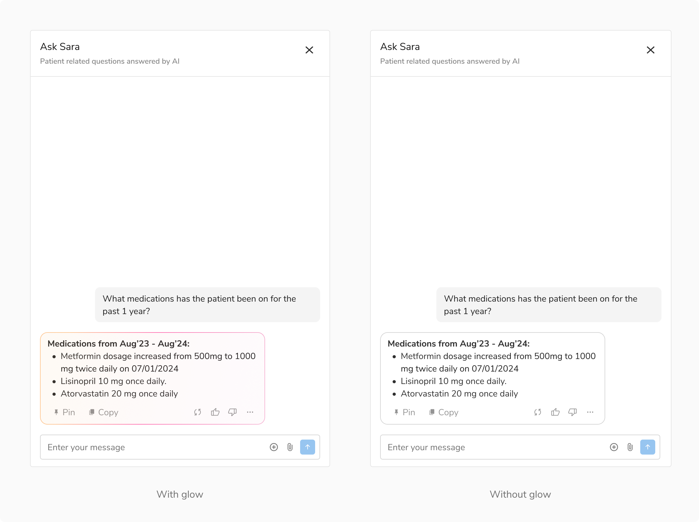

AI Response is used to communicate information from Sara to the user.

<Preview name="components-ai-ai-response-all--all" />

### Variants

#### Default

This variant comes with just a message bubble.

<Caption>Default</Caption>

#### With Metadata

This variant includes a message bubble and metadata for showing timestamp, meta item and urgency of the message.

<Caption>With Metadata</Caption>

#### With Avatar and Metadata

This variant includes a message bubble, avatar and metadata for showing timestamp, meta item and urgency of the message.

<Caption>With Avatar and Metadata</Caption>

### States

AI Response has **2 states** - default and generating.

<Caption>States</Caption>

### Structure

<Caption>Structure - AI Response</Caption>

 

<table style={{width: "100%"}}>
  <tbody>
    <tr>
      <th style={{width:"50%",  textAlign: "left"}}>Padding and Spacing</th>
      <th style={{width:"50%",  textAlign: "left"}}>Value(s)</th>
    </tr>
    <tr style={{verticalAlign: "top"}}>
      <td>Top and Bottom</td>
      <td>8px, 12px</td>
    </tr>
    <tr style={{verticalAlign: "top"}}>
      <td>Left and Right</td>
      <td>12px, 12px</td>
    </tr>
    <tr style={{verticalAlign: "top"}}>
      <td>Spacing between Avatar and Bubble</td>
      <td>8px</td>
    </tr>
    <tr style={{verticalAlign: "top"}}>
      <td>Spacing between Metadata and Bubble</td>
      <td>2px</td>
    </tr>
  </tbody>
</table>

 

### Configurations

 

<table style={{width: "100%"}}>
  <tbody>
    <tr>
      <th style={{width:"33%",  textAlign: "left"}}>Property</th>
      <th style={{width:"33%",  textAlign: "left"}}>Value(s)</th>
      <th style={{width:"33%",  textAlign: "left"}}>Default value</th>
    </tr>
    <tr style={{verticalAlign: "top"}}>
      <td>Avatar (optional)</td>
      <td>
          <ul>
              <li>True</li>
              <li>False</li>
          </ul>
      </td>
      <td>True</td>
    </tr>
    <tr style={{verticalAlign: "top"}}>
      <td>Action Bar (optional)</td>
      <td>
          <ul>
              <li>True</li>
              <li>False</li>
          </ul>
      </td>
      <td>True</td>
    </tr>
  </tbody>
</table>
 

### Behavior

#### Tooltip on Actions

It is recommended to display a tooltip when hovering over icon buttons within an AI response.

<Caption>Tooltip on Icon Buttons</Caption>

#### Generating Content

Here is an example showcasing how content is generated inside AI Response.

<Preview name="components-ai-ai-response-generating-content--generating-content" />

### Usage

#### Custom Response

AI responses are highly customizable and can incorporate a wide range of components to meet diverse use cases.

<Caption>Custom Content inside AI Response</Caption>

#### Taking Feedback From Users

Users can share their feedback on the AI response by using the feedback buttons located at the bottom right corner of the response.

<Preview name="components-ai-ai-response-giving-feedback--giving-feedback" />

#### Minimizing Visual Distractions

It is recommended to turn off the AI glow in case of high visual overload as AI has evolved from a key innovation to a standard expectation, we aim to minimize the distraction caused by the bubble's stroke.

<Caption>Minimizing Visual Distractions</Caption>
