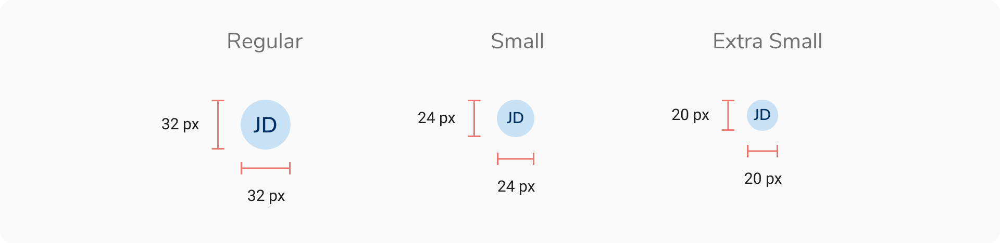

An avatar consists of a display picture of the entity that it represents i.e. a user. In case a display picture is not available, it consists of a colored background and the initials of the name that it represents. And if somehow the initials can't be fetched, a fallback glyph is used.

### Appearances
Avatar comes in 9 appearances -
<Preview name='components-avatar-variants-appearance--appearance' />

### Sizes
Avatar comes in 2 sizes -
<Preview name='components-avatar-variants-size--size' />

### Structure
 
 

 

<table style="width: 100%">
 <tbody>
   <tr>
     <th style="width:50%; text-align: left;">Property</th>
     <th style="width:50%; text-align: left;">Value(s)</th>
   </tr>
   <tr style="vertical-align: top">
     <td>Size</td>
     <td>
         <ul>
             <li>32x32px <em>(Regular)</em></li>
             <li>24x24px <em>(Small)</em></li>
         </ul>
     </td>
   </tr>
 </tbody>
</table>
 

### Configurations
<table style="width: 100%">
  <tbody>
    <tr>
      <th style="width:33%; text-align: left;">Property</th>
      <th style="width:33%; text-align: left;">Value(s)</th>
      <th style="width:33%; text-align: left;">Default value</th>
    </tr>
    <tr style="vertical-align: top">
      <td>Appearance</td>
      <td>
          <ul>
              <li>Jal</li>
              <li>Stone</li>
              <li>Neem</li>
              <li>Haldi</li>
              <li>Mirch</li>
              <li>Tawak</li>
              <li>Nimbu</li>
              <li>Neel</li>
              <li>Jamun</li>
          </ul>
      </td>
      <td>-</td>
    </tr>
    <tr style="vertical-align: top">
      <td>Size</td>
      <td>
          <ul>
              <li>Regular</li>
              <li>Tiny</li>
          </ul>
      </td>
      <td>Regular</td>
    </tr>
    <tr style="vertical-align: top">
      <td>First name</td>
      <td>&#60;first_name&#62;</td>
      <td>Jane</td>
    </tr>
    <tr style="vertical-align: top">
      <td>Last name</td>
      <td>&#60;last_name&#62;</td>
      <td>Doe</td>
    </tr>
    <tr style="vertical-align: top">
      <td>Outline</td>
      <td>&#60;color&#62;</td>
      <td>Namak</td>
    </tr>
    <tr style="vertical-align: top">
      <td>Additional users</td>
      <td>&#60;count&#62;</td>
      <td>-</td>
    </tr>
  </tbody>
</table>
 

### Usage
 

#### Color assignment
The background color of an avatar should be generated dynamically in such a way that at the time of its creation a random color (from the available options) is assigned. Once assigned, the color should stay the same as long as that particular avatar is in use.

For example, an avatar generated for a user - Franklin Clinton, can look like following and it should look the same wherever it is used.

<Caption>Color assignment</Caption>
 

#### Displaying Name
Since an avatar can only show an image or the initials, there should be an option to show the full name of the entity. This is achieved by **hovering** over on the avatar to display a tooltip containing the full name.

<Caption>Hovering on an avatar</Caption>
 

#### Number of avatars
Avatars can be used individually or as a group if required. For example - if an activity is being performed by 4 users, an avatar group should be used to represent them.

To be specific, an avatar can be used in 3 ways as -
##### Single entity

<Caption>Single avatar</Caption>

##### Two entities

<Caption>Two avatars</Caption>

##### More than 2 entities

<Caption>More than 2 avatars</Caption>

In order to show the additional entities that are not visible upfront, a popover having the list of full names of those additional entities is shown on hover.

<Caption>Showing list of names in an avatar group</Caption>
 