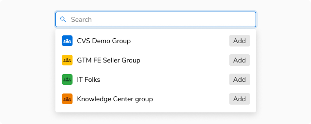
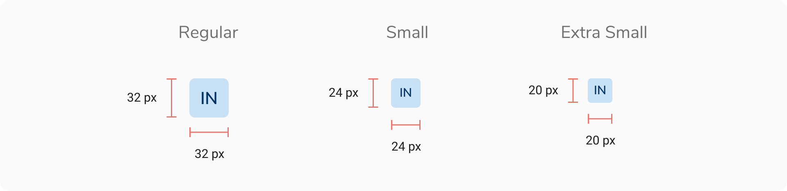
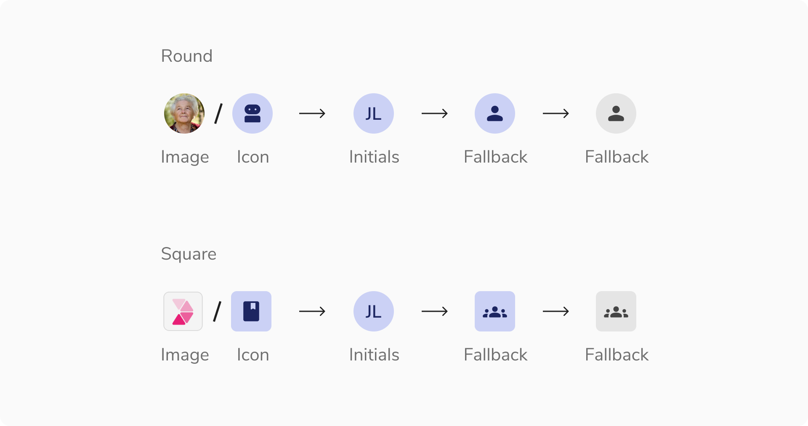
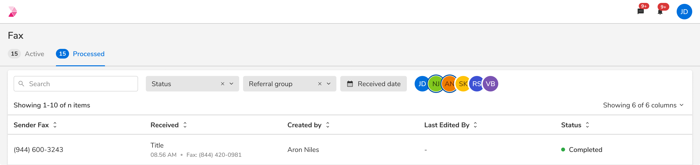
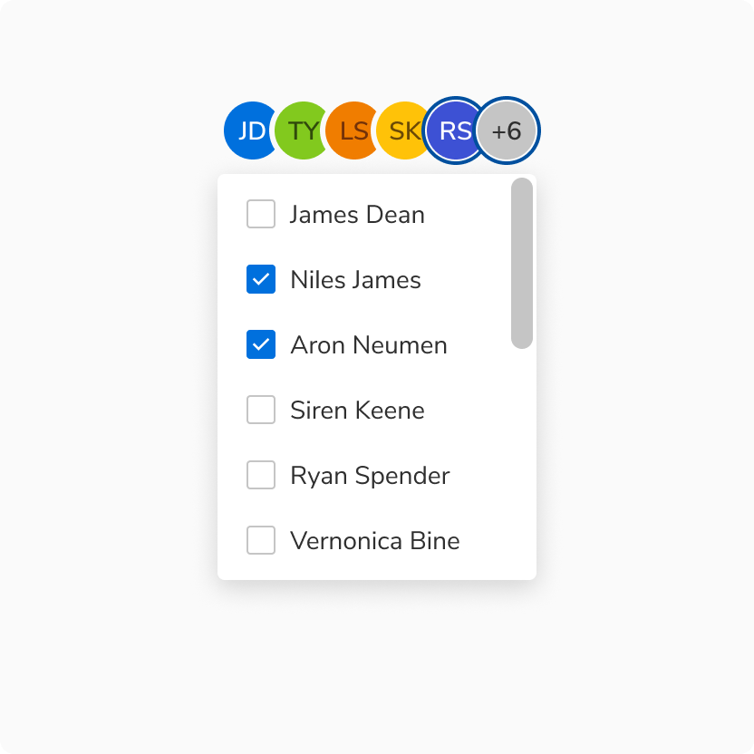
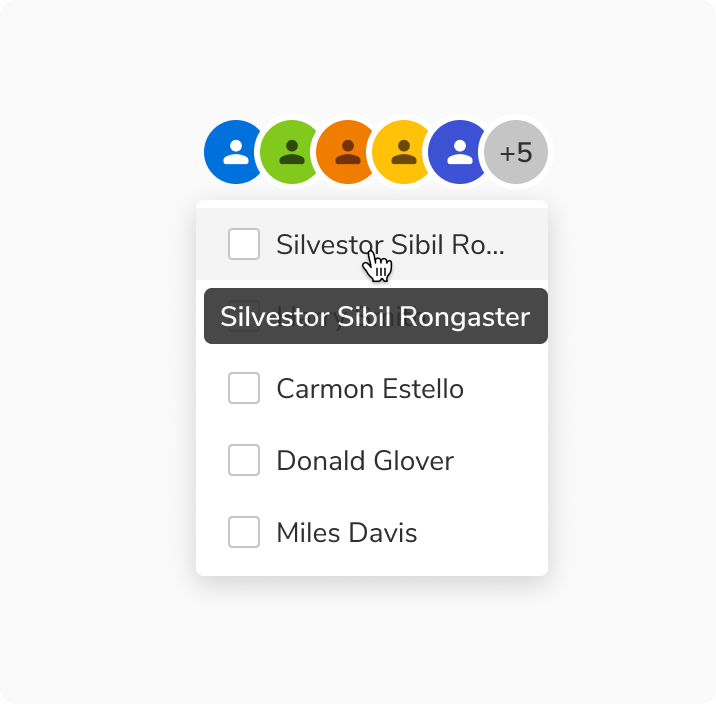

An avatar consists of a display picture of the entity that it represents i.e. a user. In case a display picture is not available, it consists of a colored background and the initials of the name that it represents. And if somehow the initials can't be fetched, a fallback glyph is used.

### Appearances

Avatar comes in 9 appearances -

<Preview name="components-avatar-avatar-variants-appearance--appearance" />

### Shapes
Avatar comes in **2 shapes** - round and square.

#### Round avatar
Round avatar represents a single entity i.e a user, bot or app.

#### Square avatar
Square avatar represents a group of entities or organization.

### Sizes

Avatar comes in **2 sizes** - small and regular.

<Preview name="components-avatar-avatar-variants-size--size" />

### Variants

#### With Image

#### With Icon

#### With Initials

### Structure
#### Round avatar

 
 

 

<table style={{width: "100%"}}>
  <tbody>
    <tr>
      <th style={{width:"50%",  textAlign: "left"}}>Property</th>
      <th style={{width:"50%",  textAlign: "left"}}>Value(s)</th>
    </tr>
    <tr style={{verticalAlign: "top"}}>
      <td>Size</td>
      <td>
        <ul>
          <li>
            24x24 px <em>(Small)</em>
          </li>
          <li>
            32x32 px <em>(Regular)</em>
          </li>
        </ul>
      </td>
    </tr>
  </tbody>
</table>
 

#### Square avatar

 
 

 

<table style={{width: "100%"}}>
  <tbody>
    <tr>
      <th style={{width:"50%",  textAlign: "left"}}>Property</th>
      <th style={{width:"50%",  textAlign: "left"}}>Value(s)</th>
    </tr>
    <tr style={{verticalAlign: "top"}}>
      <td>Size</td>
      <td>
        <ul>
          <li>
            24x24 px <em>(Small)</em>
          </li>
          <li>
            32x32 px <em>(Regular)</em>
          </li>
        </ul>
      </td>
    </tr>
        <tr style={{verticalAlign: "top"}}>
      <td>Corner radius</td>
      <td>4 px</td>
    </tr>
  </tbody>
</table>
 

#### Option item

 
 

<table style={{width: "100%"}}>
  <tbody>
    <tr>
      <th style={{width:"50%",  textAlign: "left"}}>Padding</th>
      <th style={{width:"50%",  textAlign: "left"}}>Value(s)</th>
    </tr>
    <tr style={{verticalAlign: "top"}}>
      <td>Top and bottom</td>
      <td>
        <ul>
          <li>
            4px
          </li>
          <li>
            8px
          </li>
          <li>
            12px
          </li>
        </ul>
      </td>
    </tr>
    <tr style={{verticalAlign: "top"}}>
      <td>Left and right</td>
      <td>16 px</td>
    </tr>
  </tbody>
</table>
 

### Configurations

 
 

#### Round avatar

 
 

<table style={{width: "100%"}}>
  <tbody>
    <tr>
      <th style={{width:"33%", textAlign: "left"}}>Property</th>
      <th style={{width:"33%", textAlign: "left"}}>Value(s)</th>
      <th style={{width:"33%", textAlign: "left"}}>Default value</th>
    </tr>
    <tr style={{verticalAlign: "top"}}>
      <td>Appearance</td>
      <td>
        <ul>
          <li>Jal</li>
          <li>Stone</li>
          <li>Neem</li>
          <li>Haldi</li>
          <li>Mirch</li>
          <li>Tawak</li>
          <li>Nimbu</li>
          <li>Neel</li>
          <li>Jamun</li>
        </ul>
      </td>
      <td>-</td>
    </tr>
    <tr style={{verticalAlign: "top"}}>
      <td>Size</td>
      <td>
        <ul>
          <li>Small</li>
          <li>Regular</li>
        </ul>
      </td>
      <td>Regular</td>
    </tr>
    <tr style={{verticalAlign: "top"}}>
      <td>Image</td>
      <td>Image sub-component</td>
      <td>-</td>
    </tr>
    <tr style={{verticalAlign: "top"}}>
      <td>Icon</td>
      <td>Icon sub-component</td>
      <td>-</td>
    </tr>
    <tr style={{verticalAlign: "top"}}>
      <td>First name</td>
      <td>&#60;first_name&#62;</td>
      <td>-</td>
    </tr>
    <tr style={{verticalAlign: "top"}}>
      <td>Last name</td>
      <td>&#60;last_name&#62;</td>
      <td>-</td>
    </tr>
    <tr style={{verticalAlign: "top"}}>
      <td>Border color</td>
      <td>&#60;color&#62;</td>
      <td>Namak</td>
    </tr>
    <tr style={{verticalAlign: "top"}}>
      <td>Additional users</td>
      <td>&#60;count&#62;</td>
      <td>-</td>
    </tr>
  </tbody>
</table>
 

#### Square avatar

 
 

<table style={{width: "100%"}}>
  <tbody>
    <tr>
      <th style={{width:"33%", textAlign: "left"}}>Property</th>
      <th style={{width:"33%", textAlign: "left"}}>Value(s)</th>
      <th style={{width:"33%", textAlign: "left"}}>Default value</th>
    </tr>
    <tr style={{verticalAlign: "top"}}>
      <td>Appearance</td>
      <td>
        <ul>
          <li>Jal</li>
          <li>Stone</li>
          <li>Neem</li>
          <li>Haldi</li>
          <li>Mirch</li>
          <li>Tawak</li>
          <li>Nimbu</li>
          <li>Neel</li>
          <li>Jamun</li>
        </ul>
      </td>
      <td>-</td>
    </tr>
    <tr style={{verticalAlign: "top"}}>
      <td>Size</td>
      <td>
        <ul>
          <li>Small</li>
          <li>Regular</li>
        </ul>
      </td>
      <td>Regular</td>
    </tr>
    <tr style={{verticalAlign: "top"}}>
      <td>Image</td>
      <td>Image sub-component</td>
      <td>-</td>
    </tr>
    <tr style={{verticalAlign: "top"}}>
      <td>Icon</td>
      <td>Icon sub-component</td>
      <td>-</td>
    </tr>
    <tr style={{verticalAlign: "top"}}>
      <td>First name</td>
      <td>&#60;first_name&#62;</td>
      <td>-</td>
    </tr>
    <tr style={{verticalAlign: "top"}}>
      <td>Last name</td>
      <td>&#60;last_name&#62;</td>
      <td>-</td>
    </tr>
  </tbody>
</table>
 

#### Option Item

 
 

<table style={{width: "100%"}}>
  <tbody>
    <tr>
      <th style={{width:"33%", textAlign: "left"}}>Property</th>
      <th style={{width:"33%", textAlign: "left"}}>Value(s)</th>
      <th style={{width:"33%", textAlign: "left"}}>Default value</th>
    </tr>
    <tr style={{verticalAlign: "top"}}>
      <td>Label</td>
      <td>&#60;label&#62;</td>
      <td>-</td>
    </tr>
    <tr style={{verticalAlign: "top"}}>
      <td>Size</td>
      <td>
        <ul>
          <li>Standard</li>
          <li>Compressed</li>
          <li>Tight</li>
        </ul>
      </td>
      <td>Compressed</td>
    </tr>
  </tbody>
</table>
 

#### Popover

 
 

<table style={{width: "100%"}}>
  <tbody>
    <tr>
      <th style={{width:"33%", textAlign: "left"}}>Property</th>
      <th style={{width:"33%", textAlign: "left"}}>Value(s)</th>
      <th style={{width:"33%", textAlign: "left"}}>Default value</th>
    </tr>
    <tr style={{verticalAlign: "top"}}>
      <td>Width</td>
      <td>&#60;width&#62;</td>
      <td>176px (Customizable)</td>
    </tr>
    <tr style={{verticalAlign: "top"}}>
      <td>Max height</td>
      <td>&#60;max_height&#62;</td>
      <td>256px (Customizable)</td>
    </tr>
    <tr style={{verticalAlign: "top"}}>
      <td>Min height</td>
      <td>&#60;min_height&#62;</td>
      <td>-</td>
    </tr>
  </tbody>
</table>
 

### Usage

 

#### Color assignment

The background color of an avatar should be generated dynamically in such a way that at the time of its creation a random color (from the available options) is assigned. Once assigned, the color should stay the same as long as that particular avatar is in use.

For example, an avatar generated for a user - Franklin Clinton, can look like following and it should look the same wherever it is used.

<Caption>Color assignment</Caption>
 

#### Displaying Name

Since an avatar can only show an image or the initials, there should be an option to show the full name of the entity. This is achieved by **hovering** over on the avatar to display a tooltip containing the full name.

<Caption>Hovering on an avatar</Caption>
 

#### Fallback hierarchy

This is the fallback order defined for avatars:

<Caption>Fallback hierarchy</Caption>

#### Square avatar vs Round avatar group

Square avatars and round avatar group are both used to group entities. Square avatar is ideal for presenting a group as a unified entity, while round avatar group facilitates an interactive and visually cohesive representation of individual members within the group.

#### Avoid square avatar with icon button

It is recommended to not use square avatar in conjunction with an icon button as users may mistake the avatar for a button.

#### Selection using avatars

Avatar group can also be used to make selection which can help in filtering data.

#### Number of avatars

Avatars can be used individually or as a group if required. For example - if an activity is being performed by 4 users, an avatar group should be used to represent them.

To be specific, an avatar can be used in 3 ways as -

##### Single entity

<Caption>Single avatar</Caption>

##### Two/Three entities

<Caption>Two/Three entities</Caption>

##### More than three entities

<Caption>More than three avatars</Caption>

In order to show the additional entities that are not visible upfront, a popover having the list of full names of those additional entities is shown on hover.

<Caption>Showing list of names in an avatar group</Caption>
 

##### Selection in avatar

 

<b>Up to six entities</b>

Avatar group can accommodate up to six avatars to facilitate data filtering and alleviate cognitive overload.

 

<b>More than six entities </b>

In case of selection to show additional entities that are not visible upfront, a popover having the checklist of full names of those additional entities is shown on clicking the avatar.

#### Selection avatar group vs Select

It is recommended to use selection avatar group for fewer entities, and select for a larger number of options.

#### Using PNG and SVG in avatar

It is recommended to use stone light or a suitable background color that ensures enough contrast between the image and its backdrop when using PNG or SVG formats without a background. 

<Caption>Using PNG and SVG in avatar</Caption>

#### Width of popover

While the popover's width is flexible and can vary, it is advisable to maintain a size that is equal to or larger than the avatar group.

<Caption>Width of popover</Caption>

#### Overflow behavior of items

In case of overflow, the items will get truncated and can be viewed inside a tooltip on hover.  

<Caption>Overflow behavior of items</Caption>
