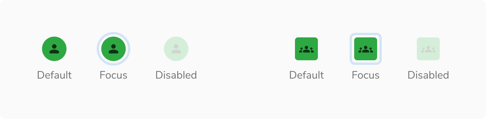
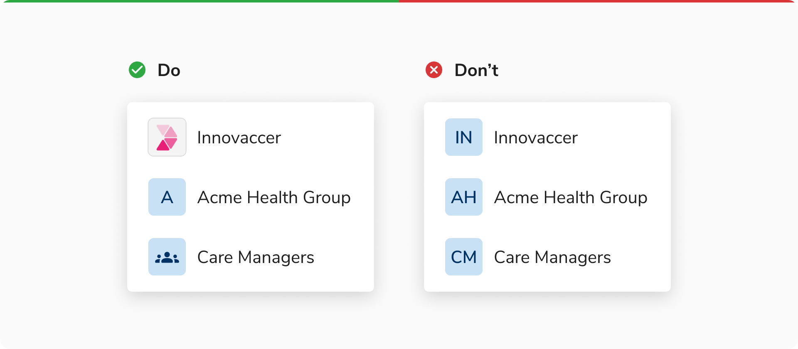
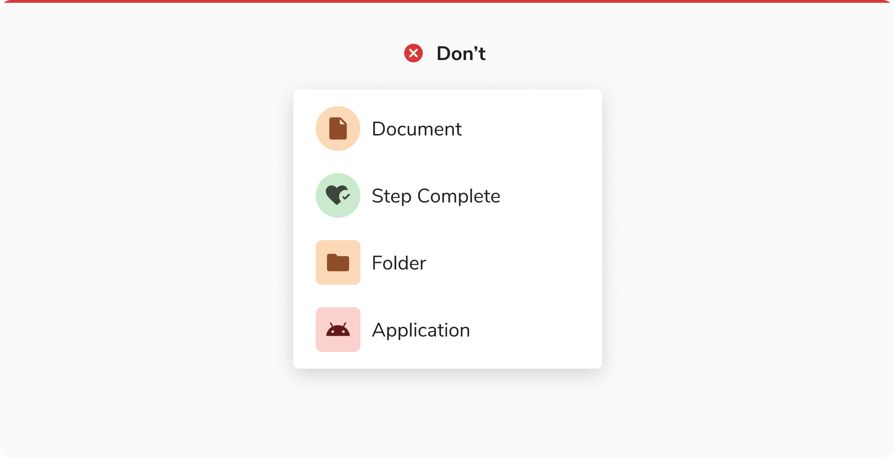

### Appearances

Avatar comes in 9 appearances -

<Preview name="components-avatar-avatar-variants-appearance--appearance" />

### Shapes
Avatar comes in **2 shapes** - round and square.

#### Round Avatar
The circular shape conveys approachability and subtly resembles a face. Use this avatar for an individual.

<Caption>A round avatar</Caption>

#### Square Avatar
The angular shape communicates structure and formality. Use this avatar to represent entities such as a group, team, organization, user role, etc.

<Caption>A square avatar</Caption>

### Sizes

Avatar comes in **3 sizes** - regular, small and extra small.

<Preview name="components-avatar-avatar-variants-size--size" />

### States

Avatar comes in **3 states** - default, focus and disabled.

<Caption>Default, Focus and Disabled states in Avatar</Caption>

### Variants

#### With Initials

<Caption>Avatars with initials</Caption>

#### With Icon

For bots, use an icon or image instead of initials to clearly differentiate them from people

<Caption>Avatars with icon</Caption>

#### With Image

<Caption>Avatars with image</Caption>

### Structure
#### Round Avatar

 
 

<Caption>Structure of round avatar</Caption>

 

<table style={{width: "100%"}}>
  <tbody>
    <tr>
      <th style={{width:"50%",  textAlign: "left"}}>Property</th>
      <th style={{width:"50%",  textAlign: "left"}}>Value(s)</th>
    </tr>
    <tr style={{verticalAlign: "top"}}>
      <td>Height</td>
      <td>
        <ul>
          <li>
            20px <em>(Extra Small)</em>
          </li>
          <li>
            24px <em>(Small)</em>
          </li>
          <li>
            32px <em>(Regular)</em>
          </li>
        </ul>
      </td>
    </tr>
    <tr style={{verticalAlign: "top"}}>
      <td>Width</td>
      <td>
        <ul>
          <li>
            20px <em>(Extra Small)</em>
          </li>
          <li>
            24px <em>(Small)</em>
          </li>
          <li>
            32px <em>(Regular)</em>
          </li>
        </ul>
      </td>
    </tr>
  </tbody>
</table>
 

#### Square Avatar

 
 

<Caption>Structure of square avatar</Caption>

 

<table style={{width: "100%"}}>
  <tbody>
    <tr>
      <th style={{width:"50%",  textAlign: "left"}}>Property</th>
      <th style={{width:"50%",  textAlign: "left"}}>Value(s)</th>
    </tr>
    <tr style={{verticalAlign: "top"}}>
      <td>Height</td>
      <td>
        <ul>
          <li>
            20px <em>(Extra Small)</em>
          </li>
          <li>
            24px <em>(Small)</em>
          </li>
          <li>
            32px <em>(Regular)</em>
          </li>
        </ul>
      </td>
    </tr>
    <tr style={{verticalAlign: "top"}}>
      <td>Width</td>
      <td>
        <ul>
          <li>
            20px <em>(Extra Small)</em>
          </li>
          <li>
            24px <em>(Small)</em>
          </li>
          <li>
            32px <em>(Regular)</em>
          </li>
        </ul>
      </td>
    </tr>
    <tr style={{verticalAlign: "top"}}>
      <td>Corner radius</td>
      <td>4 px</td>
    </tr>
  </tbody>
</table>
 

### Configurations

 
 

#### Round Avatar

 
 

<table style={{width: "100%"}}>
  <tbody>
    <tr>
      <th style={{width:"33%", textAlign: "left"}}>Property</th>
      <th style={{width:"33%", textAlign: "left"}}>Value(s)</th>
      <th style={{width:"33%", textAlign: "left"}}>Default value</th>
    </tr>
    <tr style={{verticalAlign: "top"}}>
      <td>Appearance</td>
      <td>
        <ul>
          <li>Jal</li>
          <li>Stone</li>
          <li>Neem</li>
          <li>Haldi</li>
          <li>Mirch</li>
          <li>Tawak</li>
          <li>Nimbu</li>
          <li>Neel</li>
          <li>Jamun</li>
        </ul>
      </td>
      <td>-</td>
    </tr>
    <tr style={{verticalAlign: "top"}}>
      <td>Size</td>
      <td>
        <ul>
          <li>Extra Small</li>
          <li>Small</li>
          <li>Regular</li>
        </ul>
      </td>
      <td>Regular</td>
    </tr>
    <tr style={{verticalAlign: "top"}}>
      <td>Image</td>
      <td>Image sub-component</td>
      <td>-</td>
    </tr>
    <tr style={{verticalAlign: "top"}}>
      <td>Icon</td>
      <td>Icon sub-component</td>
      <td>-</td>
    </tr>
    <tr style={{verticalAlign: "top"}}>
      <td>First name</td>
      <td>&#60;first_name&#62;</td>
      <td>-</td>
    </tr>
    <tr style={{verticalAlign: "top"}}>
      <td>Last name</td>
      <td>&#60;last_name&#62;</td>
      <td>-</td>
    </tr>
  </tbody>
</table>
 

#### Square Avatar

 
 

<table style={{width: "100%"}}>
  <tbody>
    <tr>
      <th style={{width:"33%", textAlign: "left"}}>Property</th>
      <th style={{width:"33%", textAlign: "left"}}>Value(s)</th>
      <th style={{width:"33%", textAlign: "left"}}>Default value</th>
    </tr>
    <tr style={{verticalAlign: "top"}}>
      <td>Appearance</td>
      <td>
        <ul>
          <li>Jal</li>
          <li>Stone</li>
          <li>Neem</li>
          <li>Haldi</li>
          <li>Mirch</li>
          <li>Tawak</li>
          <li>Nimbu</li>
          <li>Neel</li>
          <li>Jamun</li>
        </ul>
      </td>
      <td>-</td>
    </tr>
    <tr style={{verticalAlign: "top"}}>
      <td>Size</td>
      <td>
        <ul>
          <li>Extra Small</li>
          <li>Small</li>
          <li>Regular</li>
        </ul>
      </td>
      <td>Regular</td>
    </tr>
    <tr style={{verticalAlign: "top"}}>
      <td>Image</td>
      <td>Image sub-component</td>
      <td>-</td>
    </tr>
    <tr style={{verticalAlign: "top"}}>
      <td>Icon</td>
      <td>Icon sub-component</td>
      <td>-</td>
    </tr>
    <tr style={{verticalAlign: "top"}}>
      <td>First name</td>
      <td>&#60;first_name&#62;</td>
      <td>-</td>
    </tr>
    <tr style={{verticalAlign: "top"}}>
      <td>Last name</td>
      <td>&#60;last_name&#62;</td>
      <td>-</td>
    </tr>
  </tbody>
</table>
 

### Usage

 

#### Logo or Single Initial for Groups, Teams, and Orgs

Whenever possible, use the official logo to represent an organization, team, or group. If a logo is unavailable, use a single initial as the representation. Avoid using multiple initials, as they may appear to be an abbreviation and cause confusion.

<Caption>Logo or Single Initial for Groups, Teams, and Orgs</Caption>

 

#### Representing Applications and Abstract entities

Avatars are primarily used to represent people. Avoid using avatars to represent apps, files, or steps in a workflow.

<Caption>Avoid using avatars to represent apps, files, or steps in a workflow</Caption>

 

#### Neutral Color Avatar Usage

Neutral colors are reserved for states like fallback state or excessive state. Avoid using neutral avatars to represent real people.

 

#### Color Assignment

The background color of an avatar should be generated dynamically in such a way that at the time of its creation a random color (from the available options) is assigned. Once assigned, the color should stay the same as long as that particular avatar is in use.

For example, an avatar generated for a user - Franklin Clinton, can look like following and it should look the same wherever it is used.

<Caption>Color assignment in avatars</Caption>

 

#### Displaying Name

Since an avatar can either show an image, icon or the initials, there should be an option to show the full name of the entity. This is achieved by hovering over on the avatar to display a tooltip containing the full name.

<Caption>Hovering on an avatar</Caption>
 

#### Square Avatar vs Avatar Group

Square Avatar is useful to represent the group as a single unit. Also works well when space is limited.

Avatar Group is better when individual group members need to be visible upfront.

#### Fallback Hierarchy

This is the fallback order defined for avatars:

<Caption>Fallback hierarchy</Caption>

#### Avoid Square Avatar With Icon Button

It is recommended to not use square avatar in conjunction with an icon button as users may mistake the avatar for a button.

<Caption>Not able to identify the square avatar clearly when used with icon button</Caption>

#### Using PNG and SVG in Avatar

It is recommended to use stone light or a suitable background color that ensures enough contrast between the image and its backdrop when using PNG or SVG formats without a background. 

<Caption>Using PNG and SVG in avatar</Caption>

#### Appending Suffix to the Name of an Entity

In an avatar group, you can add a suffix to an entity's name that appears in tooltips and popovers. 

**Note:** Adding a suffix for disabled states is recommended to keep users informed.

<Caption>Appending a suffix to the name of the disabled entity</Caption>

#### Presence in Round Avatar

Regular and small round avatars can include presence indicators that visually represent the user’s availability , such as **"active"** and **"away"**.

**Note:** Disabled avatars can’t have a presence indicator.

<Caption>Presence in Round Avatar </Caption>

#### Status in Regular Round Avatar

Regular round avatars can include status indicators to represent user-defined or system-determined messages, providing context about the user's current activity or situation. A tooltip should be used to define the status.

**Note:** Status is a slot component which can be replaced to add an image or icon with a stroke of 2px.

<Caption>Status in Regular Round Avatar </Caption>
