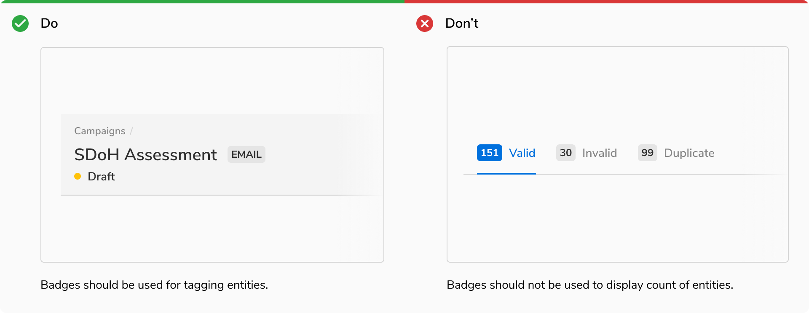

Badge contains short labels that help in 'tagging' entities. The container of a badge is rounded at the corners.
 
<Preview name='components-badge-solid-warning--solid-warning' />

### Appearances
A badge comes in **9 appearances** and **2 styles** each.

#### Solid style
Solid style is used to highlight important information on the page so that they can be recognized easily. Solid style helps the badge to easily pop out in a page.
<Preview name='components-badge-variants-appearance--appearance' />
 

#### Subtle style
Subtle style is used when a lot of entities on a single page need tagging/labeling. In that case, using solid badges becomes a bit overwhelming e.g. tags in a list. This is why subtle badges use the lightest shade of the colors.
<Preview name='components-badge-subtle-warning--subtle-warning' />

### Structure
 
 

 

 
 
<table style="width: 100%">
 <tbody>
  <tr>
    <th style="width:50%; text-align: left;">Property</th>
    <th style="width:50%; text-align: left;">Value(s)</th>
  </tr>
  <tr style="vertical-align: top">
    <td>Height</td>
    <td>20 px</td>
  </tr>
  <tr style="vertical-align: top">
      <td>Max width</td>
      <td>160 px</td>
  </tr>
  <tr style="vertical-align: top">
      <td>Corner radius</td>
      <td>4 px</td>
  </tr>
  <tr style="vertical-align: top">
      <td>Padding <em>(top, right, bottom, left)</em></td>
      <td>2 px, 4 px, 2 px, 4 px</td>
  </tr>
 </tbody>
</table>

 

### Configurations
 
 

<table style="width: 100%">
  <tbody>
    <tr>
      <th style="width:33%; text-align: left;">Property</th>
      <th style="width:33%; text-align: left;">Value(s)</th>
      <th style="width:33%; text-align: left;">Default value</th>
    </tr>
    <tr style="vertical-align: top">
      <td>Appearance</td>
      <td>
          <ul>
              <li>Stone</li>
              <li>Jal</li>
              <li>Neem</li>
              <li>Haldi</li>
              <li>Mirch</li>
              <li>Tawak</li>
              <li>Nimbu</li>
              <li>Neel</li>
              <li>Jamun</li>
          </ul>
      </td>
      <td>Stone</td>
    </tr>
    <tr style="vertical-align: top">
      <td>Subtle </td>
      <td>
          <ul>
              <li>True</li>
              <li>False</li>
          </ul>
      </td>
      <td>False</td>
    </tr>
  </tbody>
</table>
 

### Usage
 

#### Spacing between badges
Badges should maintain a **minimum spacing of 8px** from the content on either side.

<Caption> Spacing between badges </Caption>
 

#### Badges vs Pills
Badges are used for tagging entities while pills are used to display count of entities.

