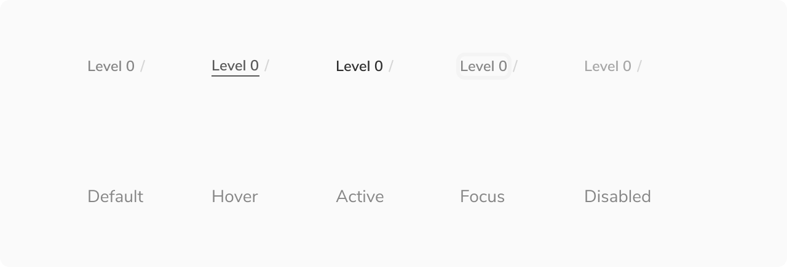

Breadcrumbs help users become aware of their current location with respect to the rest of the product/application. Breadcrumbs show the hierarchical progress from the highest entity level to the lowest.

As helpful as they are, breadcrumbs should never replace the main navigation on a page.

<Preview name="components-breadcrumbs-less-than-4-levels--less-than-4-levels" />

 

### States

Since the breadcrumb component is made up of the subtle link, you can change its state as per the requirement. Available states are - Default, Hover, Active, Focused, Disabled.

 

### Structure

 
 

 

<table style="width: 100%">
  <tbody>
    <tr>
      <th style="width:50%; text-align: left;">Property</th>
      <th style="width:50%; text-align: left;">Value(s)</th>
    </tr>
    <tr style="vertical-align: top">
      <td>
        Padding
         
        <em>(top, bottom)</em>
      </td>
      <td>4 px, 4 px</td>
    </tr>
    <tr style="vertical-align: top">
      <td>Max width</td>
      <td>160 px</td>
    </tr>
  </tbody>
</table>

 

### Configurations

 
 

<table style="width: 100%">
  <tbody>
    <tr>
      <th style="width:33%; text-align: left;">Property</th>
      <th style="width:33%; text-align: left;">Value(s)</th>
      <th style="width:33%; text-align: left;">Default value</th>
    </tr>
    <tr style="vertical-align: top">
      <td>
        Label
         
      </td>
      <td>&#60;label&#62;</td>
      <td>-</td>
    </tr>
    <tr style="vertical-align: top">
      <td>
        Link
         
      </td>
      <td>&#60;link&#62;</td>
      <td>-</td>
    </tr>
  </tbody>
</table>
 

### Usage

 

#### Showing more than 4 levels

By default, breadcrumbs can show upto 4 levels of hierarchy. For cases where there are more than 4 levels, only first and last breadcrumb is shown. The rest levels can be seen on clicking the menu button present in the middle.

<Preview name="components-breadcrumbs-more-than-4-levels--more-than-4-levels" />

#### Seeing the entire label

The max-width of the label is 160px, beyond that the text will truncate with '…'. The users can see the entire label on hover inside a tooltip.

<Caption> Entire label visible on hover inside a tooltip </Caption>
