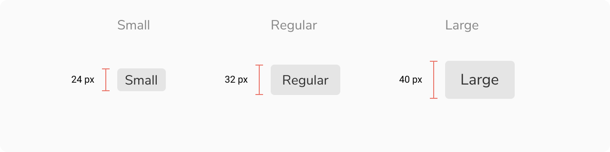
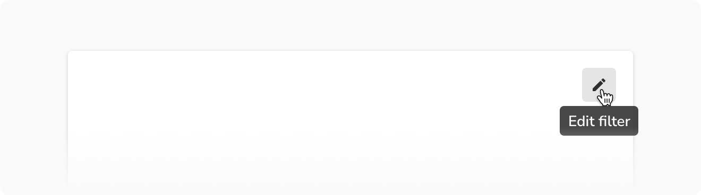
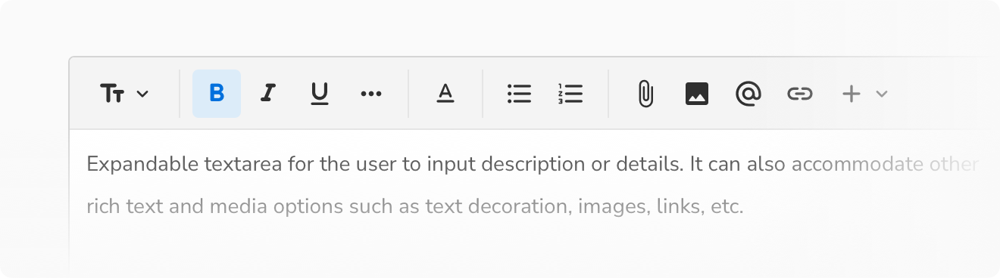

Buttons are one of the most crucial elements of a user interface. They are used to initiate actions and indicate what will happen after interacting with them. They can have varying looks basis on the prominence.
 

### Types
Buttons come in a lot of styles basis on the intent and prominence.

#### Basic button

Basic button is the simplest and the default style of the button. It is used the most across products. It provides a lightweight button style while still maintaining affordability. Use other styles if less or more visual weight is required.
<Preview name='components-button-basic-button--basic-button' />

#### Primary button
Primary button is used to draw attention towards the primary action on a page. It is recommneded to have just a single instance of primary button per page. If you think more than one primary action is needed, try to re-evaluate the priority of actions.
<Preview name='components-button-primary-button--primary-button' />

#### Alert button
Alert button indicates destructive actions that cannot be undone typically such as delete, discard, etc.
<Preview name='components-button-alert-button--alert-button' />

#### Transparent button
Transparent button indicates actions that are less important or less frequent.
<Preview name='components-button-transparent-button--transparent-button' />

#### Expanded button
Expanded button is used when the width of the button needs to match the parent. Use it sparingly as it takes a lot of space and attention.
<Preview name='components-button-expanded-button--expanded-button' />

#### Icon with label button
Icon with label adds additional visual cues in buttons. The icon can either precede the label or succeed it.

##### Icon in left
<Preview name='components-button-icon-left-button--icon-left-button' />

##### Icon in right
<Preview name='components-button-icon-right-button--icon-right-button' />

#### Icon button
Icon button only uses icons to indicate what the action would be. They come handy when there is a space constraint and the icon meaning is universal i.e. easy to understand such as print, edit, delete, etc.

It is recommended to show tooltip on hover so as to provide clarity on what the action would be.
<Preview name='components-button-icon-button--icon-button' />
 

### Appearances

Buttons come in **4 appearances** basis on their intent - basic, primary, alert and transparent. The only exception is the expanded button which does not support the 'transparent' appearance.
<Preview name='components-button-variants-appearance--appearance' />
 

### Sizes

Buttons come in **3 sizes** - small, regular and large.
<Preview name='components-button-variants-size--size' />
 

### States

Buttons come in **6 states** - default, hover, active, focus, disabled and loading. Buttons with basic and transparent appearance come with an additional **selected** state to mimic toggle behavior.
<Preview name='components-button-variants-state-primary--primary' />
 

### Structure 
 
 

 

<table style="width: 100%">
  <tbody>
    <tr>
      <th style="width:50%; text-align: left;">Property</th>
      <th style="width:50%; text-align: left;">Value(s)</th>
    </tr>
    <tr style="vertical-align: top">
      <td>Height</td>
      <td>
          <ul>
              <li>24 px <em>(Small)</em></li>
              <li>32 px <em>(Regular)</em></li>
              <li>40 px <em>(Large)</em></li>
          </ul>
      </td>
    </tr>
    <tr style="vertical-align: top">
      <td>Corner radius</td>
      <td>4 px</td>
    </tr>
  </tbody>
</table>
 

### Configurations
 
 

<table style="width: 100%">
  <tbody>
    <tr>
      <th style="width:33%; text-align: left;">Property</th>
      <th style="width:33%; text-align: left;">Value(s)</th>
      <th style="width:33%; text-align: left;">Default value</th>
    </tr>
    <tr style="vertical-align: top">
      <td>Appearance</td>
      <td>
          <ul>
              <li>Basic</li>
              <li>Primary</li>
              <li>Alert</li>
              <li>Transparent</li>
          </ul>
      </td>
      <td>Basic</td>
    </tr>
    <tr style="vertical-align: top">
      <td>Size</td>
      <td>
          <ul>
              <li>Small</li>
              <li>Regular</li>
              <li>Large</li>
          </ul>
      </td>
      <td>Regular</td>
    </tr>
    <tr style="vertical-align: top">
      <td>Icon <em>(optional)</em></td>
      <td>&#60;icon name&#62;</td>
      <td>-</td>
    </tr>
    <tr style="vertical-align: top">
      <td>Icon aligment </td>
      <td>
          <ul>
              <li>Left</li>
              <li>Right</li>
          </ul>
      </td>
      <td>Left</td>
    </tr>
    <tr style="vertical-align: top">
      <td>Expanded </td>
      <td>
          <ul>
              <li>True</li>
              <li>False</li>
          </ul>
      </td>
      <td>False</td>
    </tr>
  </tbody>
</table>
 

### Usage
 

#### Loading state inside a button
Buttons come with a loading state which can be used to indicate that the action clicked is in progress.
<Preview name='components-button-loader-in-button--loader-in-button' />

#### Tooltip on an icon button
Always use tooltip with icon buttons. It provides an additional way to indicate the meaning of the button. Keep the tooltip label concise.

<Caption>Show tooltip on an icon button</Caption>

 

#### Split button
Basic and icon buttons can be combined to create a split button. The split button provides a way to attach multiple options to an action. The spacing between the two buttons is 2px.
<Preview name='components-button-split-button--split-button' />

#### Toggle behavior
As mentioned earlier, in addition to the common 6 states, basic and transparent appearances also supports an additional **selected** state which can be used to mimic toggle behavior.

<Caption>Bold icon button in selected state</Caption>
 

#### Button groups
Multiple buttons of same type can be grouped in proximity to indicate related actions.

**Basic button group**
<Preview name='components-button-label-button-group--label-button-group' />

**Icon button group**
<Preview name='components-button-icon-button-group--icon-button-group' />