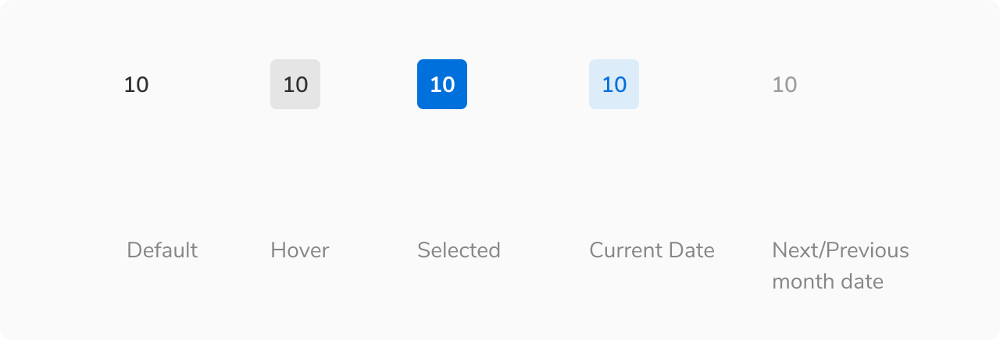
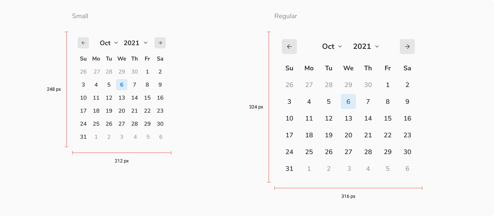
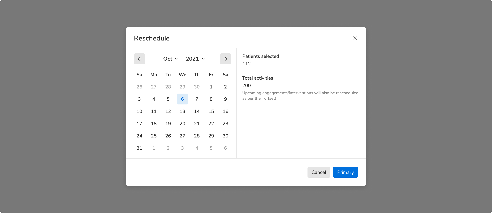

Calendar lets users select a date. The dates are arranged in a grid visually for familiarity and easy scanning. A calendar is always visible upfront on screen when used i.e. a date can be selected directly unlike a date picker where a date can be selected only after interacting with a trigger.
<Preview name="components-calendar-all--all" />

### Sizes
Calendar comes in **2 sizes** - small and regular.
<Preview name="components-calendar-variants-size--size" />

### States
A time entity in calendar (date, month, year) can come in different states -

 
 

### Structure
 
 

 

<table style="width: 100%">
  <tbody>
    <tr>
      <th style="width:50%; text-align: left;">Property</th>
      <th style="width:50%; text-align: left;">Value(s)</th>
    </tr>
    <tr style="vertical-align: top">
      <td>Size</td>
      <td>
          <ul>
              <li>248x212 px <em>(Small)</em></li>
              <li>324x316 px <em>(Regular)</em></li>
          </ul>
      </td>
    </tr>
    
  </tbody>
</table>
 

### Configurations
 
 

<table style="width: 100%">
  <tbody>
    <tr>
      <th style="width:33%; text-align: left;">Property</th>
      <th style="width:33%; text-align: left;">Value(s)</th>
      <th style="width:33%; text-align: left;">Default value</th>
    </tr>
    <tr style="vertical-align: top">
      <td>View</td>
      <td>
          <ul>
              <li>Month</li>
              <li>Year</li>
              <li>Decade</li>
          </ul>
      </td>
      <td>Month</td>
    </tr>
    <tr style="vertical-align: top">
      <td>Size</td>
      <td>
          <ul>
              <li>Small</li>
              <li>Regular</li>
          </ul>
      </td>
      <td>Regular</td>
    </tr>
  </tbody>
</table>
 

### Usage
#### Calendar vs. Date picker
Date picker is nothing but a calendar inside a popover and hence a trigger is always required to open it e.g. an input box. On the other hand, calendar is used as an inline component to show a view without additional triggers.

<Caption>Calendar is used inline</Caption>
 
 

#### Date with an event
Specific date can be highlighted to show that there is an event on that particular day.
<Preview name="components-calendar-variants-date-with-events--date-with-events"/>
