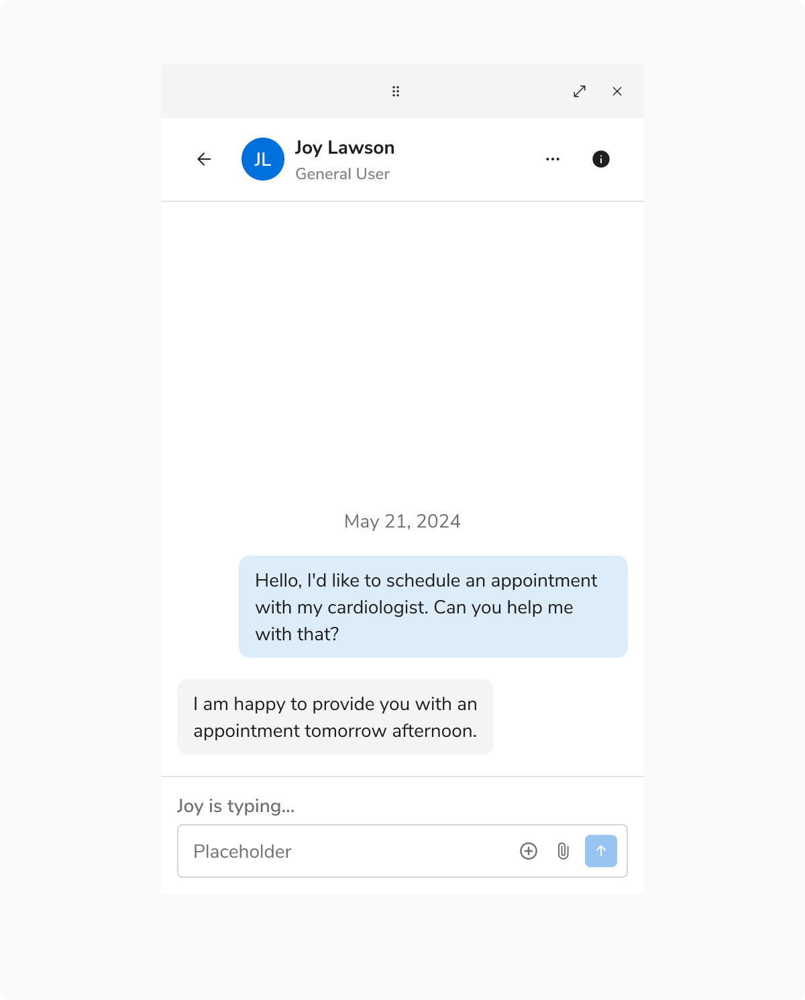

There are **4 chat ancillary components** - Chat Separator for Date, Chat Separator for Unread Messages, Chat Separator for New Messages and Typing Indicator.

### Chat Separator

#### Date

The date separator shows the date of a conversation.

<Caption>Chat Separator - Date</Caption>

 

#### Unread Messages

The unread messages separator displays the total count of unread messages and serves as a quick navigation link, directing you to the oldest unread message when clicked.

<Caption>Chat Separator - Unread Messages</Caption>

 

#### New Messages

The new messages separator marks your new messages.

<Caption>Chat Separator - New Messages</Caption>

 

### Typing Indicator

Typing indicator displays who is typing.

<Caption>Typing Indicator</Caption>

 

### Usage

#### Overflow in Typing Indicator

It is recommended to display up to three names in the typing indicator. For more than three, show two names followed by "and others typing."

![ Three [Left] and More than three [Right]](./images/overflow-typing-indicator.png)
<Caption> Three [Left] and More than three [Right]</Caption>

 

#### New Message Disappearance

The "New Message" separator disappears when navigating away from and returning to the conversation page.
