Chat bubble facilitates fluid exchange of information.

<Preview name="components-chat-chatbubble-bubble-types--bubble-types" />

### Types

There are two types of chat messages: Outgoing Message and Incoming Message.

#### Outgoing Message

An outgoing message is sent by the user, right-aligned and styled to differentiate from incoming messages, often including a timestamp and status indicator.

<Preview name="components-chat-chatbubble-outgoing-all--all" />

#### Incoming Message

An incoming message is received by the user, typically left-aligned and styled to distinguish it from outgoing messages, often including a timestamp and sender information.

<Preview name="components-chat-chatbubble-incoming-all--all" />

### Variants

#### Outgoing Message

##### Default

This variant comes with just a message bubble.

<Preview name="components-chat-chatbubble-outgoing-default-message--default-message" />

##### With Metadata

This variant includes a message bubble and metadata for showing timestamp, meta item and urgency of the message.

<Preview name="components-chat-chatbubble-outgoing-all--all" />

#### Incoming Message

##### Default

This variant comes with just a message bubble.

<Preview name="components-chat-chatbubble-incoming-default-message--default-message" />

##### With Metadata

This variant includes a message bubble and metadata for showing timestamp, meta item and urgency of the message.

<Preview name="components-chat-chatbubble-incoming-with-metadata--with-metadata" />

##### With Avatar and Metadata

This variant includes a message bubble, avatar and metadata for showing timestamp, meta item and urgency of the message.

<Preview name="components-chat-chatbubble-incoming-all--all" />

### Structure

#### Outgoing Message

##### Default

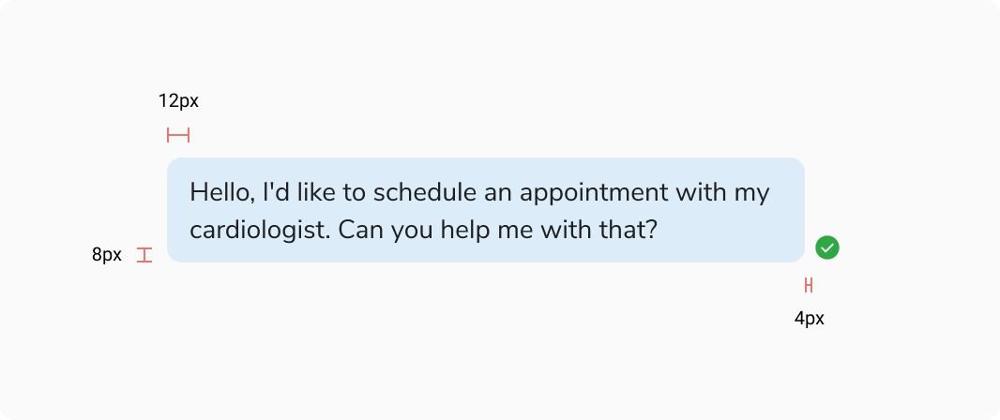
<Caption>Structure - Outgoing Message - Default</Caption>

<table style={{width: "100%"}}>
  <tbody>
    <tr>
      <th style={{width:"50%",  textAlign: "left"}}>Property</th>
      <th style={{width:"50%",  textAlign: "left"}}>Value(s)</th>
    </tr>
    <tr style={{verticalAlign: "top"}}>
      <td>Padding (left, right)</td>
      <td>12px, 12px</td>
    </tr>
    <tr style={{verticalAlign: "top"}}>
      <td>Padding (top, bottom)</td>
      <td>8px, 8px</td>
    </tr>
    <tr style={{verticalAlign: "top"}}>
      <td>Spacing between status and bubble</td>
      <td>4px</td>
    </tr>
  </tbody>
</table>
 

##### With Metadata

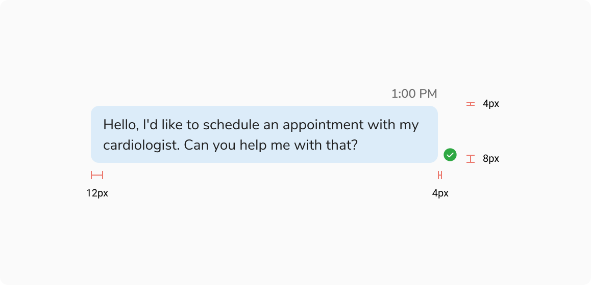
<Caption>Structure - Outgoing Message - With Metadata</Caption>

<table style={{width: "100%"}}>
  <tbody>
    <tr>
      <th style={{width:"50%",  textAlign: "left"}}>Property</th>
      <th style={{width:"50%",  textAlign: "left"}}>Value(s)</th>
    </tr>
    <tr style={{verticalAlign: "top"}}>
      <td>Padding (left, right)</td>
      <td>12px, 12px</td>
    </tr>
    <tr style={{verticalAlign: "top"}}>
      <td>Padding (top, bottom)</td>
      <td>8px, 8px</td>
    </tr>
    <tr style={{verticalAlign: "top"}}>
      <td>Spacing between metadata and bubble</td>
      <td>4px</td>
    </tr>
    <tr style={{verticalAlign: "top"}}>
      <td>Spacing between status and bubble</td>
      <td>4px</td>
    </tr>
  </tbody>
</table>
 

#### Incoming Message

##### Default

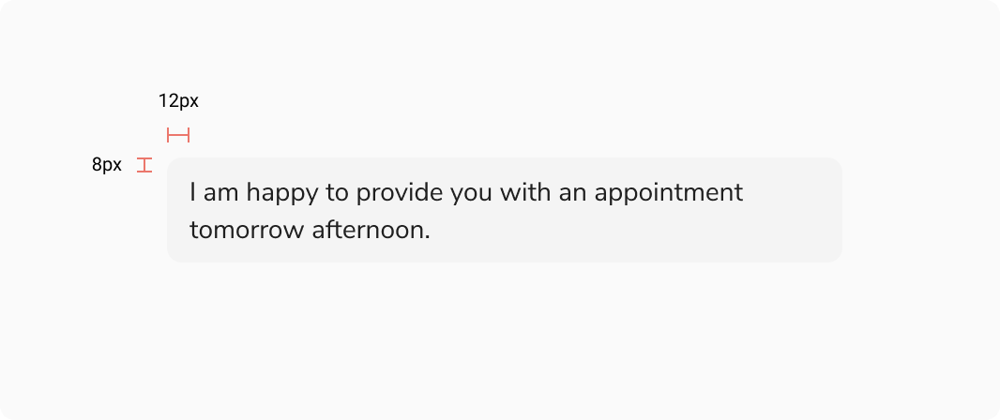
<Caption>Structure - Incoming Message - Default</Caption>

<table style={{width: "100%"}}>
  <tbody>
    <tr>
      <th style={{width:"50%",  textAlign: "left"}}>Property</th>
      <th style={{width:"50%",  textAlign: "left"}}>Value(s)</th>
    </tr>
    <tr style={{verticalAlign: "top"}}>
      <td>Padding (left, right)</td>
      <td>12px, 12px</td>
    </tr>
    <tr style={{verticalAlign: "top"}}>
      <td>Padding (top, bottom)</td>
      <td>8px, 8px</td>
    </tr>
  </tbody>
</table>
 

##### With Metadata

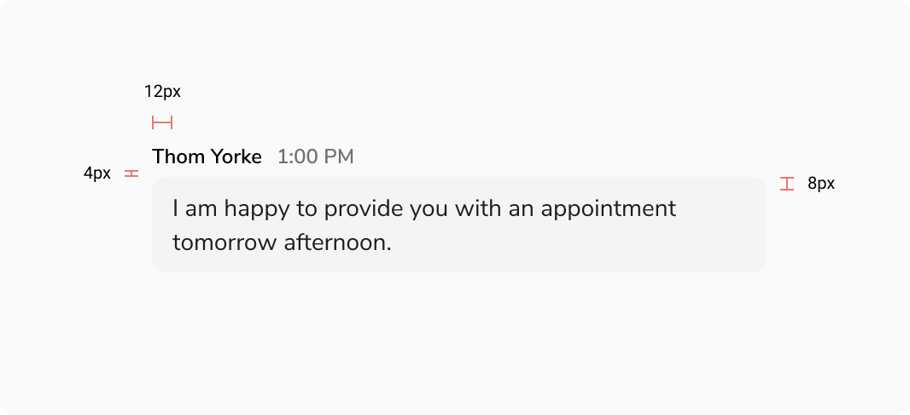
<Caption>Structure - Incoming Message - With Metadata</Caption>

<table style={{width: "100%"}}>
  <tbody>
    <tr>
      <th style={{width:"50%",  textAlign: "left"}}>Property</th>
      <th style={{width:"50%",  textAlign: "left"}}>Value(s)</th>
    </tr>
    <tr style={{verticalAlign: "top"}}>
      <td>Padding (left, right)</td>
      <td>12px, 12px</td>
    </tr>
    <tr style={{verticalAlign: "top"}}>
      <td>Padding (top, bottom)</td>
      <td>8px, 8px</td>
    </tr>
    <tr style={{verticalAlign: "top"}}>
      <td>Spacing between metadata and bubble</td>
      <td>4px</td>
    </tr>
  </tbody>
</table>
 

##### With Avatar and Metadata

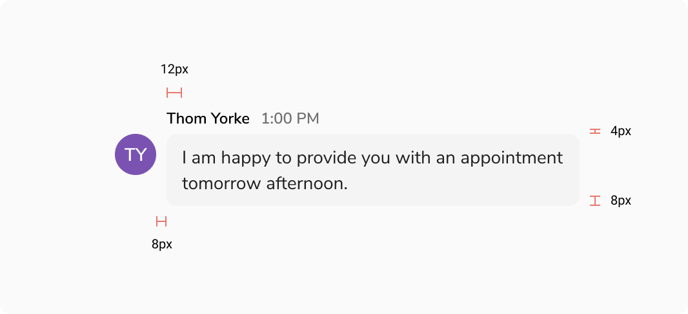
<Caption>Structure - Incoming Message - With Avatar and Metadata</Caption>

<table style={{width: "100%"}}>
  <tbody>
    <tr>
      <th style={{width:"50%",  textAlign: "left"}}>Property</th>
      <th style={{width:"50%",  textAlign: "left"}}>Value(s)</th>
    </tr>
    <tr style={{verticalAlign: "top"}}>
      <td>Padding (left, right)</td>
      <td>12px, 12px</td>
    </tr>
    <tr style={{verticalAlign: "top"}}>
      <td>Padding (top, bottom)</td>
      <td>8px, 8px</td>
    </tr>
    <tr style={{verticalAlign: "top"}}>
      <td>Spacing between metadata and bubble</td>
      <td>4px</td>
    </tr>
    <tr style={{verticalAlign: "top"}}>
      <td>Spacing between avatar and bubble</td>
      <td>8px</td>
    </tr>
  </tbody>
</table>
 

### Configurations

#### Outgoing Message

<table style={{width: "100%"}}>
  <tbody>
    <tr>
      <th style={{width:"33%", textAlign: "left"}}>Property</th>
      <th style={{width:"33%", textAlign: "left"}}>Value(s)</th>
      <th style={{width:"33%", textAlign: "left"}}>Default value</th>
    </tr>
    <tr style={{verticalAlign: "top"}}>
      <td>Actions (optional)</td>
      <td>
        <ul>
          <li>True</li>
          <li>False</li>
        </ul>
      </td>
      <td>True</td>
    </tr>
    <tr style={{verticalAlign: "top"}}>
      <td>Status (optional)</td>
      <td>
        <ul>
          <li>True</li>
          <li>False</li>
        </ul>
      </td>
      <td>True</td>
    </tr>
  </tbody>
</table>
 

#### Incoming Message

<table style={{width: "100%"}}>
  <tbody>
    <tr>
      <th style={{width:"33%", textAlign: "left"}}>Property</th>
      <th style={{width:"33%", textAlign: "left"}}>Value(s)</th>
      <th style={{width:"33%", textAlign: "left"}}>Default value</th>
    </tr>
    <tr style={{verticalAlign: "top"}}>
      <td>Actions (optional)</td>
      <td>
        <ul>
          <li>True</li>
          <li>False</li>
        </ul>
      </td>
      <td>True</td>
    </tr>
  </tbody>
</table>
 

### Behaviour

#### Sending State of Outgoing Message

While in the sending state, the outgoing message displays an opacity of 48% to indicate that it has not yet been delivered.

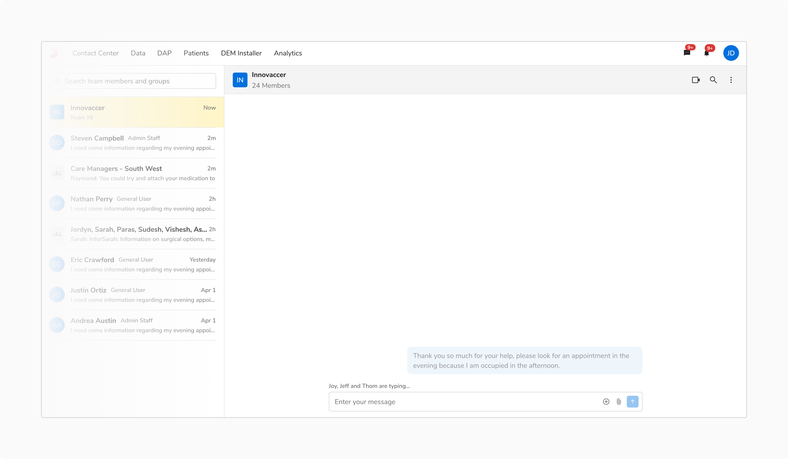
<Caption>Sending State of Outgoing Message</Caption>

#### Error State of Outgoing Message

If the outgoing message fails, you can attempt to resend it by retrying.

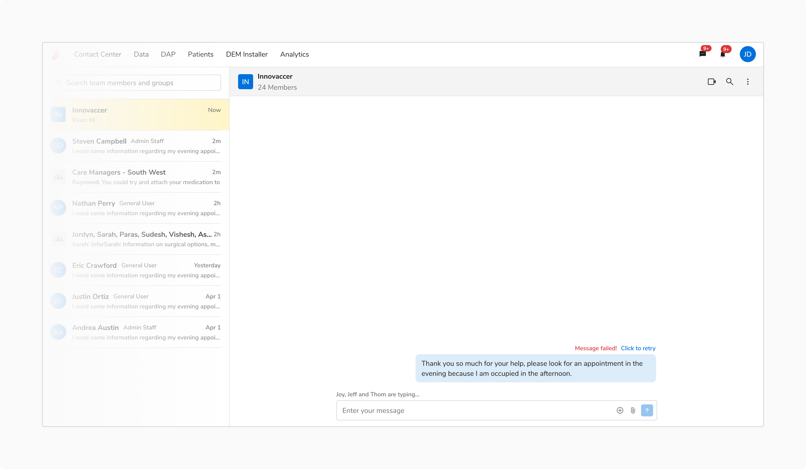
<Caption>Error State of Outgoing Message</Caption>

#### Urgent Message

It is recommended to tag a message urgent to bring attention to it. An urgent message within a thread will interrupt the conversation flow, categorizing it as a distinct entity separate from the ongoing discussion.

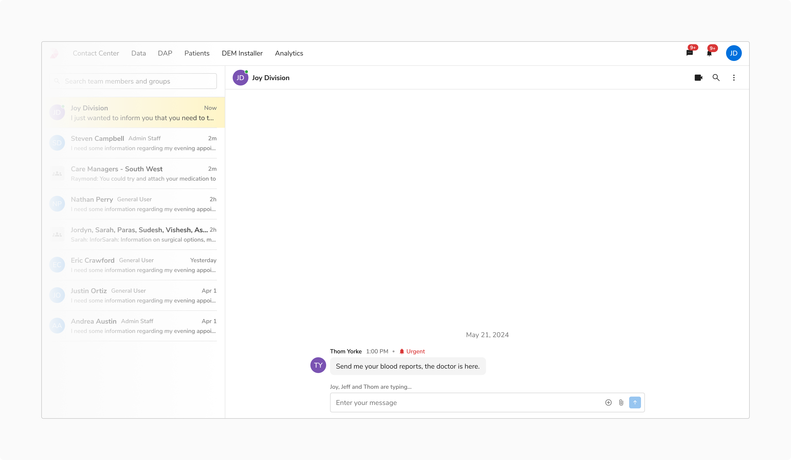
<Caption>Urgent Message</Caption>

#### Showing Actions on Hover

You can show actions relevant to a chat bubble on hover.

<Preview name="components-chat-chatbubble-incoming-with-action-bar--with-action-bar" />

#### Message Entry Guideline for Chat Bubble

**Message Grouping Logic**

<ul>
  <li>Messages sent within **less than 5 minutes** of each other will be grouped together and treated as a single conversation thread.</li>
  <li>If the time interval between consecutive messages is **5 minutes or more**, it will be considered a new entry. </li>
</ul>

**Timestamp Display**

<ul>
  <li>For messages grouped in the same thread, display the timestamp only for the first message.</li>
  <li>For new message entries, display a timestamp at the start of the entry to indicate the time gap.</li>
</ul>

**Note:** In both the cases, the status is shown for the last message, indicating that all previous messages in the thread have been delivered.

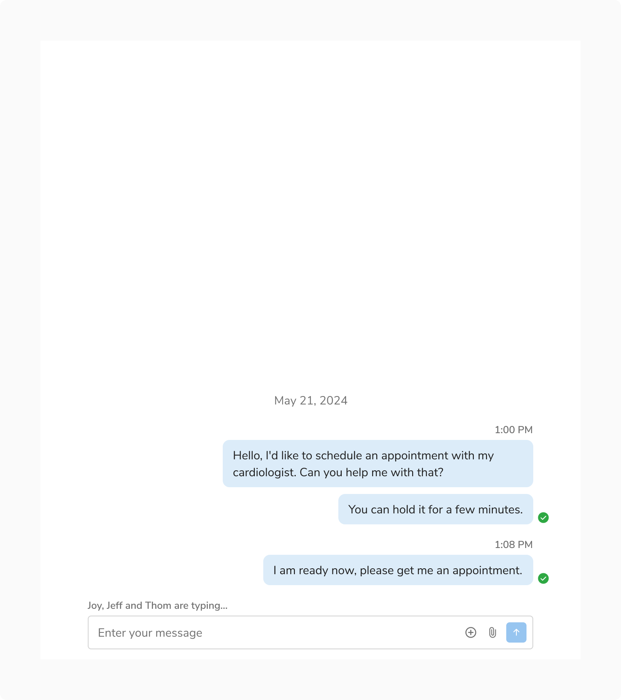
<Caption>New Message Interval</Caption>

### Usage

#### Custom Chat Message

Chat messages are highly customizable and can incorporate a wide range of components to meet diverse use cases.

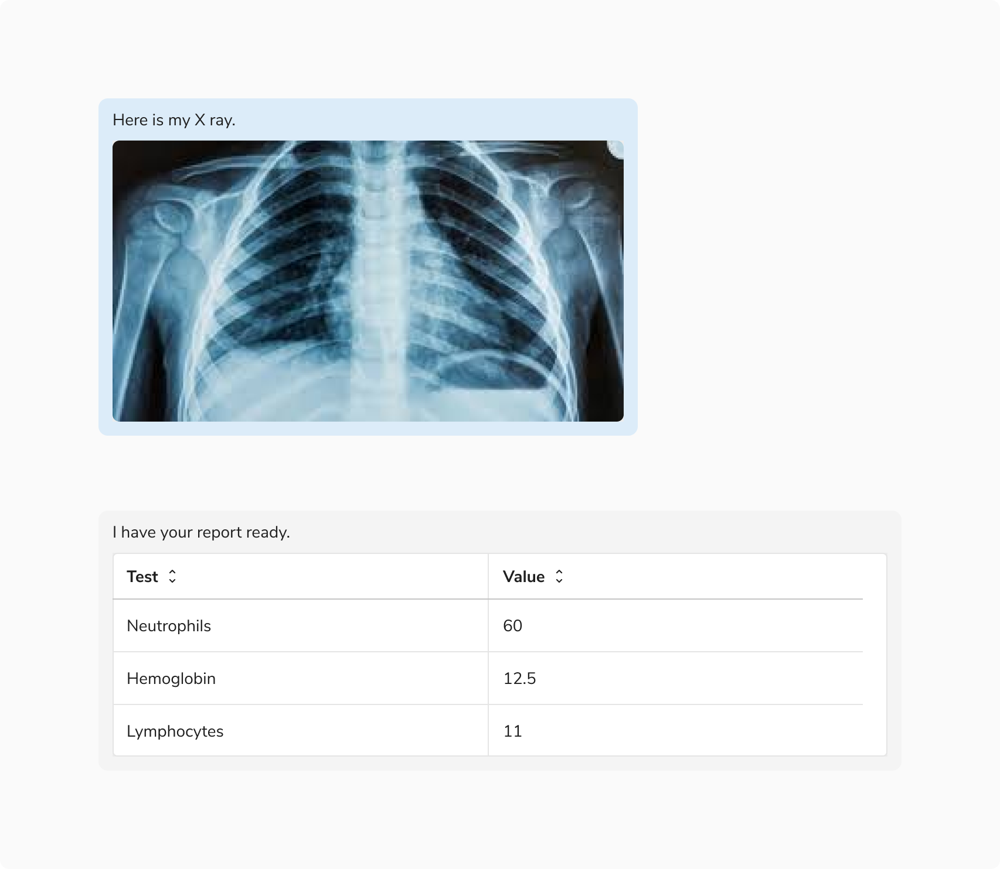
<Caption>Custom Chat Message</Caption>

 

#### Forwarding Messages

It is recommended to use a modal for forwarding messages.

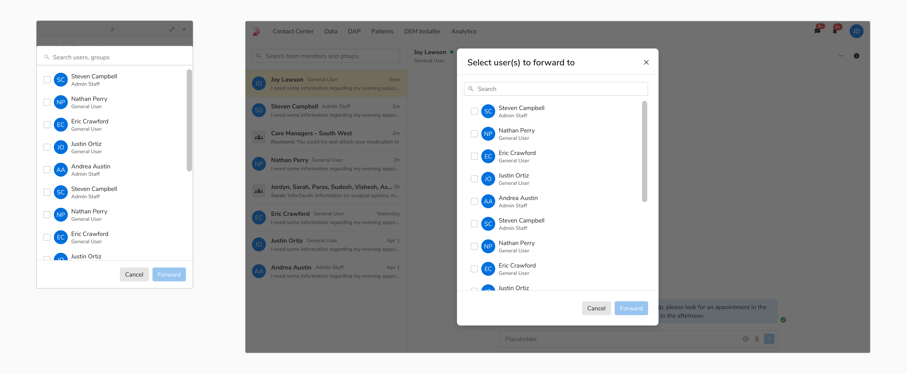
<Caption>Forwarding Messages using a modal</Caption>

 

#### Avatars and Status in Case of a Space Constraint

It is recommended to avoid showing avatars and status in case of a space constraint.

<Caption>Avoid Showing Avatars and Status in Case of a Space Constraint</Caption>

 

 

#### Timestamp for Time Critical Events

It is recommended to display the message timestamp for handling time critical scenarios effectively.
