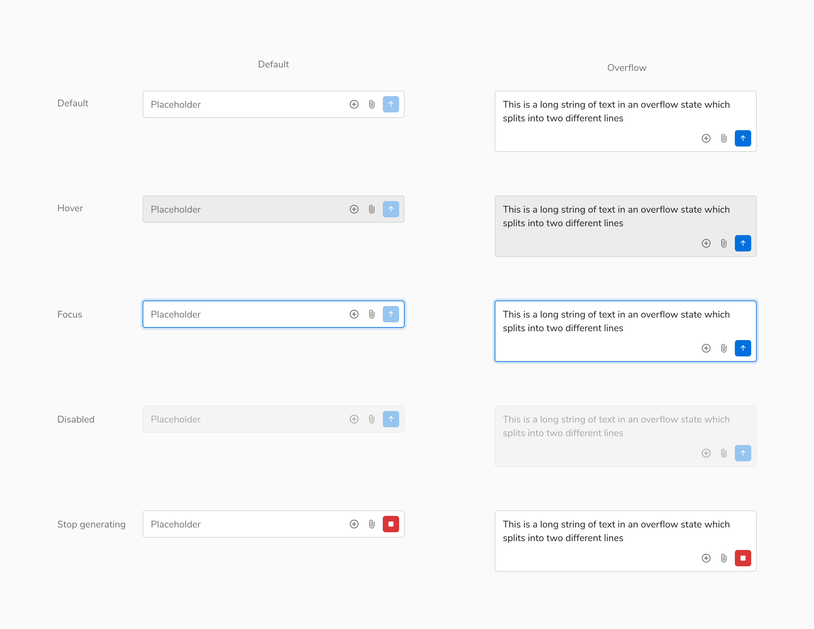

Chat input allows users to effortlessly transmit information. 

<Preview name="components-chat-chatinput-all--all" />

### States

Chat input has **5 states:** Default, hover, focus, disabled and stop generating.

<Caption>States</Caption>

 

### Structure

#### Default

 

<table style={{width: "100%"}}>
  <tbody>
    <tr>
      <th style={{width:"50%",  textAlign: "left"}}>Property</th>
      <th style={{width:"50%",  textAlign: "left"}}>Value(s)</th>
    </tr>
    <tr style={{verticalAlign: "top"}}>
      <td>Padding (left, right, top, bottom)</td>
      <td>8px</td>
    </tr>
    <tr style={{verticalAlign: "top"}}>
      <td>Spacing between typing indicator and input</td>
      <td>4px</td>
    </tr>
    <tr style={{verticalAlign: "top"}}>
      <td>Spacing between secondary actions</td>
      <td>2px</td>
    </tr>
    <tr style={{verticalAlign: "top"}}>
      <td>Spacing between secondary actions and primary action</td>
      <td>4px</td>
    </tr>
  </tbody>
</table>
 

<Caption>Structure - Default</Caption>

 

#### Overflow

 

<table style={{width: "100%"}}>
  <tbody>
    <tr>
      <th style={{width:"50%",  textAlign: "left"}}>Property</th>
      <th style={{width:"50%",  textAlign: "left"}}>Value(s)</th>
    </tr>
    <tr style={{verticalAlign: "top"}}>
      <td>Max height</td>
      <td>176px</td>
    </tr>
    <tr style={{verticalAlign: "top"}}>
      <td>Min width</td>
      <td>256px (Customizable)</td>
    </tr>
  </tbody>
</table>
 

<Caption>Structure - Overflow</Caption>

 

### Configurations

 

<table style={{width: "100%"}}>
  <tbody>
    <tr>
      <th style={{width:"33%", textAlign: "left"}}>Property</th>
      <th style={{width:"33%", textAlign: "left"}}>Value(s)</th>
      <th style={{width:"33%", textAlign: "left"}}>Default value</th>
    </tr>
    <tr style={{verticalAlign: "top"}}>
      <td>Placeholder</td>
      <td>>&#60;placeholder&#62;</td>
      <td>-</td>
    </tr>
    <tr style={{verticalAlign: "top"}}>
      <td>Secondary Actions (Customizable)</td>
      <td>
        <ul>
          <li>True</li>
          <li>False</li>
        </ul>
      </td>
      <td>True</td>
    </tr>
  </tbody>
</table>

 

### Usage

#### Secondary Actions

Secondary actions provide you with the ability to have any type of additional actions that you may require to enhance the chat experience. You can only have icon buttons as secondary actions.

<Caption>Secondary Actions</Caption>

 

#### Using Typing Indicator

Typing indicator will only show up when having a conversation with another person.

Note: There will be no typing indicator when having a conversation with our AI chatbot.

![With typing indicator [Left], Without typing indicator [Right]](./images/typing-indicator.png)
<Caption>With typing indicator [Left], Without typing indicator [Right]</Caption>
