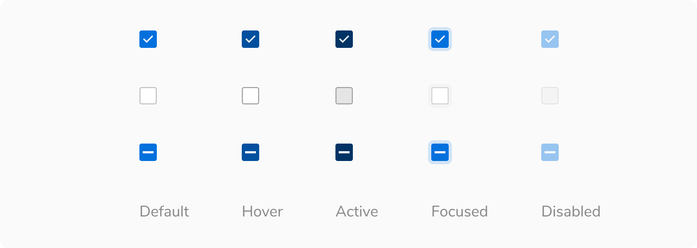
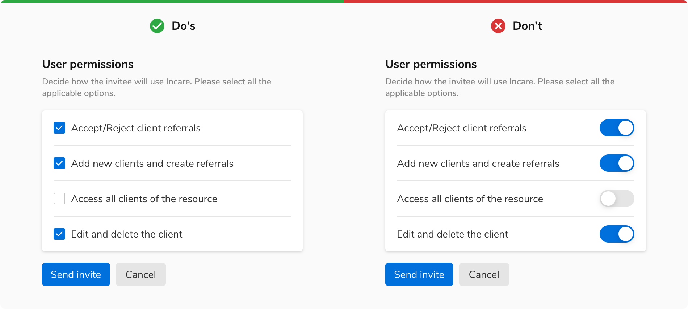
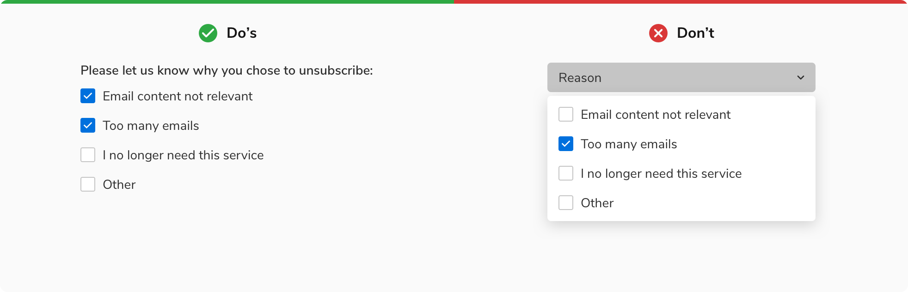

Checkboxes lets users select one or more values from a list of options. Options are not mutually exclusive here so the selection of any option won’t affect the other.

### Variants
 

#### Default
The default variant comes with a checkbox control and a label, to cater most of the use cases. This entire combination of checkbox control and label is clickable to change the checkbox selection.
<Preview name="components-checkbox-default-checkbox--default-checkbox" />

#### With help text
A checkbox can have a help text below the label to provide additional information about that particular option. The help text will always be aligned to the label. Clicking over the help text will not change the state of checkbox.
<Preview name="components-checkbox-with-help-text--with-help-text" />

### Sizes
Checkbox comes in two sizes - regular and tiny.
<Preview name="components-checkbox-variants-size--size"/>

### States
 

#### Selection States
Checkbox has three selection states - checked, unchecked and indeterminate.

 

#### Interactive States
Checkbox has five interactive states - default, hover, active, focus and disabled.

 
 

### Properties
<table style="width: 100%">
  <tr>
    <th style="width:33%; text-align: left;">Property</th>
    <th style="width:33%; text-align: left;">Value(s)</th>
    <th style="width:33%; text-align: left;">Default value</th>
  </tr>
  <tr style="vertical-align: top">
    <td>Size</td>
    <td>
        <ul>
            <li>Regular</li>
            <li>Tiny</li>
        </ul>
    </td>
    <td>Regular</td>
  </tr>
  <tr style="vertical-align: top">
    <td>Label <em>(optional)</em></td>
    <td>&#60;label&#62;</td>
    <td>-</td>
  </tr>
  <tr style="vertical-align: top">
    <td>Help text <em>(optional)</em></td>
    <td>&#60;help text&#62;</td>
    <td>-</td>
  </tr>
  <tr style="vertical-align: top">
    <td>Spacing between checkbox control and label</td>
    <td>8px</td>
    <td>-</td>
  </tr>
</table>
 

### Usage
 

#### Checkbox Group
Checkbox group is a list of multiple standalone checkboxes with a group label on the top.

**Note**: Multiple checkboxes should have a minimum of 8px spacing in between.
<Preview name="components-checkbox-checkbox-group--checkbox-group"/>

#### Alignment
A group of checkboxes can be aligned either **vertically** or **horizontally**. However, it is advisable to stack the checkboxes vertically with one option in a line for easier reading and scanning. If you need to use them horizontally, make sure to space the options appropriately so that it is clear which control goes with which label.
<Preview name="components-checkbox-checkbox-group--checkbox-group"/>

#### Nesting
Checkboxes can be nested in case of a list having sub-sections. The parent remains unchecked if no child is checked. 

Indeterminate state of the parent shows a partially checked state when there is a nested relationship. The parent checkbox will remain indeterminate until some of its children checkboxes are checked.
<Preview name="components-checkbox-nested-checkboxes--nested-checkboxes" />

#### Overflow Behavior
If the label or the help text with the checkbox overflows, wrap it to the next line but make sure that the control and the label are top aligned.
<Preview name="components-checkbox-overflow-behavior--overflow-behavior" />

#### Checkbox vs. Radio
Radio buttons allow only one selection from a list of mutually exclusive options whereas checkboxes allow users to select multiple options.

#### Checkbox vs. Switch
Checkbox should be considered instead of a switch when a confirmation action is required to apply the changes. For example in forms etc.

 

#### Checkbox vs. Dropdown
Checkboxes should be used when there are fewer than 5 options as they are easy to scan and save an additional click of opening a dropdown.

However, if the number of options exceeds 5 or if the space is limited then it is recommended to use dropdowns.

 
