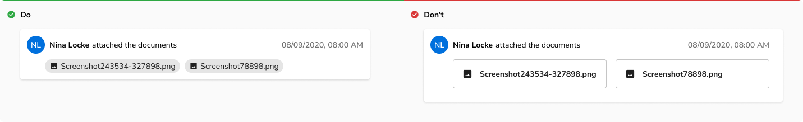
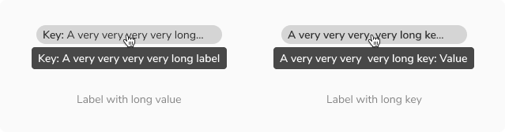

Chips are compact interactive elements that allow users to make selections, filter content, or trigger actions. Since they mostly appear in a group, they are compact in size and come to the rescue when regular components are either too overwhelming (e.g. buttons for selection) or too underwhelming (e.g. dropdowns for applied filters).
 

### Types
 

#### Selection Chip

Selection chips are used to let the users select one or many options from a group and the effect is immediate. Do not provide a single option for selection.

For example - applying filters on a page. In that case, as soon as a selection chip is clicked, the filtered results are shown.

<Caption>Example of selection chips</Caption>

#### Action Chip

Action chips are used when there is a group of related actions to perform. These actions are dynamic and contextual to the content. Buttons can’t be used in this case as they should be used for persistent and consistent actions only.

<Caption>Example of action chips</Caption>

#### Input Chip

Input chips are used inside the inputs to behave as removable entries or tags.

<Caption>Example of input chips</Caption>

 

### Variants

#### With Icon

Chips can have an optional icon on the left preceding the label.

<Caption>with icon on left</Caption>

#### With Remove Button

Selection and input chips can have a remove button on the right of the label to remove them from a view.

<Caption>Chips with remove button</Caption>

 

### States
Chips come in **5 states**: default, hover, focus, disabled, and active states. In addition to the aforementioned states, the selection chip also has the selected-default, selected-hover, selected-focus, selected-disabled, selected-active state.

<Caption>Various states of chips</Caption>

### Structure

<table style={{width: "100%"}}>
  <tbody>
    <tr>
      <th style={{width:"50%",  textAlign: "left"}}>Property</th>
      <th style={{width:"50%",  textAlign: "left"}}>Value(s)</th>
    </tr>
    <tr style={{verticalAlign: "top"}}>
      <td>Height</td>
      <td>24 px</td>
    </tr>
    <tr style={{verticalAlign: "top"}}>
      <td>Padding (left)</td>
      <td>8px</td>
    </tr>
    <tr style={{verticalAlign: "top"}}>
      <td>Padding (right)</td>
      <td>
        <ul>
          <li>With remove button - 2px</li>
          <li>Without remove button - 8px</li>
        </ul>
      </td>
    </tr>
    <tr style={{verticalAlign: "top"}}>
      <td>Border</td>
      <td>1px</td>
    </tr>
    <tr style={{verticalAlign: "top"}}>
      <td>Corner radius</td>
      <td>12 px</td>
    </tr>
  </tbody>
</table>
 

### Configurations

#### Selection Chip

 

<table style={{width: "100%"}}>
  <tbody>
    <tr>
      <th style={{width:"33%", textAlign: "left"}}>Property</th>
      <th style={{width:"33%", textAlign: "left"}}>Value(s)</th>
      <th style={{width:"33%", textAlign: "left"}}>Default value</th>
    </tr>
    <tr style={{verticalAlign: "top"}}>
      <td>Label </td>
      <td>&#60;label&#62;</td>
      <td>-</td>
    </tr>
    <tr style={{verticalAlign: "top"}}>
      <td>Left icon <em>(optional)</em></td>
      <td>&#60;icon name&#62;</td>
      <td>-</td>
    </tr>
    <tr style={{verticalAlign: "top"}}>
      <td>Remove button  <em>(optional)</em></td>
      <td>&#60;close&#62;</td>
      <td>-</td>
    </tr>
    <tr style={{verticalAlign: "top"}}>
      <td>Max width </td>
      <td>&#60;max width&#62;</td>
      <td>256px (Customizable)</td>
    </tr>
  </tbody>
</table>

 

#### Action Chip

 

<table style={{width: "100%"}}>
  <tbody>
    <tr>
      <th style={{width:"33%", textAlign: "left"}}>Property</th>
      <th style={{width:"33%", textAlign: "left"}}>Value(s)</th>
      <th style={{width:"33%", textAlign: "left"}}>Default value</th>
    </tr>
    <tr style={{verticalAlign: "top"}}>
      <td>Label </td>
      <td>&#60;label&#62;</td>
      <td>-</td>
    </tr>
    <tr style={{verticalAlign: "top"}}>
      <td>Left icon <em>(optional)</em></td>
      <td>&#60;icon name&#62;</td>
      <td>-</td>
    </tr>
    <tr style={{verticalAlign: "top"}}>
      <td>Max width </td>
      <td>&#60;max width&#62;</td>
      <td>256px (Customizable)</td>
    </tr>
  </tbody>
</table>

 

#### Input Chip

 

<table style={{width: "100%"}}>
  <tbody>
    <tr>
      <th style={{width:"33%", textAlign: "left"}}>Property</th>
      <th style={{width:"33%", textAlign: "left"}}>Value(s)</th>
      <th style={{width:"33%", textAlign: "left"}}>Default value</th>
    </tr>
    <tr style={{verticalAlign: "top"}}>
      <td>Label </td>
      <td>&#60;label&#62;</td>
      <td>-</td>
    </tr>
    <tr style={{verticalAlign: "top"}}>
      <td>Left icon <em>(optional)</em></td>
      <td>&#60;icon name&#62;</td>
      <td>-</td>
    </tr>
    <tr style={{verticalAlign: "top"}}>
      <td>Remove button  <em>(optional)</em></td>
      <td>&#60;close&#62;</td>
      <td>-</td>
    </tr>
    <tr style={{verticalAlign: "top"}}>
      <td>Max width </td>
      <td>&#60;max width&#62;</td>
      <td>256px (Customizable)</td>
    </tr>
  </tbody>
</table>

 

### Usage

#### Selection vs Input vs Action Chips

 

<table style={{width: "100%"}}>
  <tbody>
    <tr>
      <th style={{width:"33%", textAlign: "left"}}>Type</th>
      <th style={{width:"33%", textAlign: "left"}}>Usage</th>
      <th style={{width:"33%", textAlign: "left"}}>Behaviour</th>
    </tr>
    <tr>
      <td style={{width:"33%", textAlign: "left"}}>Selection chip</td>
      <td style={{width:"33%", textAlign: "left"}}>Used to select from many options</td>
      <td style={{width:"33%", textAlign: "left"}}>Removable</td>
    </tr>
    <tr>
      <td style={{width:"33%", textAlign: "left"}}>Action chip</td>
      <td style={{width:"33%", textAlign: "left"}}>To perform actions related to the primary content</td>
      <td style={{width:"33%", textAlign: "left"}}>Non-removable</td>
    </tr>
    <tr>
      <td style={{width:"33%", textAlign: "left"}}>Input chip</td>
      <td style={{width:"33%", textAlign: "left"}}>To behave as removable tags in inputs</td>
      <td style={{width:"33%", textAlign: "left"}}>Removable</td>
    </tr>
  </tbody>
</table>

 

#### Chip vs Badge

Chips are used for selection/actions, quick filtering, and offering removable options whereas badges are just used for labeling entities and are not actionable.

![[Left] Chip vs [Right] Badge](./images/07-Chips-vs-Badge.png)
<Caption>[Left] Chip vs [Right] Badge</Caption>

 

#### Selection Chip vs Radio/checkbox

Selection chips generally provide an immediate response but if there is a space crunch  in forms, they can replace radio and checkboxes in order to display all the available options in a compact area.

**Note:** In the example below using selection chips instead of radio and checkboxes saves a lot of space.

![Using [Left] Selection chip vs [Right] Radio/Checkbox in forms](./images/checkbox.png)
<Caption>Using [Left] Selection chip vs [Right] Radio/Checkbox in forms</Caption>

 

#### Action Chips vs Buttons

The number and label of action chips are contextual to the content and appear dynamically as a group of interactive elements, while buttons are expected to appear consistently and are persistent.

![[Left] Action chip vs [Right] Buttons](./images/09-Action-chip.png)
<Caption>[Left] Action chip vs [Right] Buttons</Caption>

 

#### Chips vs Interactive Cards

Chips are used for simpler options whereas interactive cards are used for descriptive options that need better categorization. 

<Caption>Chips vs Interactive cards</Caption>

 

#### Overflow Behavior in Chips

Chip label is by default truncated at the width of 256px which can be customized based on the use case. The truncated label can be seen inside a tooltip on hover. 

<Caption>Overflow behavior in chips</Caption>

<Caption>Overflow behavior in chips with a custom label</Caption>

 

#### Text Styling

Text inside the chips can be styled to highlight some information. 

For example - In table, the column name and the separator in the filter chip label are highlighted using a heavier text than the text showing the value of the filter. 

<Caption>Configured text style in chips’ label</Caption>
