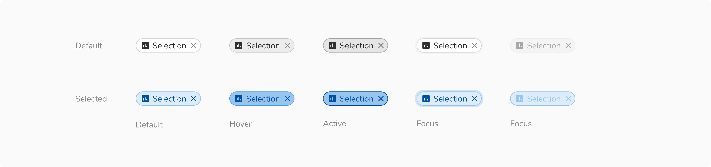
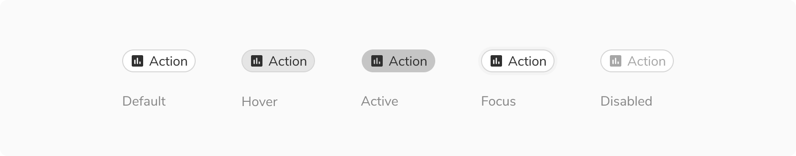
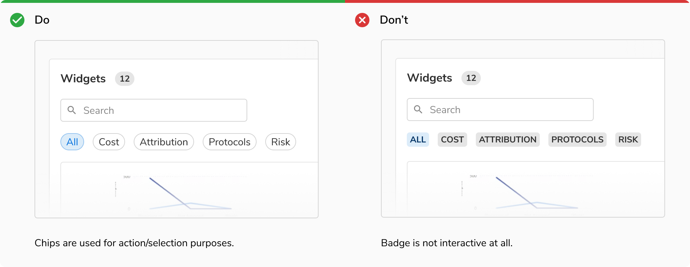

Chips are compact components that appear in a group. Since they appear in a group, they are compact in size and come to the rescue when regular components are either too overwhelming (e.g. buttons for selection) or too underwhelming (e.g. dropdowns for applied filters).
 

### Types
 

#### Selection chips
Selection chips are used to let the users select one or many options from a group and the effect is immediate. For example - applying filters on a page. In that case, as soon as a filter chip is clicked, the filtered results are shown.
<Preview name="components-chip-selection--selection" />
 

#### Action chips
Action chips are used when there is a group of related actions to perform. These actions are contextual and dynamic. Buttons can't be used in this case as they should be used for persistent and consistent actions only.
<Preview name="components-chip-action-chip--action-chip" />
 

#### Input chips
Input chips are used inside inputs to behave as removable entries or tags.
<Preview name="components-chip-input--input" />
 

### States
 

#### Selection chip
Selection chips has **five states** - default, hover, active, focus and disabled.

 

#### Action chip
Action chips has seven states - default, hover, active, focus and disabled.

 

#### Input chip
Input chips has seven states - default, hover, focus and disabled.

 
 

### Structure
 
 

 

<table style="width: 100%">
  <tbody>
    <tr>
      <th style="width:50%; text-align: left;">Property</th>
      <th style="width:50%; text-align: left;">Value(s)</th>
    </tr>
    <tr style="vertical-align: top">
      <td>Height</td>
      <td>24 px</td>
    </tr>
    <tr style="vertical-align: top">
      <td>Corner radius</td>
      <td>12 px</td>
    </tr>
  </tbody>
</table>
 

### Configurations
 
 

<table style="width: 100%">
  <tbody>
    <tr>
      <th style="width:33%; text-align: left;">Property</th>
      <th style="width:33%; text-align: left;">Value(s)</th>
      <th style="width:33%; text-align: left;">Default value</th>
    </tr>
    <tr style="vertical-align: top">
      <td>Label </td>
      <td>&#60;label&#62;</td>
      <td>-</td>
    </tr>
    <tr style="vertical-align: top">
      <td>Icon <em>(optional)</em></td>
      <td>&#60;icon name&#62;</td>
      <td>-</td>
    </tr>
    <tr style="vertical-align: top">
      <td>Clear button</td>
      <td>
          <ul>
              <li>True</li>
              <li>False</li>
          </ul>
      </td>
      <td>False</td>
    </tr>
  </tbody>
</table>
 

### Usage
 

#### Selection chip vs radio/checkbox
Selection chips should be used when an immediate change/result is expected on selection. Radio/checkbox should be used when an explicit action is needed to submit the selection, e.g. in a form.

 
 
