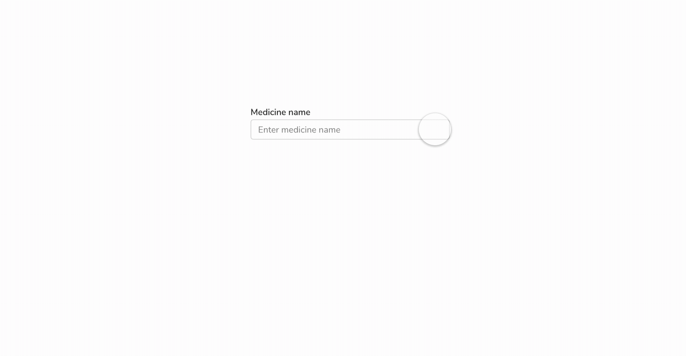
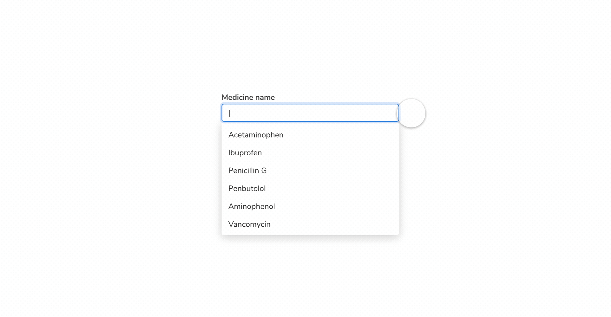

### Combobox - opening

<Caption>Opening of Combobox</Caption>

#### Popover

Default [popover](https://design.innovaccer.com/components/popover/interactions/#opening-popover) animation is used.

### Combobox - closing

<Caption>Closing a Combobox</Caption>

#### Popover

Default [popover](https://design.innovaccer.com/components/popover/interactions/#closing-popover) animation is used.

### Keyboard Interactions

 

<table style="width: 100%">
  <tbody>
    <tr>
      <th style="width:33%; text-align: left;">Initial state</th>
      <th style="width:33%; text-align: left;">Keyboard Interaction</th>
      <th style="width:33%; text-align: left;">Final state</th>
    </tr>
    <tr style="vertical-align: top">
      <td>Combobox in default state </td>
      <td>&#60;Tab&#62;</td>
      <td>Combobox will be in focus but the popover will not be opened. </td>
    </tr>
    <tr style="vertical-align: top">
      <td></td>
      <td>Click</td>
      <td>Combobox will be in focus and the popover will be opened. </td>
    </tr>
    <tr style="vertical-align: top">
      <td>Combobox in focus (typing state)</td>
      <td>&#60;Tab&#62;</td>
      <td>
        Focus shifts to next item in Tab sequence on the page.   The popover will be excluded from the tab sequence
        on the page
      </td>
    </tr>
    <tr style="vertical-align: top">
      <td></td>
      <td>Type characters</td>
      <td>
        <ul>
          <li>Show the filtered out options in the listbox (irrespective of the visibility of popover). </li>
          <li>Close the popover if no matches were found. </li>
        </ul>
      </td>
    </tr>
    <tr style="vertical-align: top">
      <td></td>
      <td>&#60;down arrow&#62;</td>
      <td>
        <ul>
          <li>
            If popover is not open: open popover and shifts focus from combobox to first focusable item in listbox
          </li>
          <li>If popover is open: Focus shifts from combobox to first focusable item in listbox</li>
        </ul>
      </td>
    </tr>
    <tr style="vertical-align: top">
      <td></td>
      <td>&#60;up arrow&#62;</td>
      <td>
        <ul>
          <li>
            If popover is not open: open popover and shifts focus from combobox to the last focusable item in listbox
          </li>
          <li>If popover is open: Focus shifts from combobox to the last focusable item in listbox</li>
        </ul>
      </td>
    </tr>
    <tr style="vertical-align: top">
      <td></td>
      <td>&#60;Escape&#62;</td>
      <td>
        <ul>
          <li>
            If popover is open: Close the popover. Focus is now on the combobox with no change to the value entered in
            the combobox.
          </li>
          <li>If popover is not open: Nothing happens. </li>
        </ul>
      </td>
    </tr>
    <tr style="vertical-align: top">
      <td></td>
      <td>&#60;Backspace/Delete&#62;</td>
      <td>
        <ul>
          <li>
            If value is already present:
            <ul>
              <li class="ml-5">
                <b>Single-select:</b>
                <ul>
                  <li class="ml-5">Edits the value in the combobox</li>
                </ul>
              </li>
              <li class="ml-5">
                <b>Multi-select:</b>
                <ul>
                  <li class="ml-5">Removes the input chip</li>
                </ul>
              </li>
            </ul>
          </li>
          <li>If no value is present: Nothing happens</li>
        </ul>
      </td>
    </tr>
    <tr style="vertical-align: top">
      <td>Popover is open and first item is focused.   (Combobox will not be in focus at this instance)  </td>
      <td>&#60;Tab&#62;</td>
      <td>Focus shifts to next item in Tab sequence on the page.   The popover will be excluded from the tab sequence on the page</td>
    </tr>
    <tr style="vertical-align: top">
      <td></td>
      <td>&#60;down arrow&#62;</td>
      <td>
        <ul>
          <li>Focus shifts to next focusable item in the list</li>
          <li>If focus is on last focusable item: Focus shifts to first focusable item in listbox</li>
        </ul>
      </td>
    </tr>
    <tr style="vertical-align: top">
      <td></td>
      <td>&#60;up arrow&#62;</td>
      <td>
        <ul>
          <li>Focus shifts to previous focusable item in the list</li>
          <li>If focus is on first focusable item: Focus shifts to the last focusable item in listbox</li>
        </ul>
      </td>
    </tr>
    <tr style="vertical-align: top">
      <td></td>
      <td>&#60;Escape&#62;</td>
      <td>Close the popover. Focus is now on the combobox with no change to the value entered in the combobox(if any). </td>
    </tr>
    <tr style="vertical-align: top">
      <td></td>
      <td>&#60;Enter&#62;</td>
      <td>
        <ul>
          <li>
            <b>Single select:</b>
            <ul>
              <li class="ml-5">Select the focused item and input it in the combobox and focus is now shifted to the combobox</li>
              <li class="ml-5">Selected item will be in the selected state in the listbox</li>
              <li class="ml-5">Close the popover by default</li>
            </ul>
          </li>
          <li>
            <b>Multi select:</b>
            <ul>
              <li class="ml-5">Select the focused item and add it as a chip in combobox. </li>
              <li class="ml-5">Selected item will be removed from the listbox, </li>
              <li class="ml-5">The popover will not be closed by default. </li>
              <li class="ml-5">Focus will now be shifted to the first focusable item in the listbox</li>
            </ul>  
          </li>
        </ul>
      </td>
    </tr>
  </tbody>
</table>
