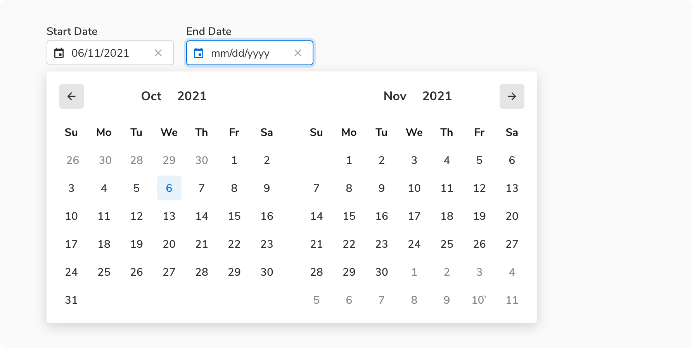
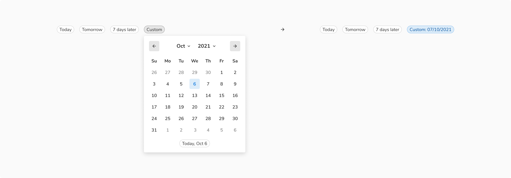
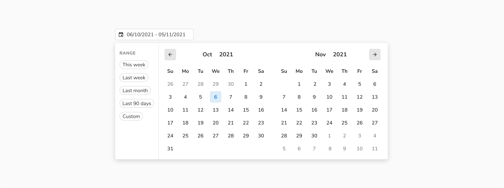

Date picker lets users select or directly enter date values. It can either be a single date or a date range.

### Structure
Date picker is built up using calendar and popover components. Unlike calendar, which can be displayed upfront, a trigger is always needed for the date picker such as inputs.
<Preview name="datepicker-variants-with-input"/>

### Types
Date picker comes in two types - one for selecting single date value called date picker and another for selecting a date range aptly called date range picker.

#### Date picker
For selecting single date value.

 

#### Date range picker
For selecting a date range.

 
 

### Usage
 

#### Triggers
One obvious expectation from a date picker is the ability to input values using a keyboard e.g. when a user has to enter the date of birth. Getting the desired date is much quicker this way as users do not have to go through the calendar to select the desired value. Therefore, use **inputs** to trigger the date picker.
<Preview name="datepicker-variants-with-input"/>

#### Using preset values
Use selection chips to give quick selection of preset date/date-range values.

 

If there is a space crunch, you can have these preset values in the popover itself. But this defeats the purpose of quick selection since the users will have to open the popover to access them. Hence, make sure to use this only when there is no option left.

 

#### Using single input for a date range
If there is a space crunch, you can have a single input for entering/selecting a date range.
<Preview name="daterangepicker-variants-with-single-input"/>

#### Using date and time picker together
As soon as a date or date range is selected, time picker dropdown should be triggered so that users can select the time without any additional click.

 
 

