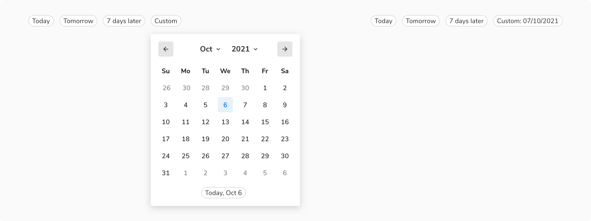

Date picker lets users select or directly enter date values. It can either be a single date or a date range.

<Preview name="components-datepicker-variants-with-input--with-input"/>

### Types
Date picker comes in two types - one for selecting single date value called date picker and another for selecting a date range aptly called date range picker.

#### Date picker
For selecting single date value.

<Caption> Date picker </Caption>

 

#### Date range picker
For selecting a date range.

<Caption>Date range picker</Caption>

 
 

### Structure
 
 
Date picker is built up using calendar and popover components. Unlike calendar, which can be displayed upfront, a trigger is always needed for the date picker such as inputs.
 
 

 

<table style="width: 100%">
  <tbody>
    <tr>
      <th style="width:50%; text-align: left;">Property</th>
      <th style="width:50%; text-align: left;">Value(s)</th>
    </tr>
    <tr style="vertical-align: top">
      <td>Size</td>
      <td>
          <ul>
              <li>292x212 px <em>(Small)</em></li>
              <li>372x316 px <em>(Regular)</em></li>
          </ul>
      </td>
    </tr>
    
  </tbody>
</table>
 

### Configurations
 
 

<table style="width: 100%">
  <tbody>
    <tr>
      <th style="width:33%; text-align: left;">Property</th>
      <th style="width:33%; text-align: left;">Value(s)</th>
      <th style="width:33%; text-align: left;">Default value</th>
    </tr>
    <tr style="vertical-align: top">
      <td>View</td>
      <td>
          <ul>
              <li>Month</li>
              <li>Year</li>
              <li>Decade</li>
          </ul>
      </td>
      <td>Month</td>
    </tr>
    <tr style="vertical-align: top">
      <td>Size</td>
      <td>
          <ul>
              <li>Small</li>
              <li>Regular</li>
          </ul>
      </td>
      <td>Regular</td>
    </tr>
  </tbody>
</table>
 

### Usage
 

#### Triggers
One obvious expectation from a date picker is the ability to input values using a keyboard e.g. when a user has to enter the date of birth. Getting the desired date is much quicker this way as users do not have to go through the calendar select the desired value. Therefore, use **inputs** to trigger the date picker.
<Preview name="components-datepicker-variants-with-input--with-input"/>

#### Using preset values
Use selection chips to give quick selection of preset date/date-range values.

<Caption>Using preset values</Caption>
 

If there is a space crunch, you can have these preset values in the popover itself. But this defeats the purpose of quick selection since the users will have to open the popover to access them. Hence, make sure to use this only when there is no option left.

<Caption>Preset values inside popover</Caption>

 

#### Using single input for a date range
If there is a space crunch, you can have a single input for entering/selecting a date range.
<Preview name="components-daterangepicker-variants-with-single-input--with-single-input"/>

#### Using date and time picker together
As soon as a date or date range is selected, time picker dropdown should be triggered so that users can select the time without any additional click.

<Caption>Date and time picker together</Caption>

 

#### Selecting day of the week or time of day
Use selection chips for selecting day of the week or time of day.

<Caption>Selection chips to select day of the week or time of day</Caption>

 

