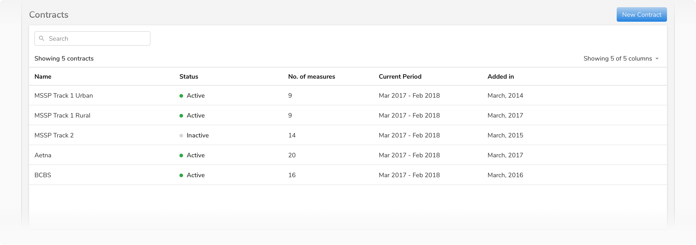
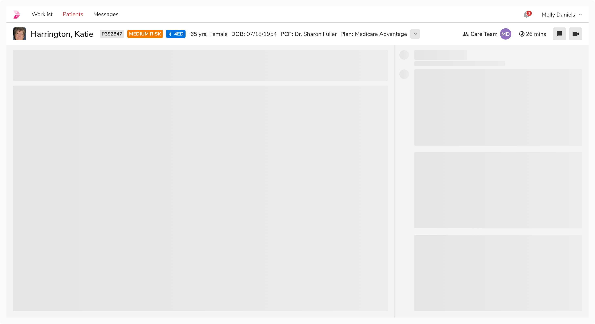
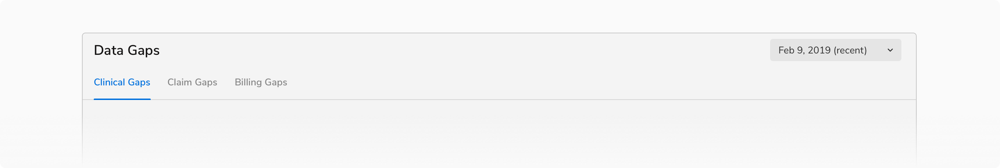
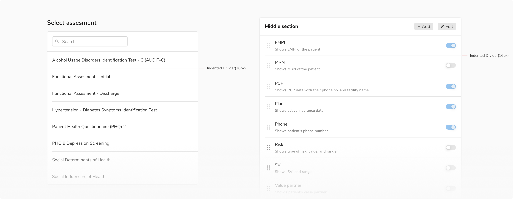
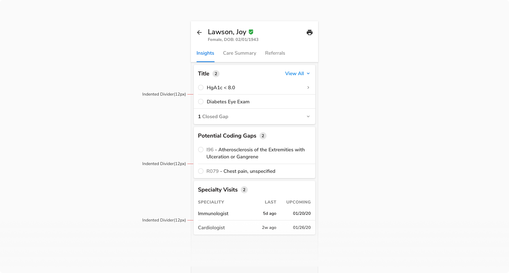
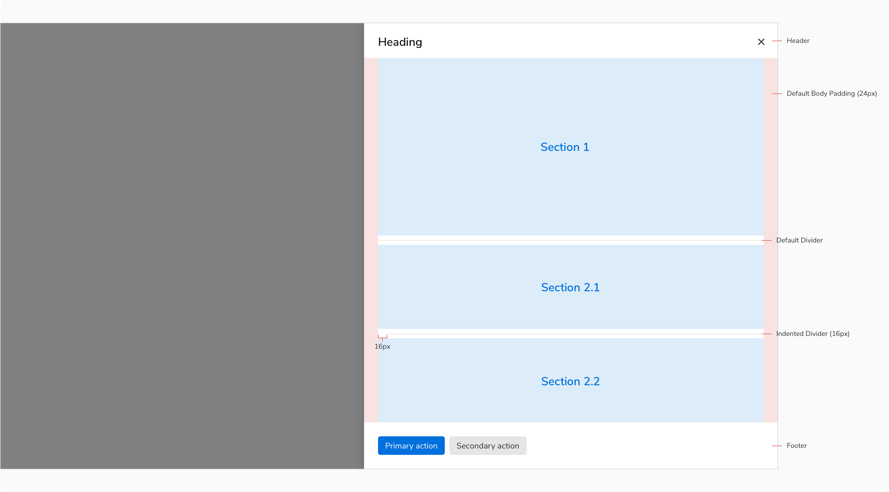
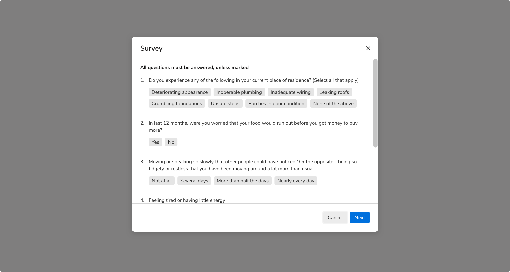
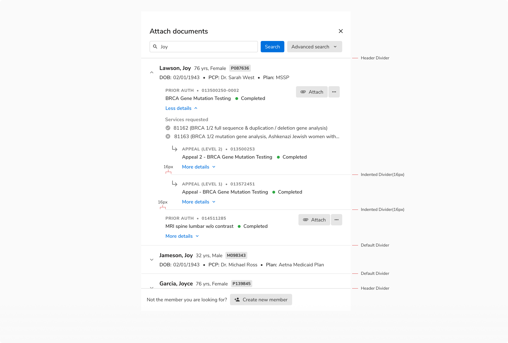
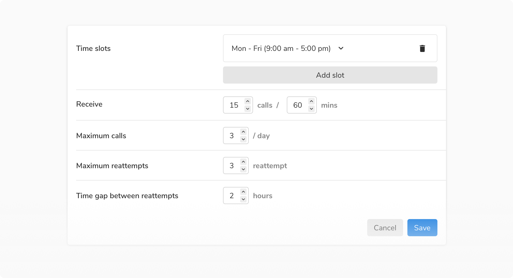

Dividers can help separate the content into different sections within a page but if used abundantly can make the interface cluttered.

### Types
 

#### Horizontal
The horizontal divider divides the content vertically. It divides the whole layout into sections & typically spans the full width of the layout. Such dividers are useful for separating different rows of a table, sections inside a card, headers and footers from body, etc.
<Preview name="components-divider-basic-divider-in-card--basic-divider-in-card"/>

#### Vertical
The vertical divider divides the content horizontally.
<Preview name="components-divider-vertical-divider--vertical-divider"/>

### Appearances
 

#### Basic
Basic appearance is the default appearance of the dividers and the most used one.

<Caption> Basic appearance of horizontal dividers in a table </Caption>

 

<Caption> Basic appearance of a vertical divider </Caption>

 

#### Header
Header appearance is typically used in headers and footers to differentiate these sections from the body. It is slightly darker from the default variant. The slightly darker color and the position of this divider help in differentiating it from the basic dividers which might be present in the body.

For example, if a user is scrolling the content of the body, any basic divider present there can be distinguished from this divider because of its color and position.

<Caption> Header appearance of horizontal divider in a page header </Caption>

 

<Caption> Header appearance of horizontal divider in a card </Caption>

 
 

### Structure
 
 

 #### Horizontal divider

 
 
<table style="width: 100%">
 <tbody>
  <tr>
    <th style="width:50%; text-align: left;">Property</th>
    <th style="width:50%; text-align: left;">Value(s)</th>
  </tr>
  <tr style="vertical-align: top">
    <td>Height</td>
    <td>1 px</td>
  </tr>
 </tbody>
</table>

 

#### Vertical divider

 
 
<table style="width: 100%">
 <tbody>
  <tr>
    <th style="width:50%; text-align: left;">Property</th>
    <th style="width:50%; text-align: left;">Value(s)</th>
  </tr>
  <tr style="vertical-align: top">
    <td>Width</td>
    <td>1 px</td>
  </tr>
 </tbody>
</table>

### Configurations

#### Horizontal divider
 
 

<table style="width: 100%">
  <tbody>
    <tr>
      <th style="width:33%; text-align: left;">Property</th>
      <th style="width:33%; text-align: left;">Value(s)</th>
      <th style="width:33%; text-align: left;">Default value</th>
    </tr>
    <tr style="vertical-align: top">
      <td>Appearance</td>
      <td>
          <ul>
              <li>Basic</li>
              <li>Header</li>
          </ul>
      </td>
      <td>Basic</td>
    </tr>
  </tbody>
</table>
 

### Usage
 

#### Indentation
Horizontal dividers with basic appearance can be slightly spaced from the left (12px or 16 px). This way they can separate related list-type content. They should be aligned with anchoring elements in the left such as icons, avatars, etc.
<Preview name="components-divider-indented-divider--indented-divider"/>

> Table is the only exception here where we do not use the indented divider in rows because table can have vertical dividers as well which then make it appear like the familiar Excel like structure. Having an indented divider doesn't work in that case.

 
In most of the cases, the content inside cards/containers already has a padding of 16px and thus the divider(s) should start in such a way that it is aligned with the content (be it text or an anchor point like an icon, avatar, etc.).

<Caption> Default list type content vs List with anchor point </Caption>
 

For cases where the available width is not enough to accommodate content with 16px padding, indentation of **12px** should be used.

<Caption> Due to the space crunch, padding inside cards is 12px instead of the regular 16px & hence 12px indentation is being used here </Caption>
 

#### Being aware of default padding/margin
A lot of the times there is a default padding/margin present in a component e.g. in the body of a sidesheet. Hence, in such cases the dividers do not span till the edge(s). Be aware of padding/margin in such cases.

<Caption> Dividers here are within the confinement of body (after applied padding) </Caption>
 

#### Dividers with scrollable content
In modals, sheets, and cards with scrollable content, the header appearance of divider should be used in the header and footer. The slightly darker color of this divider and its position help in differentiating it from the basic appearance that might be present in the body.

<Caption> Header divider in both header & footer </Caption>
 

#### Nesting of Dividers
Sometimes multiple dividers may be needed within a section. In such cases, the dividers should be used in a way so that the hierarchy of information is preserved.

<Caption> Multiple dividers being used to maintain the hierarchy </Caption>
 

#### Dividers in Horizontal Layout
In horizontal forms or layout, dividers can help users keep track of the row that is being viewed/edited at the moment.

<Caption> Dividers in a horizontal layout form </Caption>
 

#### Overuse of Dividers
Dividers should only be used if the elements cannot be separated enough using white space. Overuse of dividers would only result in visual clutter. 