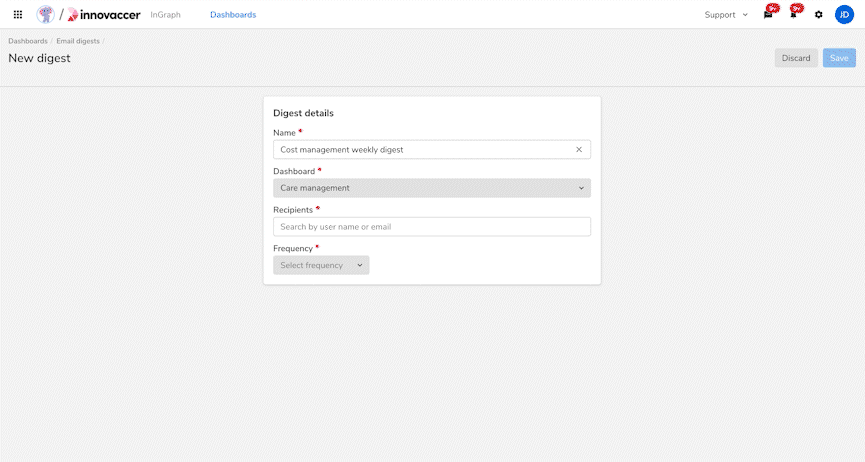
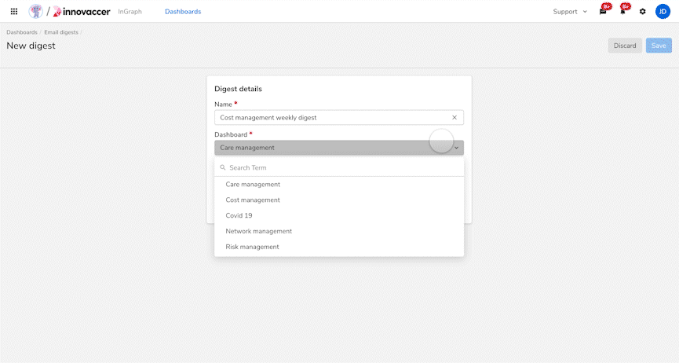

### Dropdown - Opening

 
 

#### Dropdown button

 

<Card shadow='none'>
  <Table
    showMenu={false}
    separator={true}
    data={[
      {
        Property: 'State',
        Initial: '$Default',
        Final: '$Active',
      },
    ]}
    schema={[
      {
        name: 'Property',
        displayName: 'Property',
        width: '34%',
        sorting: false,
        separator: true,
        cellType: 'DEFAULT'
      },
      {
        name: 'Initial',
        displayName: 'Initial state',
        width: '33%',
        sorting: false,
        separator: true,
        cellRenderer: ({ data }) => {
          return <Rectangle name={data.Initial} />;
        },
        
      },
      {
        name: 'Final',
        displayName: 'Final state',
        width: '33%',
        sorting: false,
        separator: true,
        cellRenderer: ({ data }) => {
          return <Rectangle name={data.Final} />;
        },
      },
    ]}
    withHeader={false}
  />
</Card>
 

**Curve**

<Card shadow='none'>
  <Table
    showMenu={false}
    separator={true}
    data={[
      {
        Curve: 'cubic-bezier(0, 0, 0.38, 0.9)',
        Duration: '120ms',
      }
    ]}
    schema={[
      {
        name: 'Curve',
        displayName: 'Curve',
        width: '50%',
        sorting: false,
        separator: true,
        cellRenderer: ({ data }) => {
          return <Rectangle name={data.Curve} />;
        },
      },
      {
        name: 'Duration',
        displayName: 'Duration',
        width: '50%',
        sorting: false,
        separator: true
        
      },
    ]}
    withHeader={false}
  />
</Card>
 
 

#### Dropdown Popover

Default popover animation is used.
 

#### Dropdown Items

 

<Card shadow='none'>
  <Table
    showMenu={false}
    separator={true}
    data={[
      {
        Property: 'Opacity - Individual Items',
        Initial: '0',
        Final: '100',
      },
    ]}
    schema={[
      {
        name: 'Property',
        displayName: 'Property',
        width: '34%',
        sorting: false,
        separator: true,
        cellType: 'DEFAULT'
      },
      {
        name: 'Initial',
        displayName: 'Initial state',
        width: '33%',
        sorting: false,
        separator: true,
        cellRenderer: ({ data }) => {
          return <Rectangle name={data.Initial} />;
        },
        
      },
      {
        name: 'Final',
        displayName: 'Final state',
        width: '33%',
        sorting: false,
        separator: true,
        cellRenderer: ({ data }) => {
          return <Rectangle name={data.Final} />;
        },
      },
    ]}
    withHeader={false}
  />
</Card>
 

**Curve**

<Card shadow='none'>
  <Table
    showMenu={false}
    separator={true}
    data={[
      {
        Curve: 'cubic-bezier(0, 0, 0.38, 0.9)',
        Durationa: '80ms',
        Delay: '120ms',
      }
    ]}
    schema={[
      {
        name: 'Curve',
        displayName: 'Curve',
        width: '30%',
        sorting: false,
        separator: true,
        cellRenderer: ({ data }) => {
          return <Rectangle name={data.Curve} />;
        },
      },
      {
        name: 'Durationa',
        displayName: 'Initial delay',
        width: '30%',
        sorting: false,
        separator: true
        
      },
      {
        name: 'Delay',
        displayName: 'Duration - Individual Items',
        width: '30%',
        sorting: false,
        separator: true
        
      },
    ]}
    withHeader={false}
  />
</Card>
 
 

### Dropdown - Closing

 
 

#### Dropdown button

 

<Card shadow='none'>
  <Table
    showMenu={false}
    separator={true}
    data={[
      {
        Property: 'State',
        Initial: '$Active',
        Final: '$Default',
      },
    ]}
    schema={[
      {
        name: 'Property',
        displayName: 'Property',
        width: '34%',
        sorting: false,
        separator: true,
        cellType: 'DEFAULT'
      },
      {
        name: 'Initial',
        displayName: 'Initial state',
        width: '33%',
        sorting: false,
        separator: true,
        cellRenderer: ({ data }) => {
          return <Rectangle name={data.Initial} />;
        },
        
      },
      {
        name: 'Final',
        displayName: 'Final state',
        width: '33%',
        sorting: false,
        separator: true,
        cellRenderer: ({ data }) => {
          return <Rectangle name={data.Final} />;
        },
      },
    ]}
    withHeader={false}
  />
</Card>
 

**Curve**

<Card shadow='none'>
  <Table
    showMenu={false}
    separator={true}
    data={[
      {
        Curve: 'cubic-bezier(0, 0, 0.38, 0.9)',
        Duration: '120ms',
      }
    ]}
    schema={[
      {
        name: 'Curve',
        displayName: 'Curve',
        width: '50%',
        sorting: false,
        separator: true,
        cellRenderer: ({ data }) => {
          return <Rectangle name={data.Curve} />;
        },
      },
      {
        name: 'Duration',
        displayName: 'Duration',
        width: '50%',
        sorting: false,
        separator: true
        
      },
    ]}
    withHeader={false}
  />
</Card>
 
 

#### Dropdown Popover

Default popover animation is used.
 

#### Dropdown Items

 

<Card shadow='none'>
  <Table
    showMenu={false}
    separator={true}
    data={[
      {
        Property: 'Opacity - Individual Items',
        Initial: '100',
        Final: '0',
      },
    ]}
    schema={[
      {
        name: 'Property',
        displayName: 'Property',
        width: '34%',
        sorting: false,
        separator: true,
        cellType: 'DEFAULT'
      },
      {
        name: 'Initial',
        displayName: 'Initial state',
        width: '33%',
        sorting: false,
        separator: true,
        cellRenderer: ({ data }) => {
          return <Rectangle name={data.Initial} />;
        },
        
      },
      {
        name: 'Final',
        displayName: 'Final state',
        width: '33%',
        sorting: false,
        separator: true,
        cellRenderer: ({ data }) => {
          return <Rectangle name={data.Final} />;
        },
      },
    ]}
    withHeader={false}
  />
</Card>
 

**Curve**

<Card shadow='none'>
  <Table
    showMenu={false}
    separator={true}
    data={[
      {
        Curve: 'cubic-bezier(0, 0, 0.38, 0.9)',
        Delay: '120ms',
      }
    ]}
    schema={[
      {
        name: 'Curve',
        displayName: 'Curve',
        width: '40%',
        sorting: false,
        separator: true,
        cellRenderer: ({ data }) => {
          return <Rectangle name={data.Curve} />;
        },
      },
      {
        name: 'Delay',
        displayName: 'Duration - Individual Items',
        width: '30%',
        sorting: false,
        separator: true
        
      },
    ]}
    withHeader={false}
  />
</Card>
 
 
