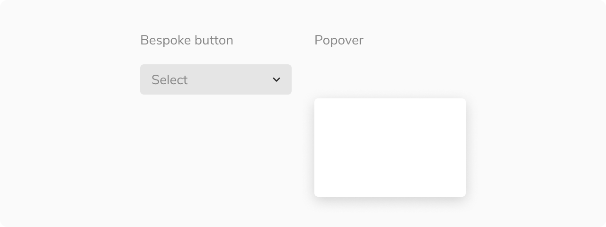
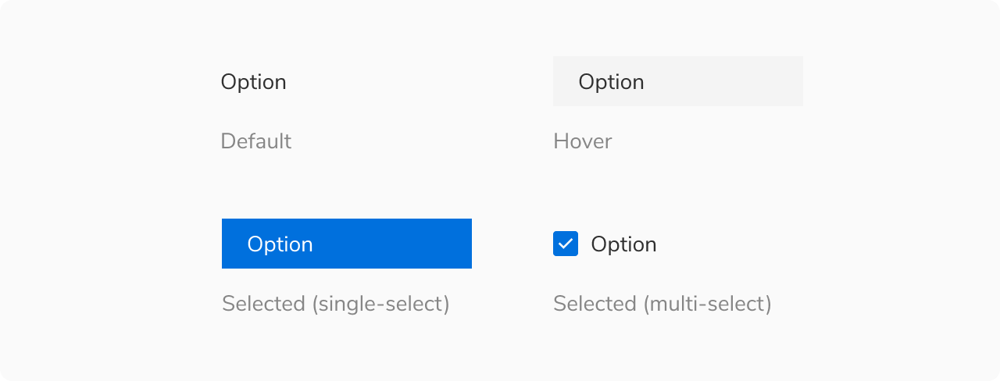
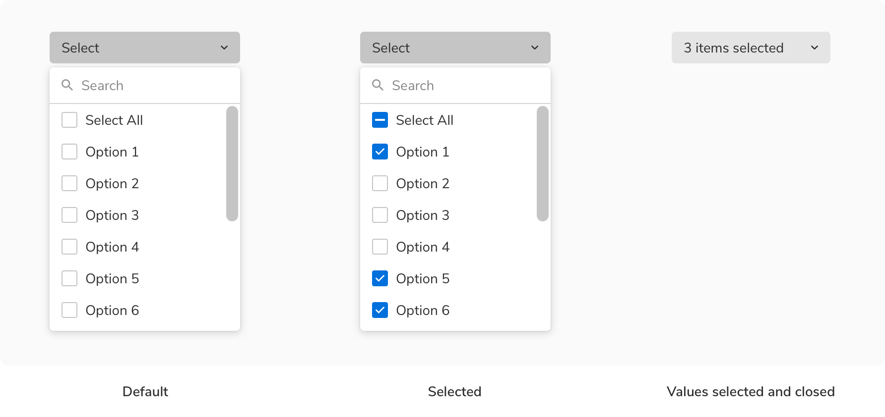
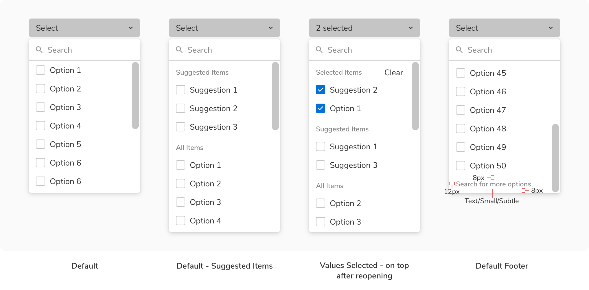
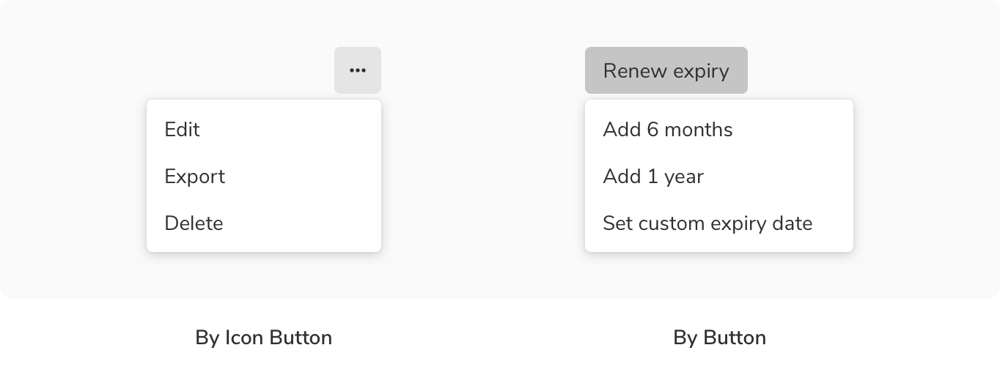
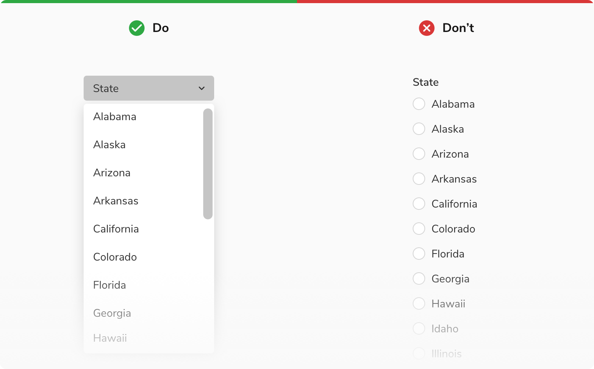

Dropdowns display a list of options for users to choose from. They provide the option to let users select a single option or multiple.

### Structure
Dropdown is made up of 2 key components - a custom **button** which acts as a trigger and a **popover** which acts as a container for the options.

 
 

### Types
Dropdowns can be categorized into **2 types** basis on their uses -

#### Standard
This is the typical custom button + popover combination of dropdowns.
<Preview name="components-dropdown-standard-dropdown--standard-dropdown"/>

#### Menu
This is the icon button + popover combination of dropdowns which is used only for menu commands e.g. edit, export, delete, etc. This is **not used** for selecting options. The menu can open in either direction i.e towards left or towards the right.
<Preview name="components-dropdown-dropdown-as-menu--dropdown-as-menu"/>

### Variants
 

#### Button variants
The custom button for dropdowns comes with a few variants -

##### Standard
The standard variant consists of just text which changes its state when one or more options are selected.
<Preview name="components-dropdown-standard-dropdown--standard-dropdown"/>

##### With icon
This variant comes with an icon in the left preceding the text to provide additional cues regarding the type of the options.
<Preview name="components-dropdown-dropdown-with-icon--dropdown-with-icon"/>

##### Inline label
This variant comes with a label preceding the text and can be used at places where there is a space crunch.
<Preview name="components-dropdown-label-position-in-dropdown--label-position-in-dropdown"/>

#### Options variants
The options in a dropdown can be single select or multi-select. They come with a few variants -

##### Standard
This variant comes with just text.
<Preview name="components-dropdown-standard-dropdown--standard-dropdown"/>

##### With icon
This variant comes with an icon preceding the text.
<Preview name="components-dropdown-dropdown-items-with-icon--dropdown-items-with-icon"/>

##### With sub info
This variant comes with sub-info beneath the text.
<Preview name="components-dropdown-dropdown-items-with-sub-info--dropdown-items-with-sub-info"/>

##### With checkbox
This variant comes with the support of checkboxes to select single or multiple options. The options here can also have sub info just like the previous variant.
<Preview name="components-dropdown-dropdown-items-with-checkbox--dropdown-items-with-checkbox"/>

### Sizes
Dropdowns come in **2 sizes** - regular and tiny.
<Preview name="components-dropdown-variants-size--size"/>

### States
 

#### Button states
The custom button comes in **5 states** - default, hover, focus, active and disabled.

 
 

#### Options states
The options come in **3 states** - default, hover and selected. Users can also use the up/down arrow key to traverse the options. In that case, the highlighted option has the same state as hover.

 
 

### Properties
#### Options
<table style="width: 100%">
  <tbody>
    <tr>
      <th style="width:33%; text-align: left;">Property</th>
      <th style="width:33%; text-align: left;">Value(s)</th>
      <th style="width:33%; text-align: left;">Default value</th>
    </tr>
    <tr style="vertical-align: top">
      <td>Icon <em>(optional)</em></td>
      <td>&#60;icon name&#62;</td>
      <td>-</td>
    </tr>
    <tr style="vertical-align: top">
      <td>Sub info <em>(optional)</em></td>
      <td>&#60;sub info&#62;</td>
      <td>-</td>
    </tr>
    <tr style="vertical-align: top">
      <td>Checkbox <em>(optional)</em></td>
      <td>Checkbox</td>
      <td>-</td>
    </tr>
  </tbody>
</table>
 

#### Trigger (Dropdown button)
<table style="width: 100%">
  <tbody>
    <tr>
      <th style="width:33%; text-align: left;">Property</th>
      <th style="width:33%; text-align: left;">Value(s)</th>
      <th style="width:33%; text-align: left;">Default value</th>
    </tr>
    <tr style="vertical-align: top">
      <td>Size</td>
      <td>
          <ul>
              <li>Regular</li>
              <li>Tiny</li>
          </ul>
      </td>
      <td>Regular</td>
    </tr>
    <tr style="vertical-align: top">
      <td>Icon <em>(optional)</em></td>
      <td>&#60;icon name&#62;</td>
      <td>-</td>
    </tr>
    <tr style="vertical-align: top">
      <td>Inline label <em>(optional)</em></td>
      <td>&#60;label&#62;</td>
      <td>-</td>
    </tr>
  </tbody>
</table>
 

### Usage
 

#### Search
Dropdown can be offered with a search functionality. In that case, the search input appears at the top.
<Preview name="components-dropdown-search-in-dropdown--search-in-dropdown"/>

#### Multi select
The multi-select behavior in a dropdown is divided into **2 categories** as following.

##### For options less than or equal to a threshold
<Preview name="components-dropdown-dropdown-options-less-than-50--dropdown-options-less-than-50"/>

 
 

##### For options more than the threshold
<Preview name="components-dropdown-dropdown-options-more-than-50--dropdown-options-more-than-50"/>

 
 

50 is the default threshold and it can be changed to any number between 50 to 100.
 

#### Grouping options
Dropdown options can be grouped under a section using a sub header, if needed.

 
 

#### Label position
The label provides a better understanding of what kind of selection is expected. Labels can be placed either on the top of the dropdown or can be placed inline with the value or placeholder of the dropdown.
<Preview name="components-dropdown-label-position-in-dropdown--label-position-in-dropdown"/>

#### Help text
Help text can be provided beneath a dropdown to add context regarding the type of input required just like the input fields.
<Preview name="components-dropdown-dropdown-with-caption--dropdown-with-caption"/>

#### Actions in footer
Using network resources on each checkbox selection in a dropdown can be quite expensive. To avoid sending api calls at every selection, the dropdown with multi-select comes with an option of having actions in the footer. This helps in sending the api call just once i.e. on click of Add/Apply button.
<Preview name="components-dropdown-dropdown-with-action-buttons--dropdown-with-action-buttons"/>

#### Custom trigger
Dropdowns can also be triggered by other components, primarily by buttons and icon buttons. The basic behavior of the dropdown remains the same.

 
 

#### Dropdown vs. Radio
It is recommended to use dropdowns if the number of single-select options exceeds 5 or if the space is limited, to better utilize the space. Radios should be used if the options are fewer than 5 and there are no space restrictions.

 
 

#### Dropdown vs. Checkbox
It is recommended to use dropdowns if the number of multi-select options exceeds 5 or if the space is limited, to better utilize the space. Checkboxes should be used if the options are fewer than 5 and there are no space restrictions.

 
 