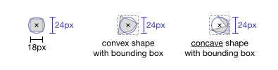

### Minimum Target Size for Interactive Icons

It is recommended to keep the interactive area of an icon at 24 &times; 24 px. If the visual icon is smaller than 24px, ensure the clickable target area is expanded to 24 &times; 24 px to meet accessibility requirements and prevent accidental activation.
 

 

### Making Interactive Icons Accessible

It is recommended to support accessibility and implement focus in case the icon is interactive.
