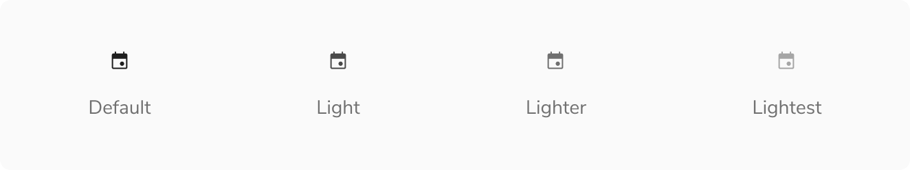
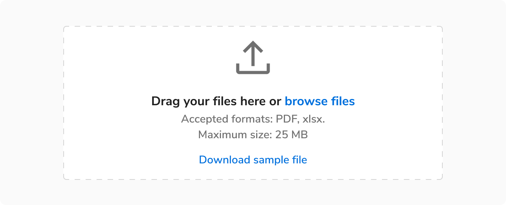
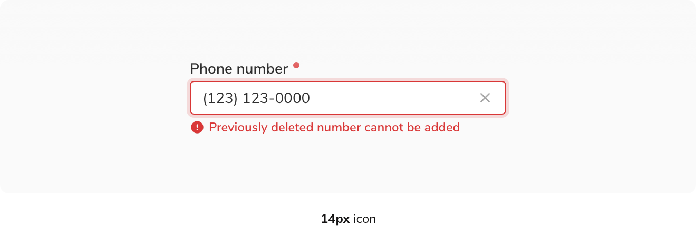
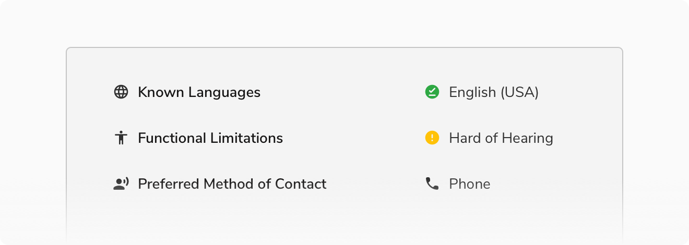
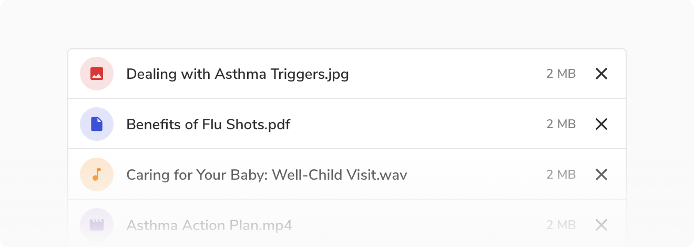
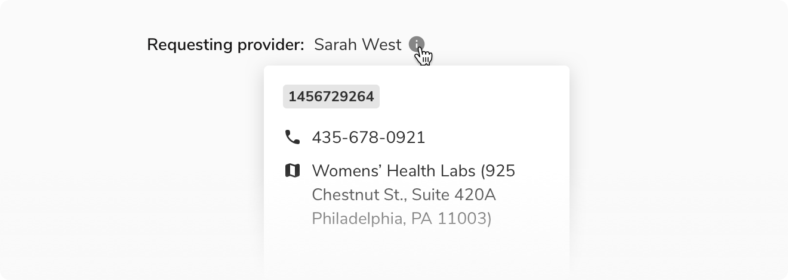

Icon is used to add additional visual cues on a page, hence helping to communicate a clearer meaning.

### Appearances
Based on the color palette that we follow, icons are offered in the following appearances. Barring the night and light variants, each appearance has **3 shades** - Default, Dark and Lighter.

#### Night

 

#### Light

**Note:** Added a dark background here just to show the color of the icon.
 

#### Jal

 

#### Mirch

 

#### Haldi

 

#### Neem

 

#### Nimbu

 

#### Tawak

 

#### Neel

 

#### Jamun

 
 

### Structure
Icons are based on Google’s Material Design and rendered using icon fonts. As of now, only rounded theme is supported. An icon component in the UI follows a simple structure. 

 
 

<table style="width: 100%">
  <tbody>
    <tr>
      <th style="width:50%; text-align: left;">Property</th>
      <th style="width:50%; text-align: left;">Value(s)</th>
    </tr>
    <tr style="vertical-align: top">
      <td>Icon theme</td>
      <td>Rounded</td>
    </tr>
  </tbody>
</table>
 

### Configurations
<table style="width: 100%">
  <tbody>
    <tr>
      <th style="width:33%; text-align: left;">Property</th>
      <th style="width:33%; text-align: left;">Value(s)</th>
      <th style="width:33%; text-align: left;">Default value</th>
    </tr>
    <tr style="vertical-align: top">
      <td>Size</td>
      <td>&#60;size&#62;</td>
      <td>16 px</td>
    </tr>
    <tr style="vertical-align: top">
      <td>Appearance</td>
      <td>
          <ul>
              <li>Night</li>
              <li>Light</li>
              <li>Jal</li>
              <li>Neem</li>
              <li>Haldi</li>
              <li>Mirch</li>
              <li>Tawak</li>
              <li>Nimbu</li>
              <li>Neel</li>
              <li>Jamun</li>
          </ul>
      </td>
      <td>Night</td>
    </tr>
    <tr style="vertical-align: top">
      <td>Shade</td>
      <td>
          <ul>
              <li>Default</li>
              <li>Light</li>
              <li>Lighter</li>
              <li>Lightest</li>
              <li>Dark</li>
          </ul>
      </td>
      <td>Default</td>
    </tr>
  </tbody>
</table>
 

**Note**: Not all shades are available for each appearance.
 

### Usage
 

#### Different sizes
Icons can also be resized to account for various use cases.

##### Large
Typically > `48px`

 

##### Small
Smaller than `16px`

 

#### With label
Icons can come really handy when showing key-value pairs.

<Caption> Icons appearing with label </Caption>
 
 

#### With background

<Caption> Icons with background containers </Caption>
 
 

#### Hover
Icons, though being non-interactive, can also have tooltips/popovers to provide additional information on hover.

<Caption> Hover on an icon </Caption>
 
 