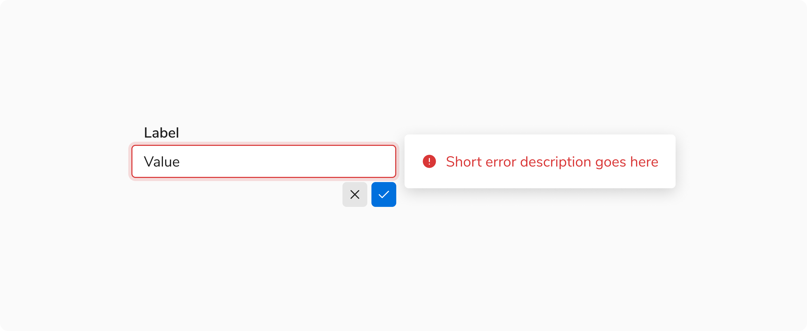

### Handling Errors in Inline Editable Fields

It is recommended to display both an **error message and an error icon** when an inline editable field is in an error state. This helps clearly communicate the issue, improves visibility of the error, and supports accessibility for all users.

 

<Caption> Error message with error icon in inline editable field </Caption>

 
