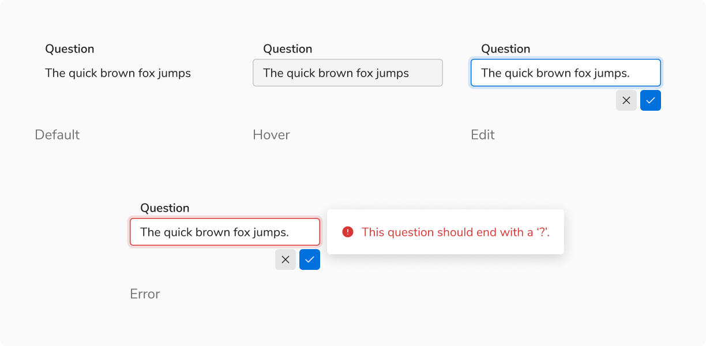
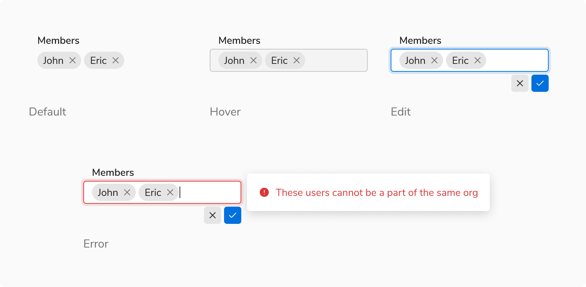
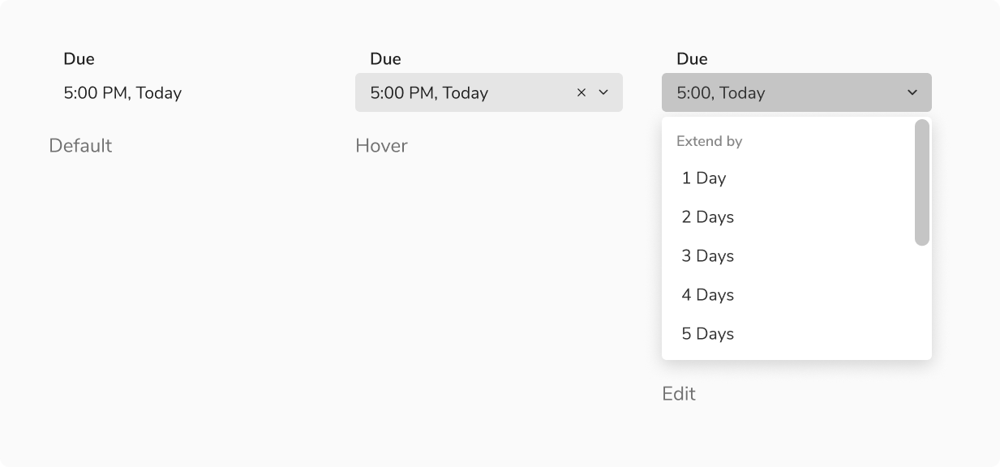
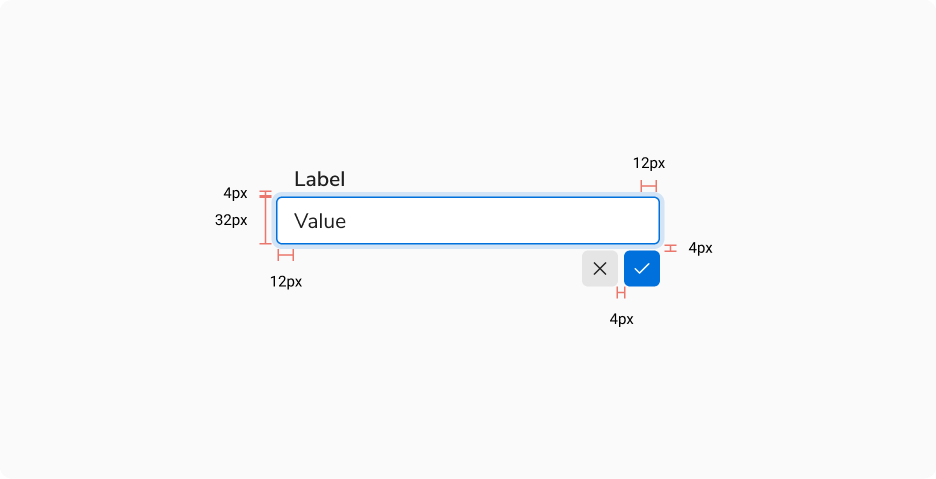
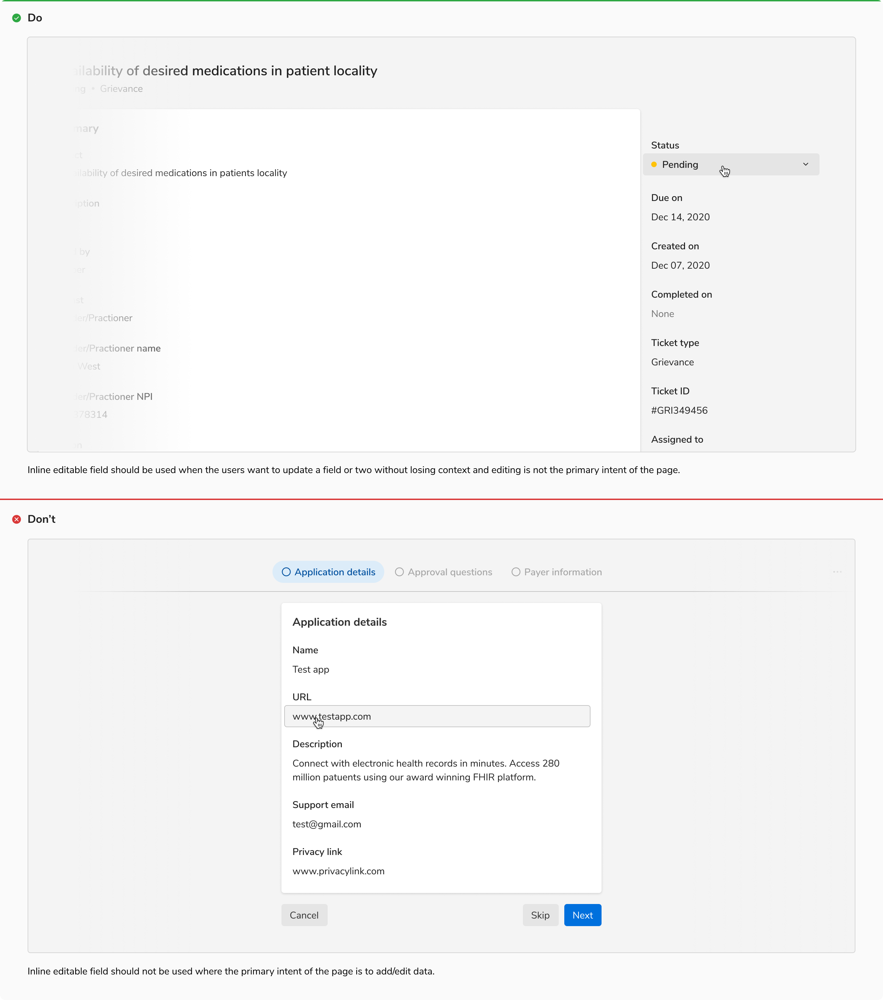
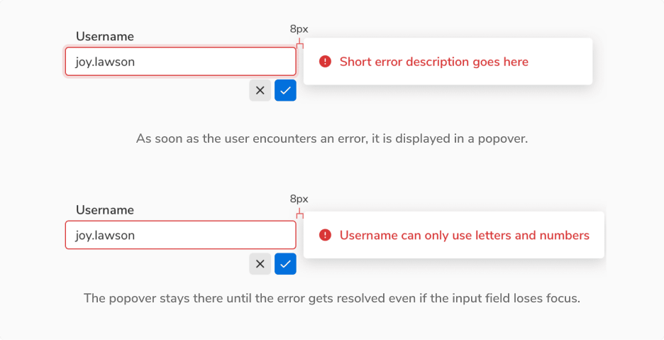
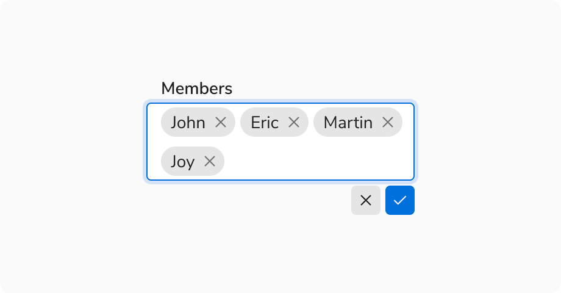
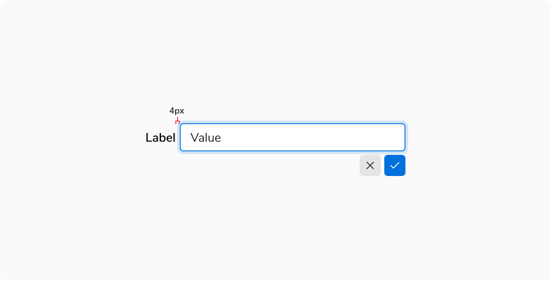

Inline editable fields enable users to edit the data right where they see it. They come handy when the users want to update a field or two without losing context and editing is not the primary intent of the page. 

### Types
 

#### Basic Input
Inline editable input comes with two small action buttons to confirm or discard the changes.
<Preview name="components-inline-editable-fields-editableinput-all--all" />

#### Input With Chips
Chips can be used as tags in inputs. **Enter/return** key is used to input the tags.
<Preview name="components-inline-editable-fields-editablechipinput-all--all" />

#### Dropdown
Dropdown type does not require explicit save/discard actions, as the result is saved immediately.
<Preview name="components-inline-editable-fields-editabledropdown-all--all" />

### Sizes
Inline editable input comes in **2 sizes** - regular and small. On the other hand, inline editable dropdown comes just in the regular size.
<Preview name="components-inline-editable-fields-editableinput-variants-size--size" />

### States
 

#### Input

<Caption> States of inline editable input</Caption>

 

#### Input With Chips

<Caption> States of inline editable input with chips</Caption>

 

#### Dropdown

<Caption> States of inline editable dropdown</Caption>

 
 

### Structure

<Caption> A regular sized inline editable input</Caption>

 
 

<table style={{width: "100%"}}>
  <tbody>
    <tr>
      <th style={{width:"50%",  textAlign: "left"}}>Property</th>
      <th style={{width:"50%",  textAlign: "left"}}>Value(s)</th>
    </tr>
    <tr style={{verticalAlign: "top"}}>
      <td>Height</td>
      <td>
            <ul>
              <li>32 px <em>(Regular input, dropdown)</em></li>
              <li>24 px <em>(Small input)</em></li>
            </ul>
      </td>
    </tr>
    <tr style={{verticalAlign: "top"}}>
      <td>Padding (right, left)</td>
      <td>12 px, 12 px</td>
    </tr>
    <tr style={{verticalAlign: "top"}}>
      <td>Spacing between input and actions</td>
      <td>4 px</td>
    </tr>
    <tr style={{verticalAlign: "top"}}>
      <td>Spacing between actions</td>
      <td>4 px</td>
    </tr>
  </tbody>
</table>

 

### Configurations

#### Input
 
 

<table style={{width: "100%"}}>
  <tbody>
    <tr>
      <th style={{width:"33%", textAlign: "left"}}>Property</th>
      <th style={{width:"33%", textAlign: "left"}}>Value(s)</th>
      <th style={{width:"33%", textAlign: "left"}}>Default value</th>
    </tr>
    <tr style={{verticalAlign: "top"}}>
      <td>Size</td>
      <td>
          <ul>
              <li>Regular</li>
              <li>Small</li>
          </ul>
      </td>
      <td>Regular</td>
    </tr>
    <tr style={{verticalAlign: "top"}}>
      <td>Width </td>
      <td>&#60;width&#62;</td>
      <td>256 px</td>
    </tr>
  </tbody>
</table>
 

#### Dropdown
 
 

<table style={{width: "100%"}}>
  <tbody>
    <tr>
      <th style={{width:"33%", textAlign: "left"}}>Property</th>
      <th style={{width:"33%", textAlign: "left"}}>Value(s)</th>
      <th style={{width:"33%", textAlign: "left"}}>Default value</th>
    </tr>
    <tr style={{verticalAlign: "top"}}>
      <td>Width </td>
      <td>&#60;width&#62;</td>
      <td>256 px</td>
    </tr>
  </tbody>
</table>
 

#### Label
 
 

<table style={{width: "100%"}}>
  <tbody>
    <tr>
      <th style={{width:"33%", textAlign: "left"}}>Property</th>
      <th style={{width:"33%", textAlign: "left"}}>Value(s)</th>
      <th style={{width:"33%", textAlign: "left"}}>Default value</th>
    </tr>
    <tr style={{verticalAlign: "top"}}>
      <td>Required</td>
      <td>
          <ul>
              <li>True</li>
              <li>False</li>
          </ul>
      </td>
      <td>False</td>
    </tr>
    <tr style={{verticalAlign: "top"}}>
      <td>Optional</td>
      <td>
          <ul>
              <li>True</li>
              <li>False</li>
          </ul>
      </td>
      <td>False</td>
    </tr>
    <tr style={{verticalAlign: "top"}}>
      <td>Info</td>
      <td>
          <ul>
              <li>True</li>
              <li>False</li>
          </ul>
      </td>
      <td>False</td>
    </tr>
  </tbody>
</table>
 

### Usage
 

#### Intent
Inline editable fields are used when the users want to update a field or two without losing context and editing is not the primary intent of the page.

#### Showing Error
Errors are shown using popovers alongside the inline editable field.

<Caption> Showing error in inline editable fields </Caption>

 

#### Overflow Behavior in Inline Editable Chip Input
In case of overflow the chip gets wrapped into the next line.

<Caption>Overflow behavior in inline editable chip input </Caption>

 

#### Horizontal Spacing Between Label and Field
It is recommended to have a minimum spacing of 4px between the label and the inline editable field when placed horizontally.

> This spacing is recommended so that the focus ring doesn’t overlap with the label. 

 

<Caption> Recommended minimum spacing between the label and field </Caption>
 