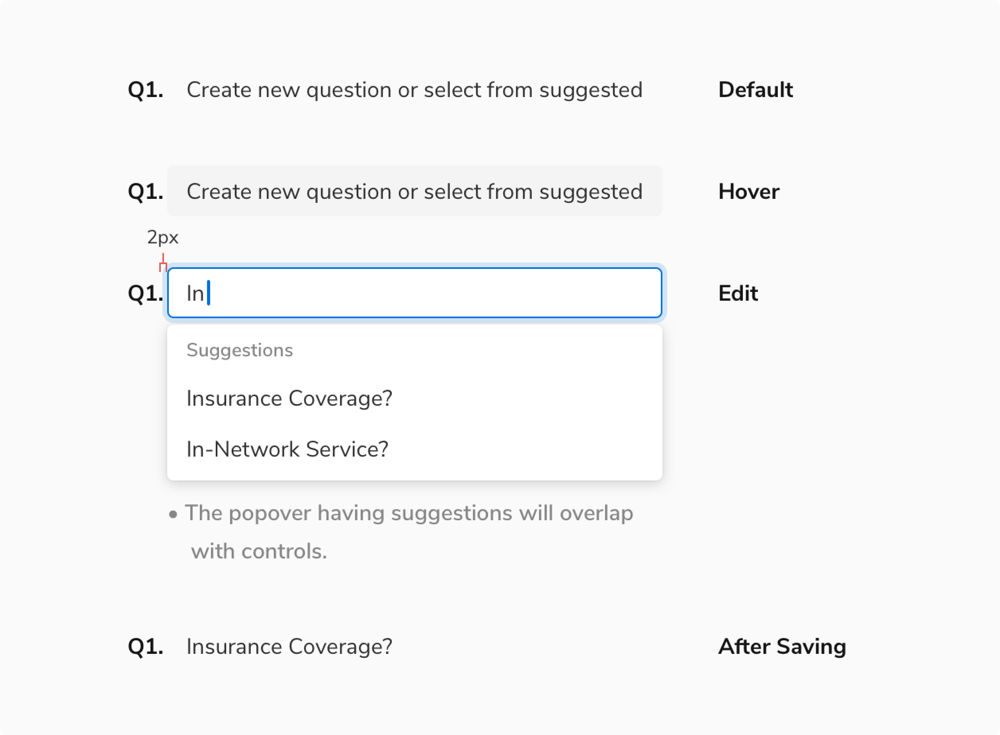
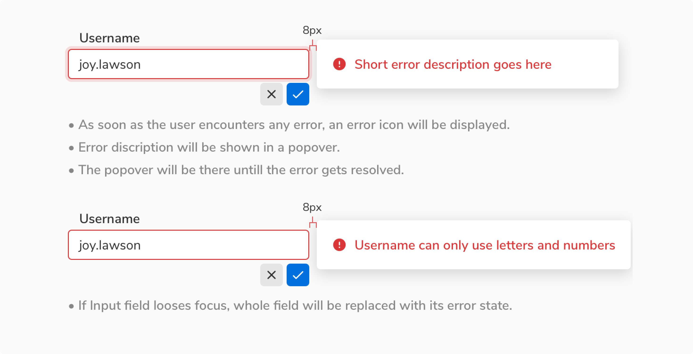

Inline editable fields enables users to edit the data right where they see it. They come handy when editing a form can be quite frequent and the users want to maintain the context.

### Types
 

#### Basic input
Inline editable input comes with two tiny action buttons to confirm or discard the changes.
<Preview name="components-editableinput-all--all" />

#### Input with chips
Chips can be used as tags in inputs. **Enter/return** key is used to input the tags.
<Preview name="components-editablechipinput-all--all" />

#### Dropdown
Dropdown type does not require explicit save/discard actions, as the result is saved immediately.
<Preview name="components-editabledropdown-all--all" />

### Sizes
Inline editable input comes in **2 sizes** - regular and tiny. On the other hand, inline editable dropdown comes just in the regular size.
<Preview name="components-editableinput-variants-size--size" />

### States
 

#### Basic input

 

#### Input with chips

 

#### Dropdown

 
 

### Usage
 

#### Saving changes
There are two options to save the changes made -
1. The primary check button
2. The return key on the keyboard

#### Discarding changes
There are two options to discard the changes made -
1. The secondary clear button
2. The escape key on the keyboard

#### Showing error
Errors are shown using popovers alongside the input field.

 
