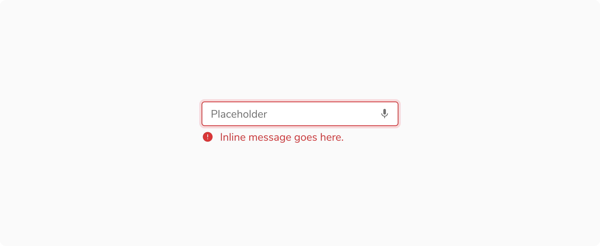
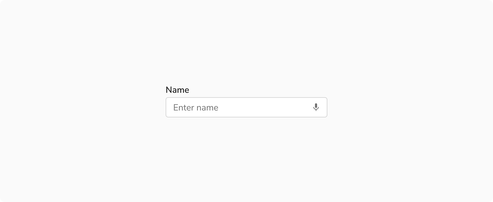

### Handling Errors in Input

It is recommended to use an error message when an input is in an error state to clearly communicate the issue and support accessibility for all users.

 

 

### Using Label with Input

It is recommended to include a visible label when using an input component. Placeholders alone should not be relied upon to communicate the input's purpose, as they disappear during typing and may not be accessible to assistive technologies.

 

 

### Maintain Minimum Target Spacing

Ensure inputs maintain sufficient spacing so that a **24 × 24 px target area around each element does not intersect with another interactive target**, supporting WCAG 2.2 minimum target size requirements and preventing accidental activation.

 

 
