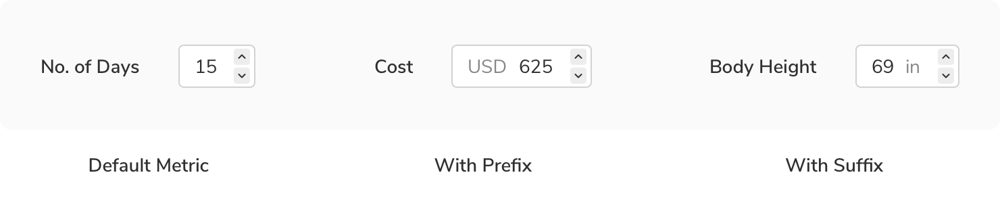
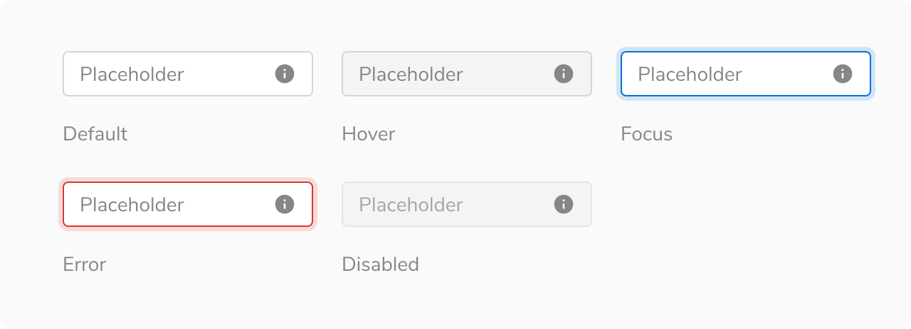
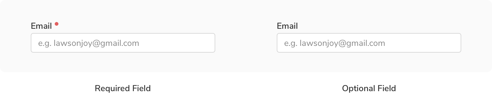

Inputs allow users to type in a value. They can be used anywhere, though they mostly appear in conjunction with other input components to create a form.

### Types
 

#### Basic input
Basic input contains the input box, value or placeholder text, and an optional icon on the right.
<Preview name="components-input-basic-input--basic-input" />

#### Metric input
Metric input takes numerical data as input. It can either have a **prefix** e.g. currency symbols such as $, €, ₹, etc., or **suffix** e.g.units such as kg, mm, in, etc. to provide additional information about the data being input. 
<Preview name="components-metricinput-all--all" />

#### Verification code input
Verification code input allows users to enter the code sent to their systems to verify themselves. These codes can be either 4 or 6 digits long.
<Preview name="components-verificationcodeinput-all--all" />

#### Free text area
Free text area lets users enter data much longer than a basic input. It can have a scrollbar and a resize action at the bottom right. Just like the basic input, it can also have help text beneath it.
<Preview name="components-textarea-default-textarea--default-textarea" />

### Variants
 

#### With icon
Basic inputs can have an icon on the left of text in the input box along with an optional icon on the right. This variant comes in 2 sizes i.e. regular and large as accomodating such icons is not possible in the tiny size.
<Preview name="components-input-icon-left-input--icon-left-input" />

#### Prefix/Suffix
Metric inputs can have prefix or suffix to provide additional information about the data being input.

 

### Sizes
Inputs come in **3 sizes** - regular, tiny and large with a few exceptions. Basic input with icon in the left, metric input and verification code input do not support the tiny size. Free text area comes in a single default size as it is resizeable.
<Preview name="components-input-variants-size--size" />

### States
Inputs come in **5 states** - default, hover, focused, error and disabled.

 
 

### Properties
#### Input
<table style="width: 100%">
  <tr>
    <th style="width:33%; text-align: left;">Property</th>
    <th style="width:33%; text-align: left;">Value(s)</th>
    <th style="width:33%; text-align: left;">Default value</th>
  </tr>
  <tr style="vertical-align: top">
    <td>Size</td>
    <td>
        <ul>
            <li>Regular</li>
            <li>Tiny</li>
            <li>Large</li>
        </ul>
    </td>
    <td>Regular</td>
  </tr>
  <tr style="vertical-align: top">
    <td>Icon left <em>(optional)</em></td>
    <td>&#60;icon name&#62;</td>
    <td>-</td>
  </tr>
  <tr style="vertical-align: top">
    <td>Action icon <em>(optional)</em></td>
    <td>&#60;icon name&#62;</td>
    <td>-</td>
  </tr>
  <tr style="vertical-align: top">
    <td>Help text <em>(optional)</em></td>
    <td>&#60;help text&#62;</td>
    <td>-</td>
  </tr>
</table>
 

#### Label
<table style="width: 100%">
  <tr>
    <th style="width:33%; text-align: left;">Property</th>
    <th style="width:33%; text-align: left;">Value(s)</th>
    <th style="width:33%; text-align: left;">Default value</th>
  </tr>
  <tr style="vertical-align: top">
    <td>Required <em>(optional)</em></td>
    <td>
        <ul>
            <li>True</li>
            <li>False</li>
        </ul>
    </td>
    <td>-</td>
  </tr>
  <tr style="vertical-align: top">
    <td>Optional <em>(optional)</em></td>
    <td>
        <ul>
            <li>True</li>
            <li>False</li>
        </ul>
    </td>
    <td>-</td>
  </tr>
  <tr style="vertical-align: top">
    <td>Info <em>(optional)</em></td>
    <td>
        <ul>
            <li>True</li>
            <li>False</li>
        </ul>
    </td>
    <td>-</td>
  </tr>
</table>
 

### Usage
 

#### Label
Labels help users understand what sort of information is required. Labels should be short and to the point. Effective labeling improves usability.
The label comes with an optional required indicator (*).
<Preview name="components-input-input-with-label--input-with-label" />

#### Label position
Label can be placed either on the top of the input field or at the left of it. It is not advised to place label on the left until there are some height constraints, as this type of placement causes a lot of eye movement. Top labels are responsive and also maintain the vertical rhythm in case of long forms.
<Preview name="components-input-label-position--label-position" />

#### Help text
Help text can be added beneath the input box to provide additional information. In case of an error that needs to be explained, inline message is used at the same place.
<Preview name="components-input-input-with-caption--input-with-caption" />

#### Required vs. Optional
Inputs can be marked as optional or required depending upon the context. To avoid unnecessary clutter, mark only the minority fields as optional or required.

**When no. of required fields < no. of optional fields**

 

**When no. of required fields > no. of optional fields**

 

It is recommended to keep the notations of required and optional fields consistent throughout the app as different notations can confuse users.

#### Input masking
Input masks are helpful for the data fields that have a specific input format, as they provide the formatting cues to help users know the format in which the data is expected for the field.
<Preview name="components-inputmask-phone-number--phone-number" />

#### Input with chips
Inputs can also be used to create filters in the field values by using input chips. To embed a chip, press **enter** after typing. To remove all the chips at once, click on the clear icon of the input box.

 

 
 

#### Verification code input behaviour
 

<iframe style="border: 1px solid rgba(0, 0, 0, 0.1);" width="800" height="450" src="https://www.figma.com/embed?embed_host=share&url=https%3A%2F%2Fwww.figma.com%2Fproto%2FYOxwh18LLa34NQIahcozOz%2FVerification-Code-Input-Expected-Flow%3Fkind%3D%26node-id%3D122%253A0%26page-id%3D0%253A1%26scaling%3Dscale-down-width%26viewport%3D163%252C286%252C0.05311004817485809&hide-ui=1" allowfullscreen></iframe>
 

