Interactive cards are flexible and make for an easily scannable way to present options.

### Types

#### Action cards

Action cards are used for navigation where description is important and the design needs to look neither overwhelming nor underwhelming. They are single select.

 

<Caption>Action card</Caption>

#### Selection cards

Selection cards are used for selection. They can be single-select or multi-select.

 

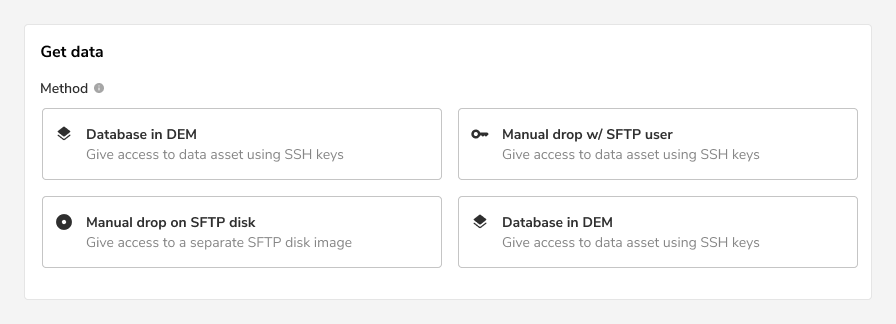

<Caption>Selection card</Caption>

### States

Interactive cards come in 5 states: default, hover, focus, disabled, and active.

#### Action cards

 

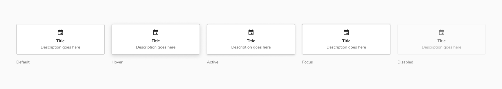

<Caption>Various states of action card</Caption>

#### Selection cards

 

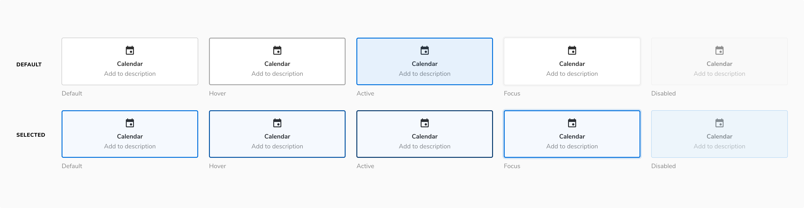

<Caption>Various states of selection card</Caption>

### Structure

#### Content alignment

##### Center

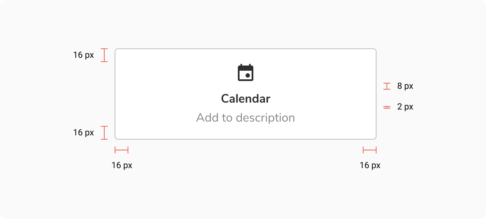
<Caption>Center aligned content</Caption>

 

<table style={{width: "100%"}}>
  <tbody>
    <tr>
      <th style={{width:"50%",  textAlign: "left"}}>Property</th>
      <th style={{width:"50%",  textAlign: "left"}}>Value(s)</th>
    </tr>
    <tr style={{verticalAlign: "top"}}>
      <td>Corner radius</td>
      <td>4 px</td>
    </tr>
    <tr style={{verticalAlign: "top"}}>
      <td>Padding (top, right, bottom, left)</td>
      <td>16 px, 16 px, 16 px, 16 px</td>
    </tr>
    <tr style={{verticalAlign: "top"}}>
      <td>Spacing between content and icon</td>
      <td>8 px </td>
    </tr>
  </tbody>
</table>

 

##### Left

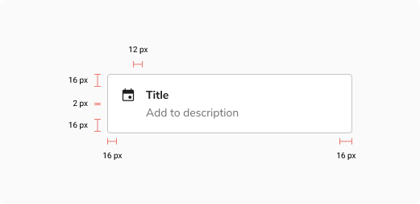
<Caption>Left aligned content</Caption>

 

<table style={{width: "100%"}}>
  <tbody>
    <tr>
      <th style={{width:"50%",  textAlign: "left"}}>Property</th>
      <th style={{width:"50%",  textAlign: "left"}}>Value(s)</th>
    </tr>
    <tr style={{verticalAlign: "top"}}>
      <td>Corner radius</td>
      <td>4 px</td>
    </tr>
    <tr style={{verticalAlign: "top"}}>
      <td>Padding (top, right, bottom, left)</td>
      <td>16 px, 16 px, 16 px, 12 px</td>
    </tr>
    <tr style={{verticalAlign: "top"}}>
      <td>Spacing between content and icon</td>
      <td>12 px </td>
    </tr>
  </tbody>
</table>

 

### Usage

#### Interactive cards vs Chips

Interactive cards are used for descriptive and well organized options, while chips are a space efficient way to display simpler options.

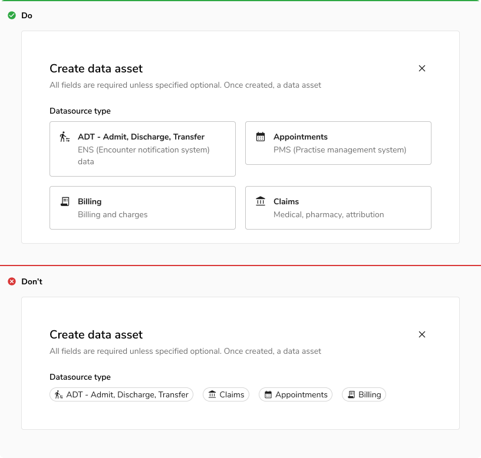
<Caption> Interactive cards vs Chips</Caption>

 

#### Interactive cards vs Radio/checkbox

Interactive cards are used when you need to categorize your options well using strong visual representation without making it overwhelming, while radio/checkbox is used for simpler layouts to save space.

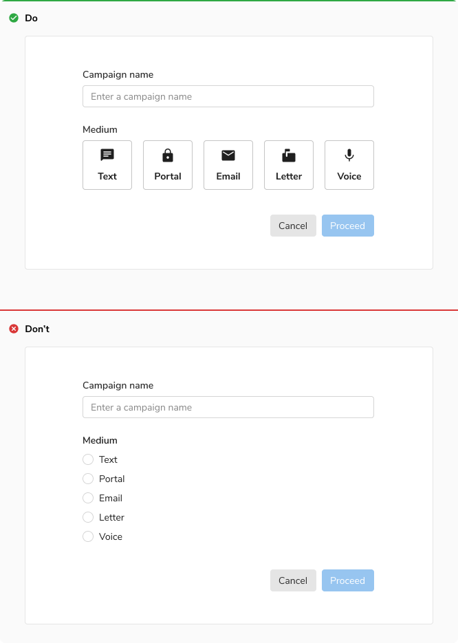
<Caption>Interactive cards vs Radio/checkbox</Caption>

#### Content alignment

##### Left

It is recommended to align content of interactive cards to the left when a long description is used, to give more visual room to read each line.

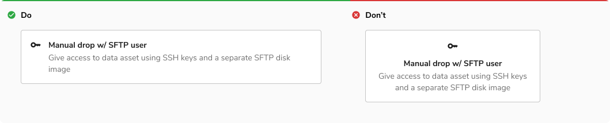
<Caption>Left content alignment</Caption>

##### Center

It is recommended to align the content of interactive cards to the center when the icon is sufficient to convey info or the description is short.

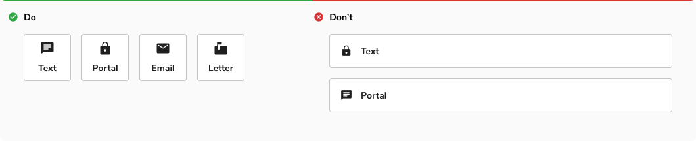
<Caption>Center content alignment</Caption>

 

#### Recommended spacing between cards

It is recommended to give a spacing of 16px between cards when stacking them horizontally or vertically.

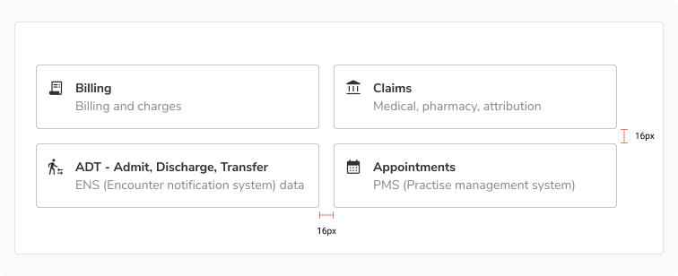
<Caption>Recommended spacing between cards</Caption>

 

#### Custom interactive cards

Interactive cards can have custom content inside it, but the states of the card with custom content must remain coherent with the default interactive cards.

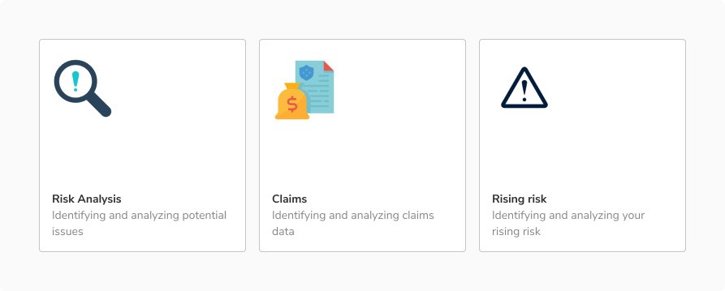
<Caption>Custom interactive cards</Caption>
