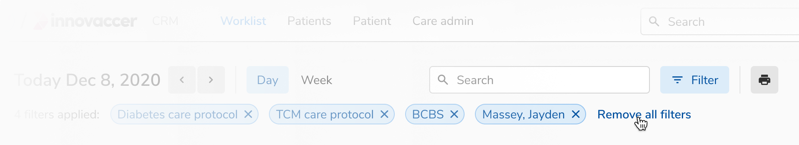
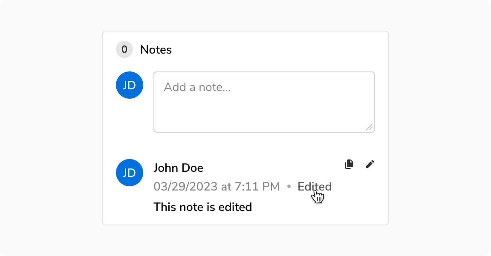
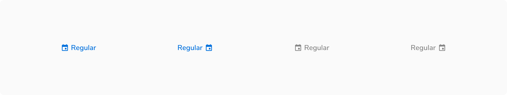
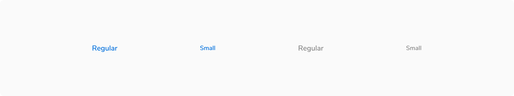
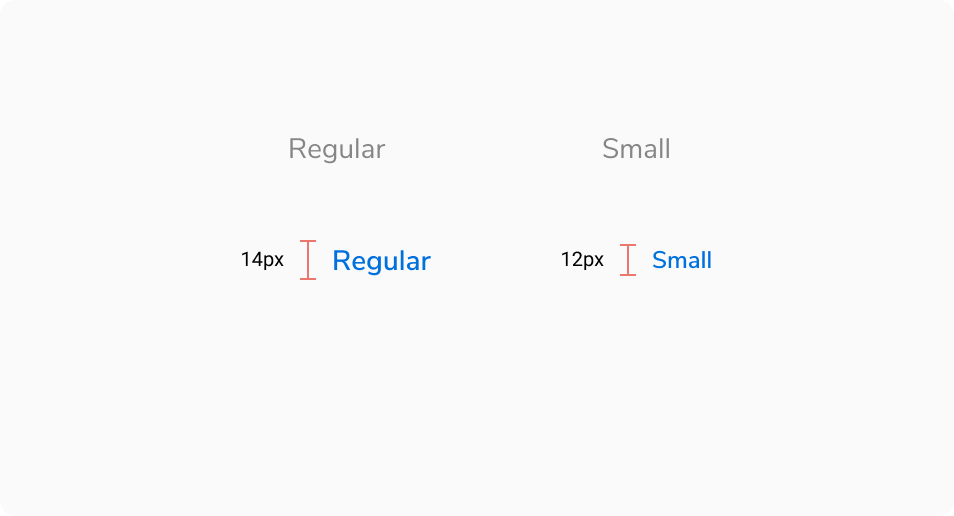
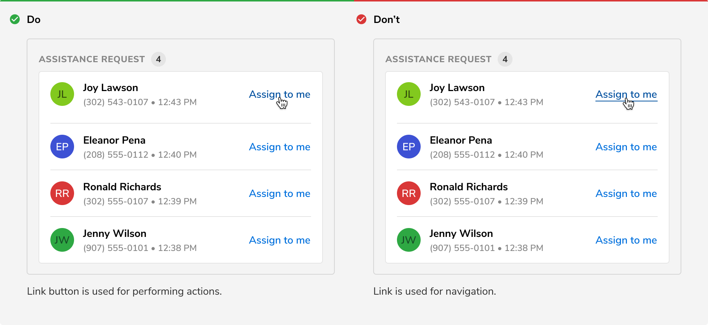

Link button is an action button with no padding which makes it easier to fit within the spacing and alignment constraints of modern web applications. It has the same interaction states and semantics of a button. 

<Preview name="components-linkbutton-all--all" />

### Variants

#### Default

Default link button is blue in color. It is used when just enough attention of users is required.

<Caption>Default link button</Caption>

#### Subtle

Subtle link button is gray in color. It is used where drawing users’ attention is not necessary.

<Caption>Subtle link button</Caption>

#### With icon

Link button can have an optional icon on the left or right.

<Caption>With icon</Caption>

### Sizes

Link button comes in **2 sizes** - regular and small.

<Caption>Different sizes of link button</Caption>

### States

Link button comes in **5 states** - default, hover, active, focus and disabled.

<Caption>Various states of link button</Caption>

### Structure

 

<Caption>Structure of link button</Caption>

<table style="width: 100%">
 <tbody>
   <tr>
     <th style="width:50%; text-align: left;">Property</th>
     <th style="width:50%; text-align: left;">Value(s)</th>
   </tr>
   <tr style="vertical-align: top">
     <td>Height</td>
     <td>
         <ul>
            <li>16 px <em>(Small)</em></li>
            <li>20 px <em>(Regular)</em></li>
         </ul>
     </td>
   </tr>
   <tr style="vertical-align: top">
     <td>Icon size</td>
     <td>
         <ul>
            <li>12 px <em>(Small)</em></li>
            <li>16 px <em>(Regular)</em></li>
         </ul>
     </td>
   </tr>
 </tbody>
</table>
 

### Configurations

 

<table style="width: 100%">
  <tbody>
    <tr>
      <th style="width:33%; text-align: left;">Property</th>
      <th style="width:33%; text-align: left;">Value(s)</th>
      <th style="width:33%; text-align: left;">Default value</th>
    </tr>
    <tr style="vertical-align: top">
      <td>Size</td>
      <td>
          <ul>
              <li>Small</li>
              <li>Regular</li>
          </ul>
      </td>
      <td>Regular</td>
    </tr>
    <tr style="vertical-align: top">
      <td>Subtle</td>
      <td>
          <ul>
              <li>True</li>
              <li>False</li>
          </ul>
      </td>
      <td>False</td>
    </tr>
    <tr style="vertical-align: top">
      <td>Icon  (optional)</td>
      <td>
          &lt;icon name&gt;
      </td>
      <td></td>
    </tr>
    <tr style="vertical-align: top">
      <td>Icon alignment</td>
      <td>
          <ul>
              <li>Left</li>
              <li>Right</li>
          </ul>
      </td>
      <td>Left</td>
    </tr>
  </tbody>
</table>

### Usage

#### Subtle link button vs Transparent button

Subtle link button is used when there is a space constraint whereas transparent button is used when there is sufficient space and the clickable area needs to be larger.

<Caption>Subtle link button vs Transparent button</Caption>

#### Link button vs Link

Link button is used for performing actions whereas link is used for navigation. 

<Caption>Link button vs Link</Caption>
