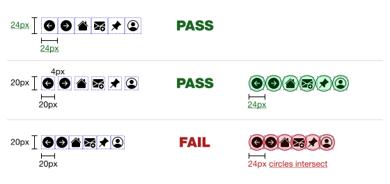

### Accessibility

 

#### Maintain Minimum Target Size for Links

It is recommended to ensure the interactive area of a link is at least **24 × 24 px**. If the visual link is smaller, provide sufficient spacing around it so that the effective target area meets the **24 × 24 px minimum target size** requirement, improving accessibility and preventing accidental activation.

 

 

#### Avoid Subtle Links Within Body Text

It is recommended to avoid using subtle styling for links within text. Links should be clearly distinguishable through visual cues such as color, underline, or emphasis to ensure they are easily identifiable and accessible to all users.

