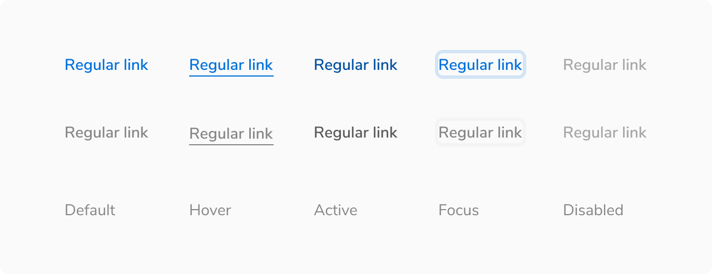
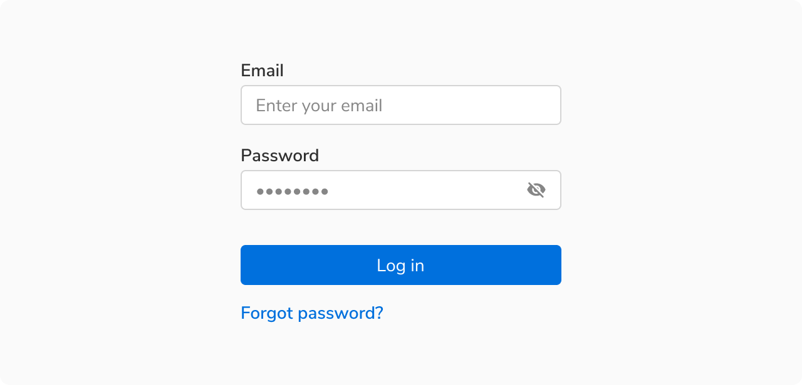
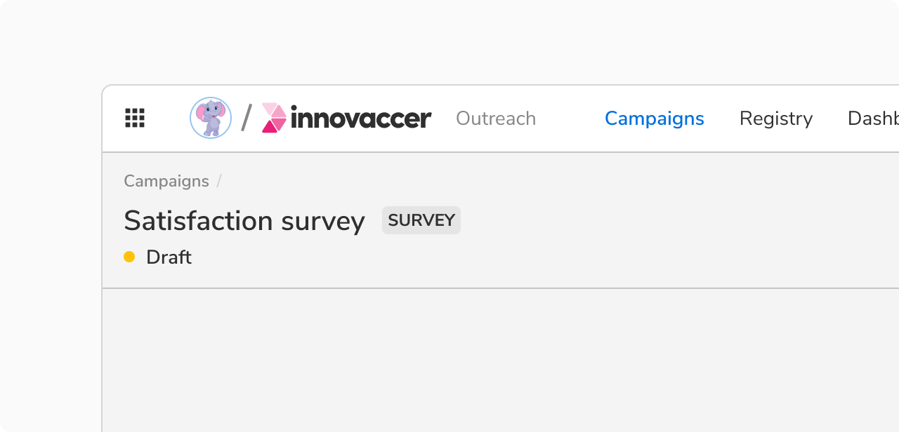

Links are used to navigate to a destination which can be on the same page or a different one.

### Structure
A link consist of just a text. It does not contain any padding.
<Preview name="link-all" />

### Sizes
Links come in **2 sizes** - regular and tiny.
<Preview name="link-variants-size" />

### Appearances
Links come in **2 appearances** - primary and subtle.
<Preview name="link-variants-appearance" />

### States
Links come in **5 states** - default, hover, active, focus and disabled.

 
 

### Properties
<table style="width: 100%">
  <tr>
    <th style="width:33%; text-align: left;">Property</th>
    <th style="width:33%; text-align: left;">Value(s)</th>
    <th style="width:33%; text-align: left;">Default value</th>
  </tr>
  <tr style="vertical-align: top">
    <td>Appearance</td>
    <td>
        <ul>
            <li>Default</li>
            <li>Subtle</li>
        </ul>
    </td>
    <td>Default</td>
  </tr>
  <tr style="vertical-align: top">
    <td>Size</td>
    <td>
        <ul>
            <li>Regular</li>
            <li>Tiny</li>
        </ul>
    </td>
    <td>Regular</td>
  </tr>
</table>
 

### Usage
#### Standard vs. Subtle link
##### Standard Link
It is the default link component and comes in the primary color. It is used to draw attention and hence it is not recommended to have many links on a single page.

 

##### Subtle Link
This is the subtle variant of link and hence uses a lighter color. It is primarily used in the breadcrumb component. Use it sparingly such as times when the default link can be too overwhelming to use (too much primary color on the screen).

 