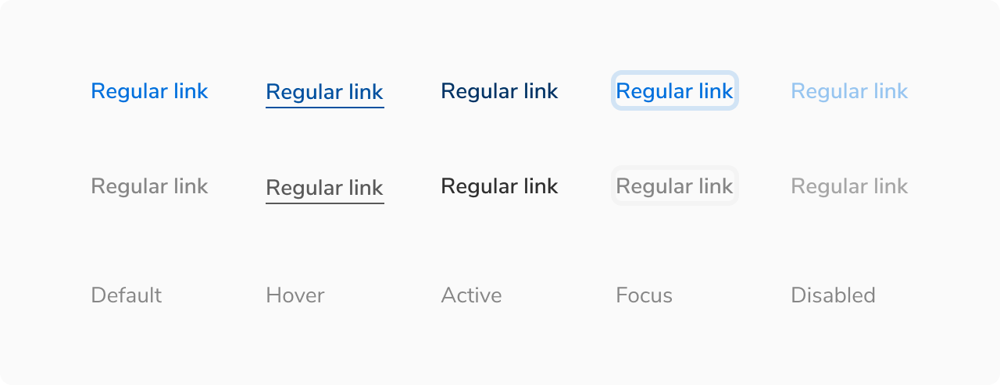

Link is used to navigate to a destination which can be on the same page or a different one.

<Preview name="components-link-all--all" />

### Sizes
Link comes in **2 sizes** - regular and small.
<Preview name="components-link-variants-size--size" />

### States
Link comes in **5 states** - default, hover, active, focus and disabled.

 
 

### Structure
A link consist of just a text. It does not contain any padding.

 
 

<table style="width: 100%">
 <tbody>
   <tr>
     <th style="width:50%; text-align: left;">Property</th>
     <th style="width:50%; text-align: left;">Value(s)</th>
   </tr>
   <tr style="vertical-align: top">
     <td>Height</td>
     <td>
         <ul>
            <li>16 px <em>(Small)</em></li>
            <li>20 px <em>(Regular)</em></li>
         </ul>
     </td>
   </tr>
 </tbody>
</table>
 

### Configurations
<table style="width: 100%">
  <tbody>
    <tr>
      <th style="width:33%; text-align: left;">Property</th>
      <th style="width:33%; text-align: left;">Value(s)</th>
      <th style="width:33%; text-align: left;">Default value</th>
    </tr>
    <tr style="vertical-align: top">
      <td>Subtle</td>
      <td>
          <ul>
              <li>True</li>
              <li>False</li>
          </ul>
      </td>
      <td>False</td>
    </tr>
    <tr style="vertical-align: top">
      <td>Size</td>
      <td>
          <ul>
              <li>Small</li>
              <li>Regular</li>
          </ul>
      </td>
      <td>Regular</td>
    </tr>
  </tbody>
</table>
 

### Usage
#### Standard vs. Subtle link
##### Standard Link
It is the default link component and comes in the primary color. It is used to draw attention and hence it is not recommended to have many links on a single page.

<Caption> ‘Forgot password?’ as primary link, being used for navigating to a new screen </Caption>
 

##### Subtle Link
This is the subtle variant of link and hence uses a lighter color. It is primarily used in the breadcrumb component. Use it sparingly such as times when the default link can be too overwhelming to use (too much primary color on the screen).

<Caption> Breadcrumbs as subtle link being used for navigating to previous screens </Caption>

 