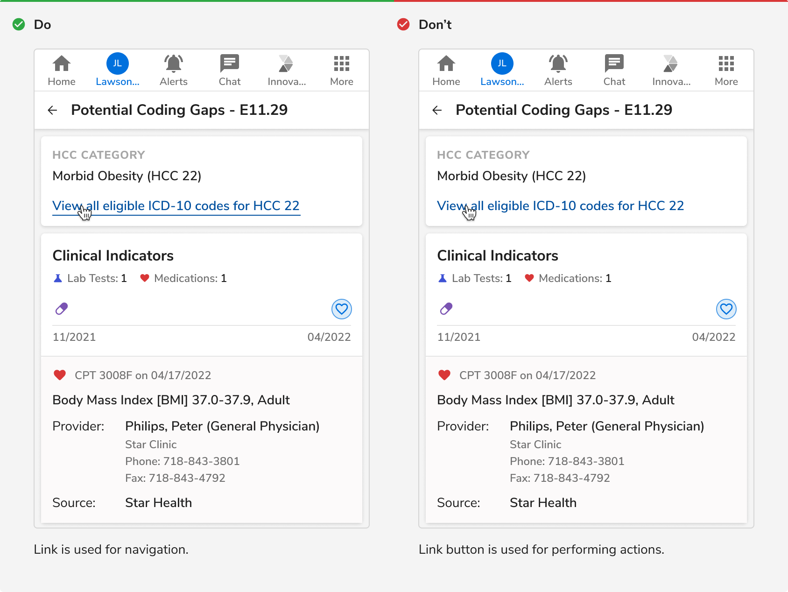

Links are used to navigate to a destination which can be on the same page or a different one. They should be used for navigation only not for actions.

<Preview name="components-link-all--all" />

### Variants

#### Default

Default link button is blue in color. It is used when just enough attention of users is required.

<Caption>Default</Caption>

#### With Icon

Link can have an optional icon on the left or right.

<Caption>With icon</Caption>

### Sizes
Link comes in **2 sizes** - regular and small.
<Preview name="components-link-variants-size--size" />

### States
Link comes in **5 states** - default, hover, active, focus and disabled.

 
 

### Structure
A link consist of just a text. It does not contain any padding.

 
 

<table style={{width: "100%"}}>
 <tbody>
   <tr>
     <th style={{width:"50%",  textAlign: "left"}}>Property</th>
     <th style={{width:"50%",  textAlign: "left"}}>Value(s)</th>
   </tr>
   <tr style={{verticalAlign: "top"}}>
     <td>Height</td>
     <td>
         <ul>
            <li>16 px <em>(Small)</em></li>
            <li>20 px <em>(Regular)</em></li>
         </ul>
     </td>
   </tr>
   <tr style={{verticalAlign: "top"}}>
     <td>Icon size</td>
     <td>
         <ul>
            <li>12 px <em>(Small)</em></li>
            <li>16 px <em>(Regular)</em></li>
         </ul>
     </td>
   </tr>
 </tbody>
</table>
 

### Configurations
<table style={{width: "100%"}}>
  <tbody>
    <tr>
      <th style={{width:"33%", textAlign: "left"}}>Property</th>
      <th style={{width:"33%", textAlign: "left"}}>Value(s)</th>
      <th style={{width:"33%", textAlign: "left"}}>Default value</th>
    </tr>
    <tr style={{verticalAlign: "top"}}>
      <td>Size</td>
      <td>
          <ul>
              <li>Regular</li>
              <li>Small</li>
          </ul>
      </td>
      <td>Regular</td>
    </tr>
    <tr style={{verticalAlign: "top"}}>
      <td>Subtle</td>
      <td>
          <ul>
              <li>True</li>
              <li>False</li>
          </ul>
      </td>
      <td>False</td>
    </tr>
    <tr style={{verticalAlign: "top"}}>
      <td>Icon   (optional)</td>
      <td>
          icon name
      </td>
      <td>-</td>
    </tr>
    <tr style={{verticalAlign: "top"}}>
      <td>Icon alignment</td>
      <td>
          <ul>
              <li>Left</li>
              <li>Right</li>
          </ul>
      </td>
      <td>Left</td>
    </tr>
  </tbody>
</table>
 

### Usage
#### Primary Link vs. Subtle Link

##### Primary Link
It is the default link component and comes in the primary color. It is used to draw attention and hence it is not recommended to have many links on a single page.

<Caption>Primary Link</Caption>
 

##### Subtle Link
This is the subtle variant of link and hence uses a lighter color. It is primarily used in the breadcrumb component. Use it sparingly such as times when the default link can be too overwhelming to use (too much primary color on the screen).

<Caption> Subtle Link </Caption>

 

#### Link vs Link button

Link is used for navigation whereas link button is used for performing actions.

<Caption>Link vs Link button</Caption>

