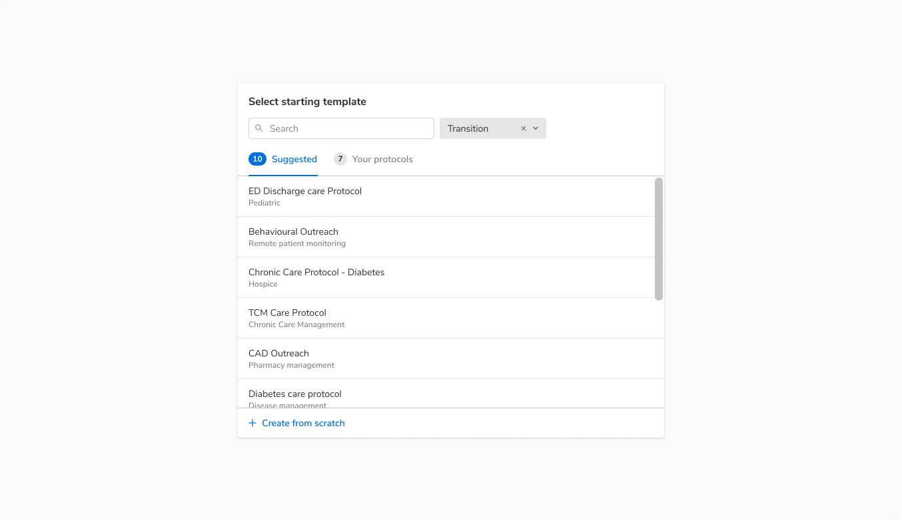
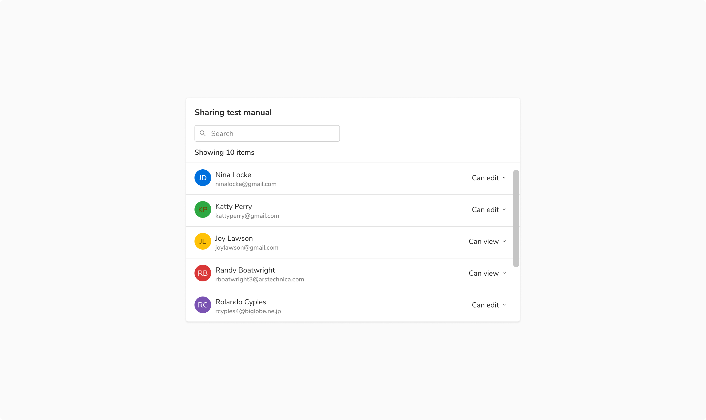
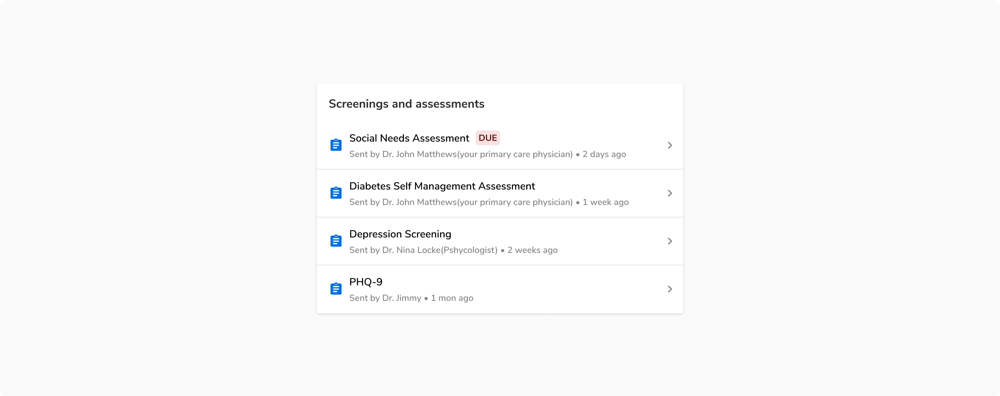
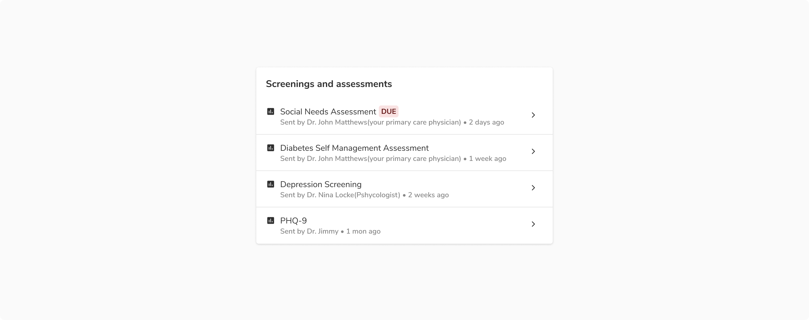
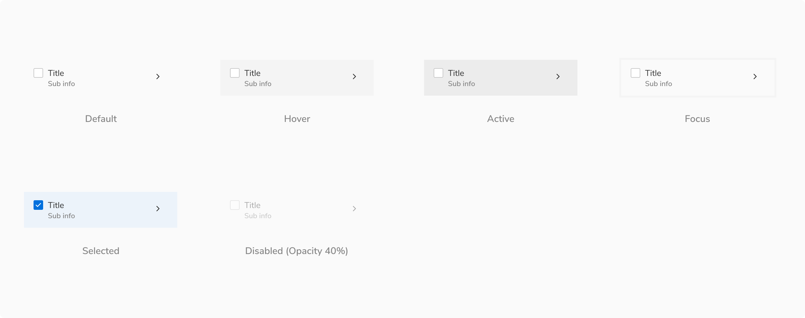
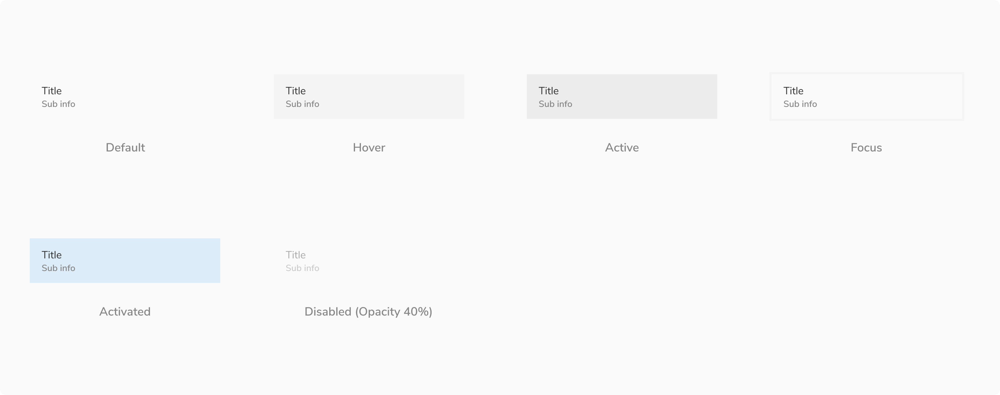
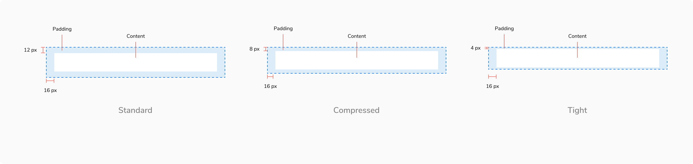
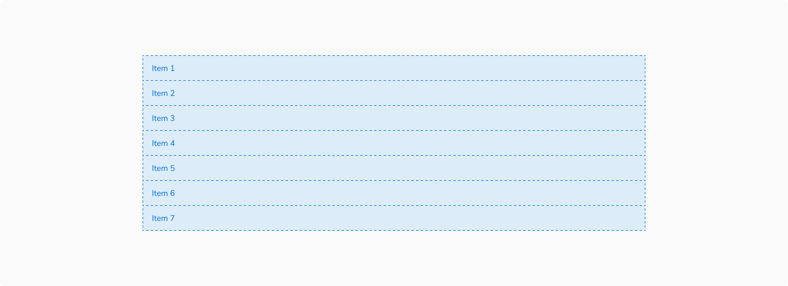
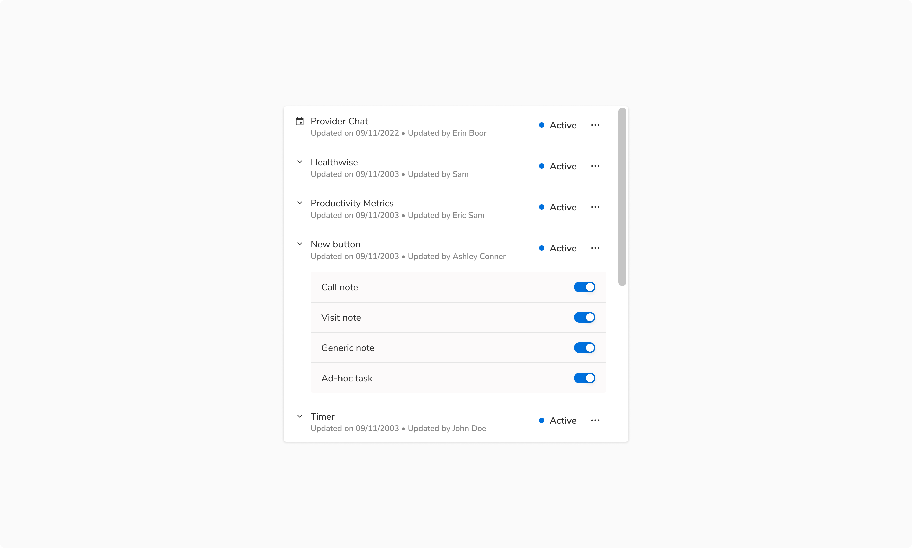
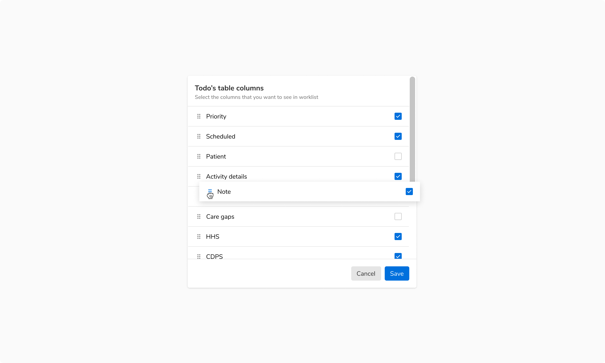

A listbox consists of related content grouped together and arranged vertically or horizontally. Listbox present the content (text, supporting visuals, etc) in a consistent layout to make them easily scannable.

### Types
Listbox come in **3 types**: option list, description list and resource list

#### Option list
A list of options where an option is an entity that a user can select/pick.

<Caption>An option list</Caption>

#### Description list
A list of items containing simple information which is meant for consumption only. It can occasionally contain minor actions such as copy, edit, remove, etc.

<Caption>A description list</Caption>

#### Resource list
A list of resources where a resource is an object in itself and has a detailed view linked to it.

<Caption>A resource list</Caption>

### Sizes
Listbox comes in **3 sizes**: standard, tight and compressed. The width varies based on the content and layout.

<table style="width: 100%">
  <tbody>
    <tr>
      <th style="width:33%; text-align: left;">Type</th>
      <th style="width:33%; text-align: left;">Vertical padding</th>
      <th style="width:33%; text-align: left;">Horizontal padding</th>
    </tr>
    <tr style="vertical-align: top">
      <td>Standard</td>
      <td>12px</td>
      <td>16px</td>
    </tr>
    <tr style="vertical-align: top">
      <td>Compressed</td>
      <td>8px</td>
      <td>16px</td>
    </tr>
    <tr style="vertical-align: top">
      <td>Tight</td>
      <td>4px</td>
      <td>16px</td>
    </tr>
  </tbody>
</table>

 

#### Standard

 
 

<Caption>Standard size - vertical padding - 12 px</Caption>

#### Compressed

 
 

<Caption>Compressed size - vertical padding - 8 px</Caption>

#### Tight 

This size is typically suited for information-dense lists.

<Caption>Tight size - vertical padding - 4 px</Caption>

### States

**Note**: Since description list item is not interactive, it does not have any state.

#### Option list

 
 

<Caption>States of option list items</Caption>

#### Description list

 
 

<Caption>States of description list items</Caption>

#### Resource list

 
 

<Caption>States of resource list items</Caption>

 

### Structure

 
 

<Caption>Structure of list items</Caption>

 

<table style="width: 100%">
  <tbody>
    <tr>
      <th style="width:50%; text-align: left;">Property</th>
      <th style="width:50%; text-align: left;">Value(s)</th>
    </tr>
    <tr style="vertical-align: top">
      <td>Horizontal padding</td>
      <td>16 px</td>
    </tr>
    <tr style="vertical-align: top">
      <td>Vertical padding</td>
      <td>
        <ul>
          <li>Standard - 12 px</li>
          <li>Compressed - 8 px</li>
          <li>Tight - 4 px</li>
        </ul>
      </td>
    </tr>
    <tr style="vertical-align: top">
      <td>Shadow of picked item (while reordering)</td>
      <td>Shadow 30</td>
    </tr>
    <tr style="vertical-align: top">
      <td>Background</td>
      <td>Nil</td>
    </tr>
  </tbody>
</table>

 

### Configurations

 
 

<table style="width: 100%">
  <tbody>
    <tr>
      <th style="width:33%; text-align: left;">Property</th>
      <th style="width:33%; text-align: left;">Value(s)</th>
      <th style="width:33%; text-align: left;">Default value</th>
    </tr>
    <tr style="vertical-align: top">
      <td>Spacing between 2 items</td>
      <td>&lt;value&gt;</td>
      <td>0 px</td>
    </tr>
  </tbody>
</table>

 

### Usage

#### Arrangement

##### Vertical

This is the most common arrangement as the list is easy to read when arranged vertically. 

 

<Caption>List items arranged vertically</Caption>

#### Nesting

List can be nested to show additional content. Any type of content such as a list, a card, etc can be nested inside a list items.

 

<Caption>A nested list</Caption>

#### Reordering list items

Reordering the list items should be hinted using a drag indicator placed at the beginning of the items. The list item can be picked and dragged using the drag indicator to reorder the list.

 

<Caption>Reordering the list items</Caption>

 

<Caption>States of drag indicator icon</Caption>
