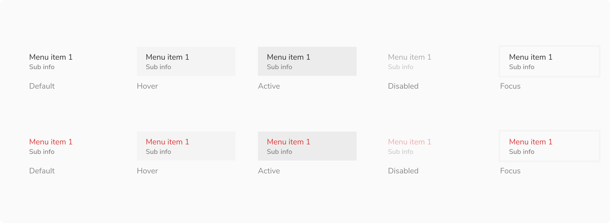
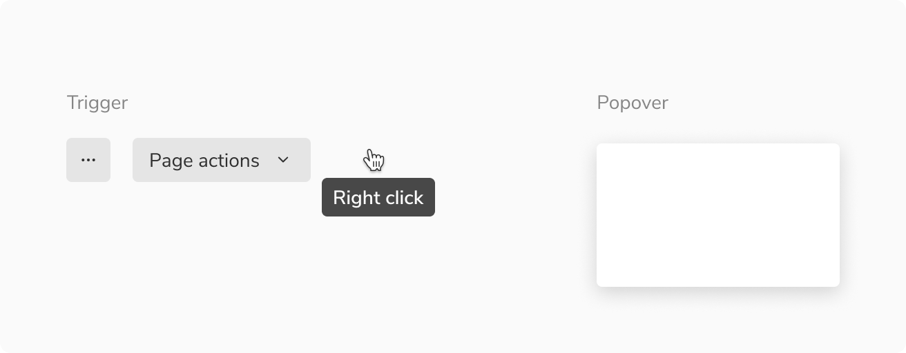
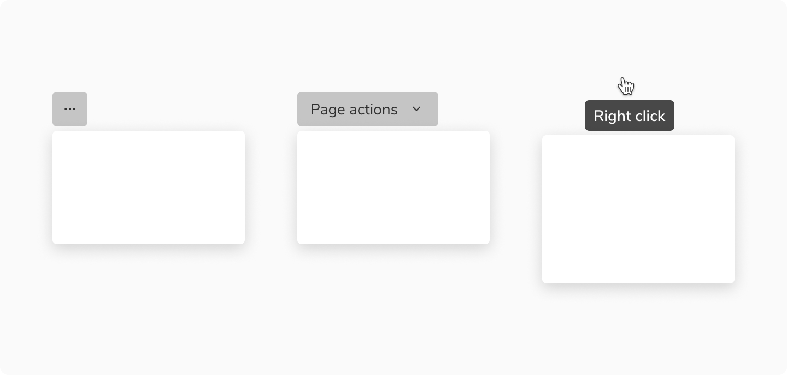
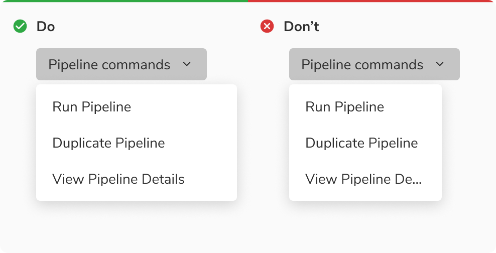
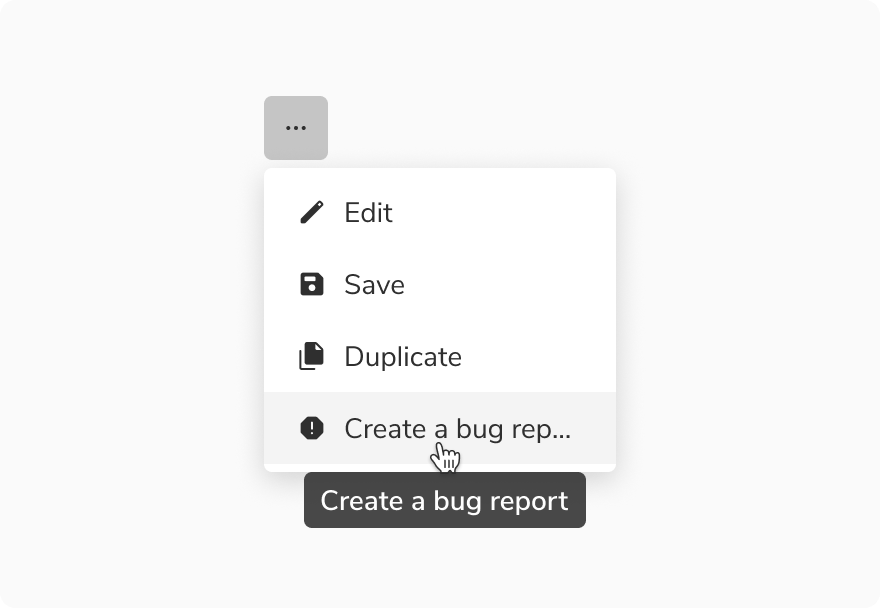
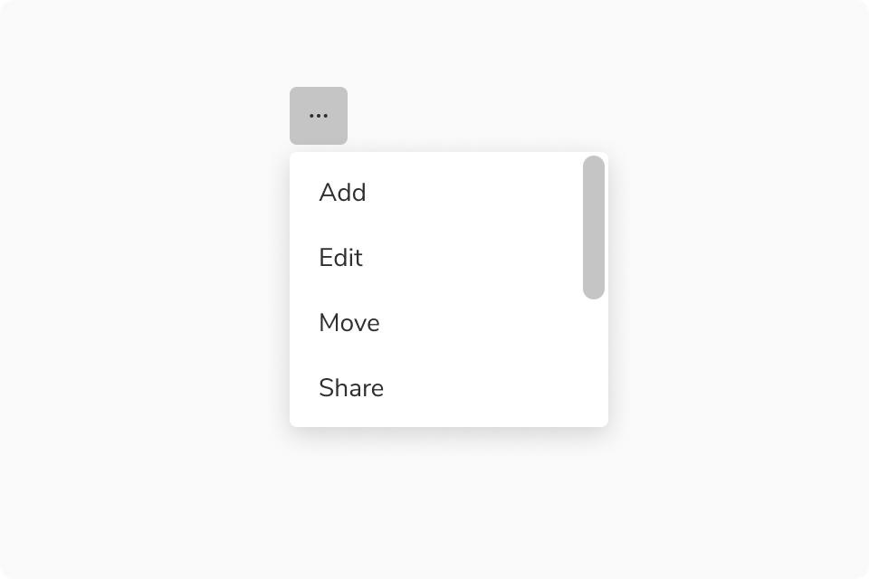
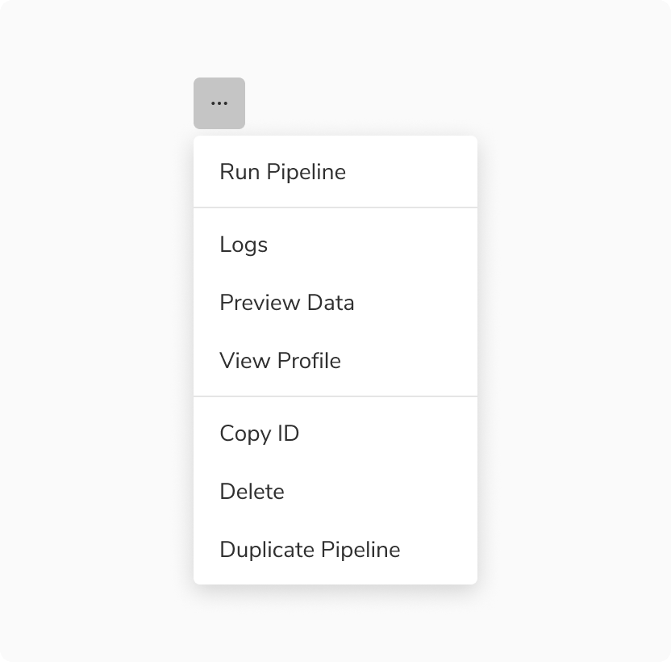
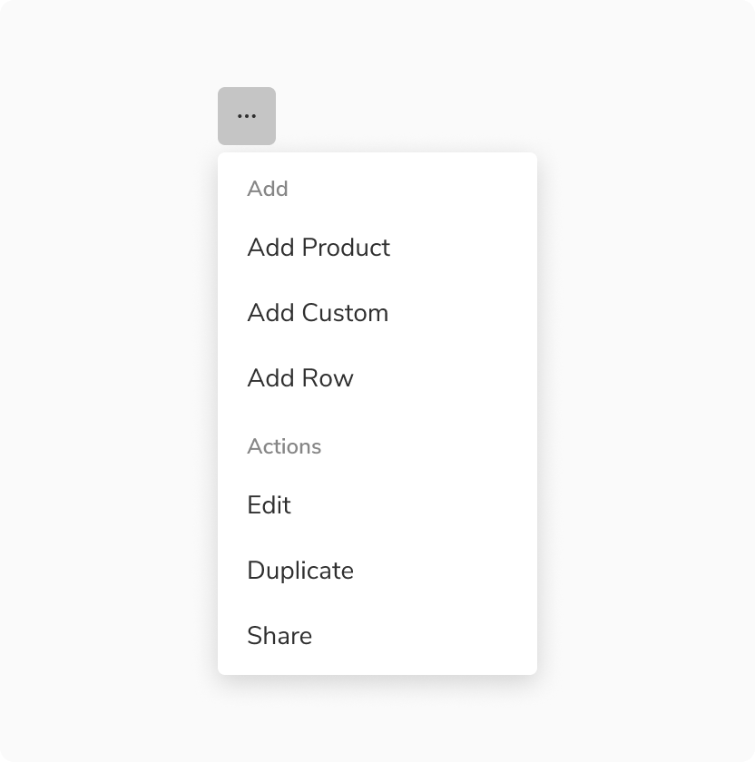
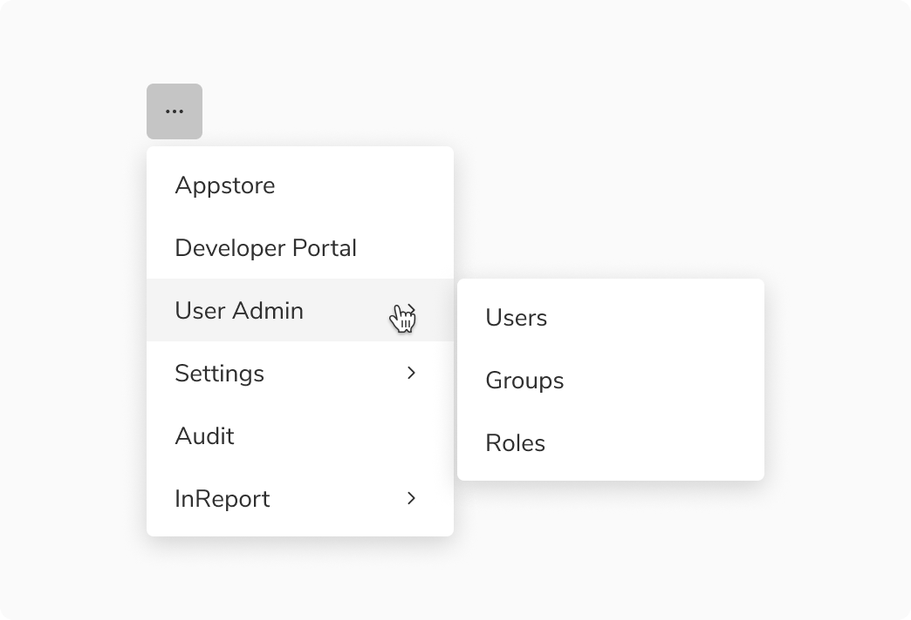
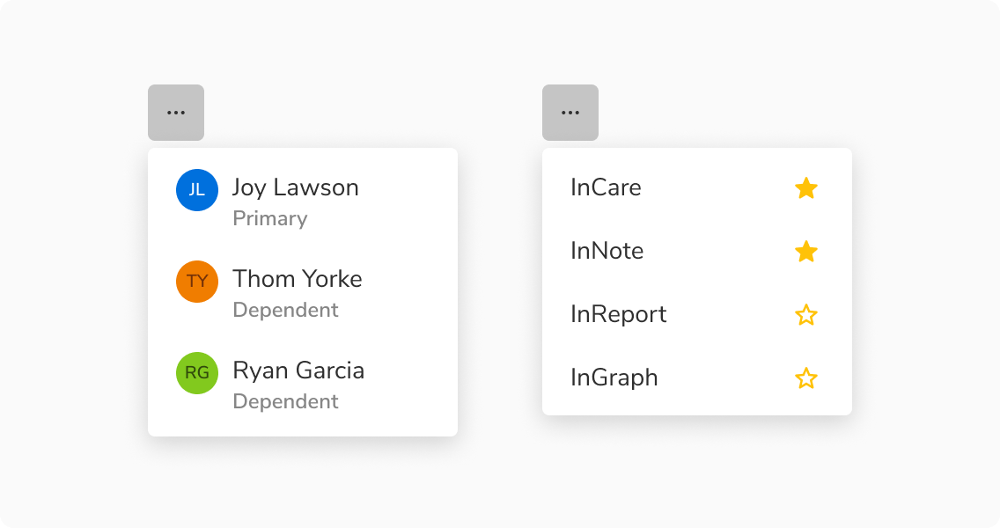

<Preview name="components-menu-all--all" />

### Types

#### Default

Default option type is used for neutral actions.

<Preview name="components-menu-all--all" />

#### Destructive

Destructive option type is used for destructive actions. It does not support nesting. 

<Preview name="components-menu-type-destructive-with-icon--with-icon" />

### Variants

#### Standard

This variant comes with just text. Both default and destructive option type support this variant.

<Preview name="components-menu-variants-standard--standard" />

#### With icon

This variant comes with an icon preceding the text. Both default and destructive option type support this variant.

<Preview name="components-menu-variants-with-icon--with-icon" />

#### With sub info

This variant comes with sub-info beneath the text. Both default and destructive option type support this variant. 

<Preview name="components-menu-variants-with-sub-info--with-sub-info" />

#### With check

This variant comes with a check which acts like a switch introducing immediate change once toggled. Only default option type supports this variant. 

<Preview name="components-menu-type-default-with-check--with-check" /> 

#### With keyboard shortcut

This variant comes with a keyboard shortcut used for expediting common actions in a menu. Only default option type supports this variant. 

<Preview name="components-menu-type-default-with-keyboard-shortcut--with-keyboard-shortcut" />

#### With chevron

This variant comes with a chevron used for introducing nesting in a menu. Only default option type supports this variant. 

<Preview name="components-menu-nesting--nesting" />

### Sizes

#### Trigger size

Menu triggers can vary in size, with **2 default sizes:** regular and small.

<Preview name="components-menu-size-trigger-size--trigger-size" />

### States

#### Option states 

The options are built using the option list and has **5 valid states** - default, hover, active, focus and disabled. Users can also use the up/down arrow key to traverse the options. 

<Caption>Option states</Caption>

### Structure

A menu is made up of two key components: a **trigger**, which can be in the form of an icon button, basic button, mouse right-click, etc., and a **popover**, which acts as a container for the menu items.

<Caption>Structure of menu</Caption>

#### Trigger

Trigger can be in the form of an icon button, basic button, mouse right-click, etc.

<Caption>Some common triggers for menu</Caption>

 

#### Option items

<Caption> Option item - Menu</Caption>

 

<table style="width: 100%">
  <tbody>
    <tr>
      <th style="width:50%; text-align: left;">Padding</th>
      <th style="width:50%; text-align: left;">Value(s)</th>
    </tr>
    <tr style="vertical-align: top">
      <td>Top and bottom</td>
      <td>
        <ul>
          <li>4px</li>
          <li>8px</li>
          <li>12px</li>
        </ul>
      </td>
    </tr>
    <tr style="vertical-align: top">
      <td>Left and right</td>
      <td>16px</td>
    </tr>
  </tbody>
</table>

 

### Configurations

#### Option types

##### Default

 

<table style="width: 100%">
  <tbody>
    <tr>
      <th style="width:33%; text-align: left;">Property</th>
      <th style="width:33%; text-align: left;">Value(s)</th>
      <th style="width:33%; text-align: left;">Default value</th>
    </tr>
    <tr style="vertical-align: top">
      <td>Label</td>
      <td>&lt;label&gt;</td>
      <td>-</td>
    </tr>
    <tr style="vertical-align: top">
      <td>Size</td>
      <td>
        <ul>
          <li>Standard</li>
          <li>Compressed</li>
          <li>Tight</li>
        </ul>
      </td>
      <td>Compressed</td>
    </tr>
    <tr style="vertical-align: top">
      <td>Left icon   (optional)</td>
      <td>&lt;icon name&gt;</td>
      <td>-</td>
    </tr>
    <tr style="vertical-align: top">
      <td>Sub info   (optional)</td>
      <td>&lt;sub info&gt;</td>
      <td>-</td>
    </tr>
    <tr style="vertical-align: top">
      <td>Chevron   (optional)</td>
      <td>
        <ul>
          <li>True</li>
          <li>False</li>
        </ul>
      </td>
      <td>False</td>
    </tr>
    <tr style="vertical-align: top">
      <td>Check   (optional)</td>
      <td>
        <ul>
          <li>True</li>
          <li>False</li>
        </ul>
      </td>
      <td>False</td>
    </tr>
    <tr style="vertical-align: top">
      <td>Keyboard shortcut   (optional)</td>
      <td>&lt;Shortcut name&gt;</td>
      <td>-</td>
    </tr>
  </tbody>
</table>

 

##### Destructive

 

<table style="width: 100%">
  <tbody>
    <tr>
      <th style="width:33%; text-align: left;">Property</th>
      <th style="width:33%; text-align: left;">Value(s)</th>
      <th style="width:33%; text-align: left;">Default value</th>
    </tr>
    <tr style="vertical-align: top">
      <td>Label</td>
      <td>&lt;label&gt;</td>
      <td>-</td>
    </tr>
    <tr style="vertical-align: top">
      <td>Size</td>
      <td>
        <ul>
          <li>Standard</li>
          <li>Compressed</li>
          <li>Tight</li>
        </ul>
      </td>
      <td>Compressed</td>
    </tr>
    <tr style="vertical-align: top">
      <td>Left icon   (optional)</td>
      <td>&lt;icon name&gt;</td>
      <td>-</td>
    </tr>
    <tr style="vertical-align: top">
      <td>Sub info   (optional)</td>
      <td>&lt;sub info&gt;</td>
      <td>-</td>
    </tr>
  </tbody>
</table>

 

#### Popover 

 

<table style="width: 100%">
  <tbody>
    <tr>
      <th style="width:33%; text-align: left;">Property</th>
      <th style="width:33%; text-align: left;">Value(s)</th>
      <th style="width:33%; text-align: left;">Default value</th>
    </tr>
    <tr style="vertical-align: top">
      <td>Width</td>
      <td>&#60;width&#62;</td>
      <td>176px (Customizable)</td>
    </tr>
    <tr style="vertical-align: top">
      <td>Max height</td>
      <td>&#60;max_height&#62;</td>
      <td>256px (Customizable)</td>
    </tr>
    <tr style="vertical-align: top">
      <td>Min height</td>
      <td>&#60;min_height&#62;</td>
      <td>-</td>
    </tr>
  </tbody>
</table>

 

### Usage

#### Width of popover

While the popover's width is flexible and can vary, it is advisable to maintain a size that is equal to or larger than the trigger of menu.

<Caption>Width of popover</Caption>

#### Overflow behavior of items

In case of overflow, the items will get truncated and can be viewed inside a tooltip on hover.  

<Caption>Overflow behavior of items</Caption>

#### Scrolling inside menu

Menu allows scrolling inside it when a substantial number of options are present.

<Caption>Scrolling in menu</Caption>

#### Grouping

##### With Divider

Divider in menu is used to group simple options into different sections or categories. It also creates a visual distinction between actions of different natures.

<Caption>Dividers in menu</Caption>

##### With Sub heading

Sub heading in menu is used to group complex options into different sections or categories.

<Caption>Sub heading in menu</Caption>

#### Nesting in menu 

Nesting in menu is employed to establish a hierarchical structure and hide options, effectively conserving space and mitigating cognitive overload.

<Caption> Nesting in menu</Caption>

#### Custom options 

Menu options can have custom content inside them.

<Caption>Custom options </Caption>
