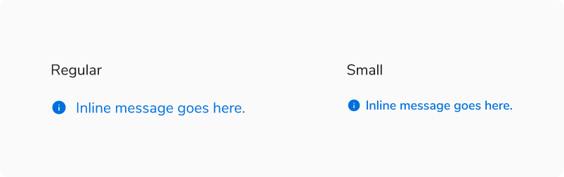
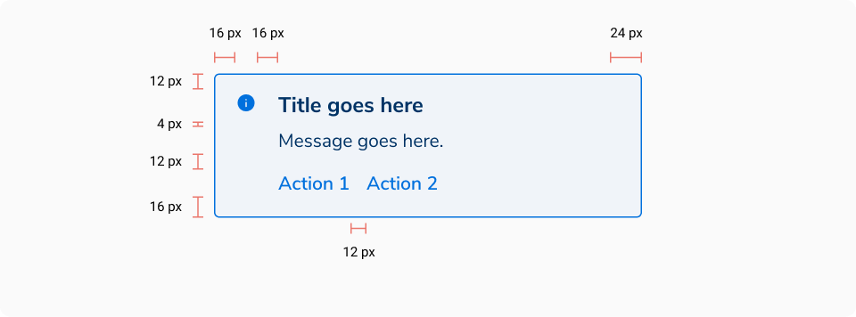
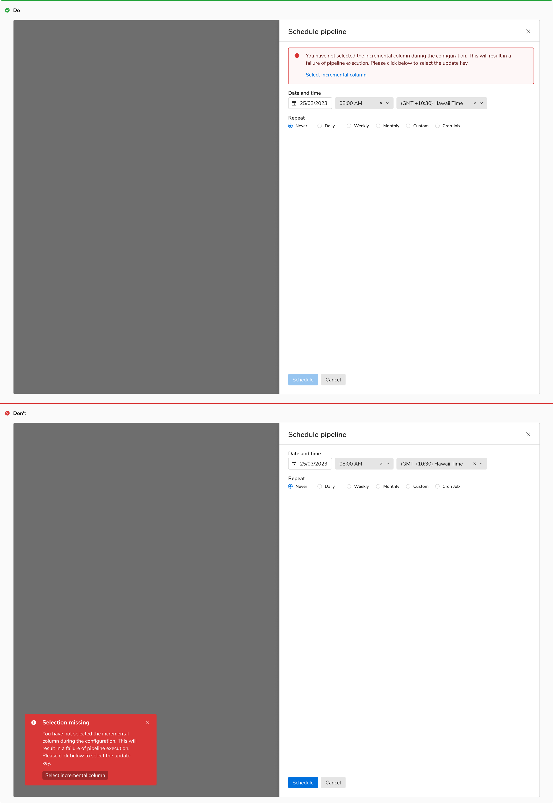

Messages serve as a prominent means of communicating important information to users, designed with a noticeable visual emphasis to capture their attention.

### Types
 

#### Standard
This is the default variant when it comes to messages. It has a significant visual loudness and should be used with caution.
<Preview name="indicators-message-appearance-info--info" />

#### Inline message
It is the less attention-grabbing counterpart and hence can be used in between components or patterns.
<Preview name="indicators-inlinemessage-appearance-info--info" />

### Variants

Standard message comes with a few variants -
#### With title
A title can be shown at the top of the messages. It is typically used to summarize the description in case it's long.
<Preview name="indicators-message-message-with-title--message-with-title" />

#### With actions
Actions can be a part of messages and are typically used to directly or indirectly dismiss them.
<Preview name="indicators-message-message-with-actions--message-with-actions" />

### Sizes
Inline messages come in **2 sizes** - small and regular .

####Inline messages

### Appearances
Messages come in **4 appearances** basis on the intent -

#### Info
The info appearance is used when the message needs to provide information that requires some attention from the users. 
<Preview name="indicators-message-appearance-info--info" />
<Preview name="indicators-inlinemessage-appearance-info--info" />

#### Warning
The warning appearance is used when the message needs to notify a warning that might need users' attention.
<Preview name="indicators-message-appearance-warning--warning" />
<Preview name="indicators-inlinemessage-appearance-warning--warning" />

#### Alert
The alert appearance is used when the message needs to provide an error or failure information that requires immediate attention. In the event of an error, the message persists until the issue is resolved, ensuring that the user remains informed until the matter is addressed.
<Preview name="indicators-message-appearance-alert--alert" />
<Preview name="indicators-inlinemessage-appearance-alert--alert" />

#### Success
The success variant is used when the inline message needs to notify the successful completion of a task or action.
<Preview name="indicators-message-appearance-success--success" />
<Preview name="indicators-inlinemessage-appearance-success--success" />

### Structure
 
 

#### Standard message

 

<table style="width: 100%">
 <tbody>
   <tr>
     <th style="width:50%; text-align: left;">Property</th>
     <th style="width:50%; text-align: left;">Value(s)</th>
   </tr>
   <tr style="vertical-align: top">
      <td>Padding <em>(top, right, bottom, left)</em></td>
      <td>12 px, 24 px, 16 px, 16 px</td>
   </tr>
 </tbody>
</table>
 

#### Inline message

 

<table style="width: 100%">
 <tbody>
   <tr>
     <th style="width:50%; text-align: left;">Property</th>
     <th style="width:50%; text-align: left;">Value(s)</th>
   </tr>
   <tr style="vertical-align: top">
     <td>Height</td>
     <td>
         <ul>
             <li>16 px <em>(Small)</em></li>
             <li>20 px <em>(Regular)</em></li>
         </ul>
     </td>
   </tr>
 </tbody>
</table>
 

### Configurations
#### Standard message
<table style="width: 100%">
  <tbody>
    <tr>
      <th style="width:33%; text-align: left;">Property</th>
      <th style="width:33%; text-align: left;">Value(s)</th>
      <th style="width:33%; text-align: left;">Default value</th>
    </tr>
    <tr style="vertical-align: top">
      <td>Appearance</td>
      <td>
          <ul>
              <li>Info</li>
              <li>Success</li>
              <li>Warning</li>
              <li>Alert</li>
          </ul>
      </td>
      <td>Info</td>
    </tr>
    <tr style="vertical-align: top">
      <td>Title <em>(optional)</em></td>
      <td>&#60;title&#62;</td>
      <td>-</td>
    </tr>
    <tr style="vertical-align: top">
      <td>Description</td>
      <td>&#60;description&#62;</td>
      <td>-</td>
    </tr>
    <tr style="vertical-align: top">
      <td>Actions <em>(optional)</em></td>
      <td>
          <ul>
              <li>Action 1</li>
              <li>Action 2</li>
          </ul>
      </td>
      <td>-</td>
    </tr>
  </tbody>
</table>
 

#### Inline message
<table style="width: 100%">
  <tbody>
    <tr>
      <th style="width:33%; text-align: left;">Property</th>
      <th style="width:33%; text-align: left;">Value(s)</th>
      <th style="width:33%; text-align: left;">Default value</th>
    </tr>
    <tr style="vertical-align: top">
      <td>Appearance</td>
      <td>
          <ul>
              <li>Info</li>
              <li>Success</li>
              <li>Warning</li>
              <li>Alert</li>
          </ul>
      </td>
      <td>Info</td>
    </tr>
    <tr style="vertical-align: top">
      <td>Size</td>
      <td>
          <ul>
              <li>Small</li>
              <li>Regular</li>
          </ul>
      </td>
      <td>Regular</td>
    </tr>
    <tr style="vertical-align: top">
      <td>Description</td>
      <td>&#60;description&#62;</td>
      <td>-</td>
    </tr>
  </tbody>
</table>
 

### Usage
 

#### Non-dismissive
Messages are non-dismissive in nature due to the prominent feedback they are delivering. They appear with the rest of the components and cannot be dismissed directly.

#### Messages vs Toasts
Messages are used for important information and are integrated directly into the content of the interface whereas toasts are temporary notifications that appear on the screen to provide brief, unobtrusive feedback to the user.

<Caption> Messages vs Toasts </Caption>

#### Inline vs. Standard message
Inline message variant should be used when feedback relative to some specific content has to be provided to the users. Whereas, the standard message variant should be used when collective feedback for a section or an entire page has to be provided to the users.

![[Left] Inline message, [Right] Standard message](./images/messages-1.png)
<Caption> [Left] Inline message, [Right] Standard message </Caption>

 
 

#### Position & width
##### Standard
Message component always appears at the top of a section but just below the header. The width of the message component always spans the width of its container or as per the content appearing below it.

<Caption> Position & width of the standard message component </Caption>

 

##### Inline message
Inline message component appears below the component it is related to, with a 4px margin at top and spans the width of the component.

<Caption> Position & width of the inline message component </Caption>
 
 

#### Message vs Toast vs Modal

 

<table style="width: 100%">
  <tbody>
    <tr>
      <th style="width:25%; text-align: left;">Factors</th>
      <th style="width:25%; text-align: left;">Toast</th>
      <th style="width:25%; text-align: left;">Message</th>
      <th style="width:25%; text-align: left;">Modal</th>
    </tr>
    <tr style="vertical-align: top">
      <td>Severity</td>
      <td><Badge appearance="warning" subtle={true}>LOW</Badge></td>
      <td><Badge appearance="accent1" subtle={true}>MEDIUM</Badge></td>
      <td><Badge appearance="alert" subtle={true}>CRITICAL</Badge></td>
    </tr>
    <tr style="vertical-align: top">
      <td>Feedback</td>
      <td>Feedback or update after an action has taken place</td>
      <td>Information or feedback that aids users in completing their action or flow</td>
      <td>Critical information that requires user input or interaction</td>
    </tr>
    <tr style="vertical-align: top">
      <td>When to use</td>
      <td>After an action has taken place</td>
      <td>Before or after an action has taken place</td>
      <td>Before an action has taken place</td>
    </tr>
    <tr style="vertical-align: top">
      <td>Information detail</td>
      <td>Concise</td>
      <td>Concise</td>
      <td>In-depth</td>
    </tr>
    <tr style="vertical-align: top">
      <td>Intrusiveness</td>
      <td>Unobtrusive</td>
      <td>Attention demanding</td>
      <td>Disruptive</td>
    </tr>
    <tr style="vertical-align: top">
      <td>Duration</td>
      <td>Persists for 5 seconds (Default), can be customized in case of a critical notification</td>
      <td>Persists but can be removed from the view upon resolution of the error.</td>
      <td>Persists until user interaction or input is received.</td>
    </tr>
  </tbody>
</table>
 
