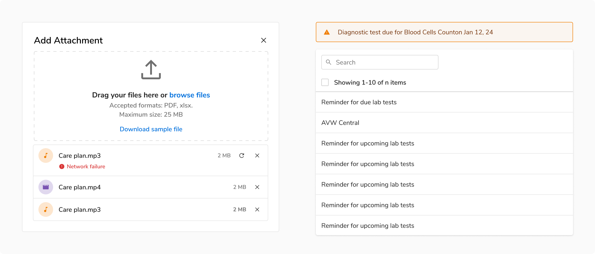

Messages are used to provide collective feedback to the users about an action or a state. They have a significant visual loudness to draw users' attention.

### Types
 

#### Standard
This is the default variant when it comes to messages. It has a significant visual loudness and should be used with caution.
<Preview name="message-info-message" />

#### Inline message
It is the less attention-grabbing counterpart and hence can be used in between components or patterns.
<Preview name="inlinemessage-variants-info-message" />

### Variants

Standard message comes with a few variants -
#### With title
A title can be shown at the top of the messages. It is typically used to summarize the description in case it's long.
<Preview name="message-message-with-title" />

#### With actions
Actions can be a part of messages and are typically used to directly or indirectly dismiss them.
<Preview name="message-message-with-actions" />

### Appearances
Messages come in **4 appearances** basis on the intent -

#### Info
The info appearance is used when the message needs to provide information that requires some attention from the users.
<Preview name="message-info-message" />
<Preview name="inlinemessage-variants-info-message" />

#### Warning
The warning appearance is used when the message needs to notify a warning that might need users' attention.
<Preview name="message-warning-message" />
<Preview name="inlinemessage-variants-warning-message" />

#### Alert
The alert appearance is used when the message needs to provide an error or failure information that requires immediate attention.
<Preview name="message-alert-message" />
<Preview name="inlinemessage-variants-alert-message" />

#### Success
The success variant is used when the inline message needs to notify the successful completion of a task or action.
<Preview name="message-success-message" />
<Preview name="inlinemessage-variants-success-message" />

### Usage
 

#### Non-dismissive
Messages are non-dismissive in nature. They appear with the rest of the components and cannot be dismissed directly.

#### Standard vs. Inline message
Inline message variant should be used when feedback relative to some specific content has to be provided to the users. Whereas, the standard message variant should be used when collective feedback for a section or an entire page has to be provided to the users.

 
 

#### Position & width
##### Standard
Message component always appears at the top of a section but just below the header. The width of the message component always spans the width of its container or as per the content appearing below it.

 

##### Inline message
Inline message component appears below the component it is related to, with a 4px margin at top and spans the width of the component.

 
