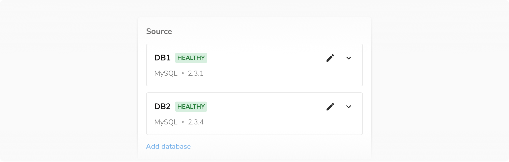
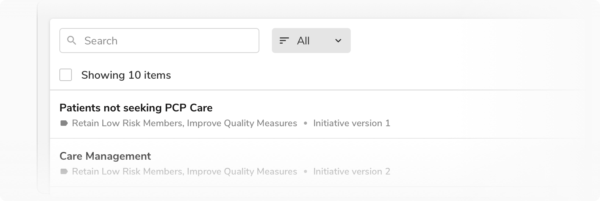
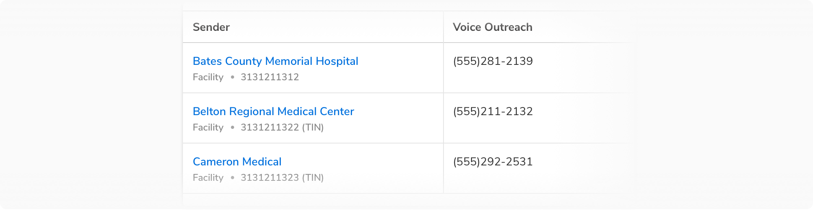

Meta list is a short horizontal list that helps in displaying secondary or meta-information separated by dots.

### Variants
#### Default
The default variant includes just text.

 

#### With icon
This variant comes with an icon in the left preceding the text to provide additional cues regarding the meta/secondary information.

 
 

### Sizes
Meta list comes in two sizes - regular and tiny.
<Preview name="metalist-all" />

### Usage
#### In the page header
Page headers use meta list to provide secondary/meta information just below the title.

 

#### In a table cell
There is a cell variant in the table which uses meta list to show secondary/meta information.

