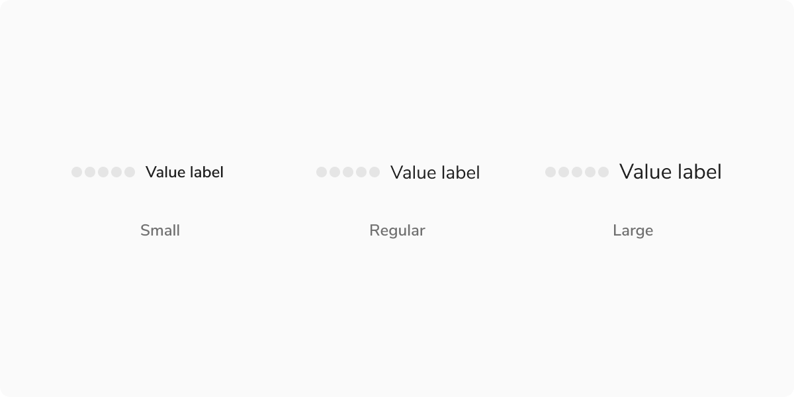

A meter is a visual tool for displaying scores or quantities, enabling quick and easy interpretation of data. It can also represent value ranges with associated semantic meaning.

<Preview name="components-meter-all--all" />

<Caption>Table using meter component to show risk scores</Caption>

### Size

#### Meter Component

Meter component has three sizes: small, regular and large

<Caption>Meter representing neutral value</Caption>

##### Small

The small size is ideal for situations with limited space or when the component appears frequently on the screen.

##### Regular

The regular size is versatile, it works well for a single component on the page or when the component is used repeatedly.

##### Large

The large size is perfect for making the element stand out compared to other elements on the page.

#### Value Label

The Value Label is available in three sizes: small, regular, and large.

**Note:** The Value Label can override the size of the meter component if needed. For instance, a small meter component can display a regular or large Value Label.

<Caption>Meter representing neutral value</Caption>

### Appearances

Meter can represent semantic values by changing appearances as the value changes, from positive to average, and then to negative.

#### Info (Default)

The default appearance of meter represents neutral and non-semantic values.

<Caption>Meter representing neutral value</Caption>

#### Warning

This appearance of meter represents an average or medium value.

<Caption>Meter representing average value</Caption>

#### Alert

This appearance of meter represents a negative semantic value.

<Caption>Meter representing negative value</Caption>

#### Success

This appearance of meter represents a positive semantic value.

<Caption>Meter representing success value</Caption>

### States

Each step in meter component have 2 steps: Empty and Filled

<Caption>Empty vs Filled Step</Caption>

### Structure

<Caption>Structure of Meter Component</Caption>

 
 

<table style={{width: "100%"}}>
  <thead>
    <tr>
      <th style={{width:"50%",  textAlign: "left"}}>Property</th>
      <th style={{width:"50%",  textAlign: "left"}}>Value(s)</th>
    </tr>
  </thead>
  <tbody>
    <tr style={{verticalAlign: "top"}}>
      <td>Size of steps</td>
      <td>
        <ul>
          <li>Small: 8x4 px </li>
          <li>Regular: 8x8 px (Round)</li>
          <li>Large: 12x12 px (Round)</li>
        </ul>
      </td>
    </tr>
    <tr>
      <td>Padding between steps</td>
      <td>2px</td>
    </tr>
    <tr>
      <td>Padding between last step and value label</td>
      <td>8px</td>
    </tr>
    <tr>
      <td>Background color - Empty step</td>
      <td>Stone Light</td>
    </tr>
  </tbody>
</table>
 

### Configurations

#### Steps

<table style={{width: "100%"}}>
  <tbody>
    <tr>
      <th style={{width:"33%", textAlign: "left"}}>Property</th>
      <th style={{width:"33%", textAlign: "left"}}>Value(s)</th>
      <th style={{width:"33%", textAlign: "left"}}>Default value</th>
    </tr>
    <tr style={{verticalAlign: "top"}}>
      <td>Number of steps</td>
      <td>&#60;Number of steps&#62;</td>
      <td>5</td>
    </tr>
    <tr style={{verticalAlign: "top"}}>
      <td>Minimum no. of steps</td>
      <td>3</td>
      <td>-</td>
    </tr>
    <tr style={{verticalAlign: "top"}}>
      <td>Background color - Filled step</td>
      <td>
        <ul>
          <li>Info</li>
          <li>Success</li>
          <li>Alert</li>
          <li>Warning</li>
        </ul>
      </td>
      <td>Info</td>
    </tr>
  </tbody>
</table>
 

#### Value Label (Optional)

<table style={{width: "100%"}}>
  <tbody>
    <tr>
      <th style={{width:"33%", textAlign: "left"}}>Property</th>
      <th style={{width:"33%", textAlign: "left"}}>Value(s)</th>
      <th style={{width:"33%", textAlign: "left"}}>Default value</th>
    </tr>
    <tr style={{verticalAlign: "top"}}>
      <td>Value Label</td>
      <td>&#60;value_label&#62;</td>
      <td>-</td>
    </tr>
    <tr style={{verticalAlign: "top"}}>
      <td>Size</td>
      <td>
        <ul>
          <li>Small</li>
          <li>Regular</li>
          <li>Large</li>
        </ul>
      </td>
      <td>Regular</td>
    </tr>
  </tbody>
</table>
 

### Usage

#### Logic for Filling a Step

Each step covers a specific range of values. If the value is less than or equal to the half of the range, the step remains empty; it fills once the value exceeds the range.

For example, in the case below, the score is out of 100 with 5 steps, each covering 20 points. If the score is 15, step 1 will be filled.

<Caption>Logic for filling a step</Caption>

 

<Caption>Logic for filling a step</Caption>

#### Value Label

Meters can display a detailed value label on the right side, showing simple numerical data like “9” or “50%,” as well as ranges to help users interpret metrics such as "40 out of 100" or "30/100."

**Note:** The Value Label by default shows the percentage value provided to the component and can be customized as needed.

<Caption>Various formats for displaying values on the right.</Caption>

 

#### Number of Steps in Meter

The Meter component comes with 5 default steps, but the number of steps can be customized based on the use case. 

**Note:** However, ensure the steps are not set to fewer than 3 to avoid any kind of confusion.

<Caption>Number of steps should not be less than 3. </Caption>

 

#### Multi-Sentiment Support

The Meter component supports multiple sentiments in a single instance using appearances.

<Caption>Multi-Sentiment Support</Caption>
