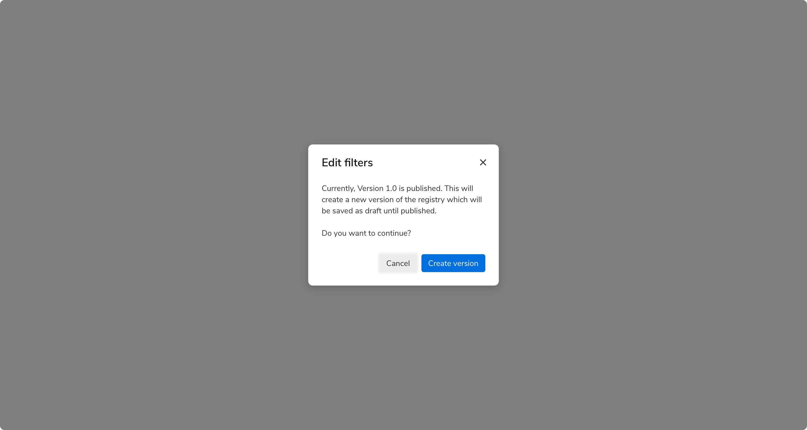
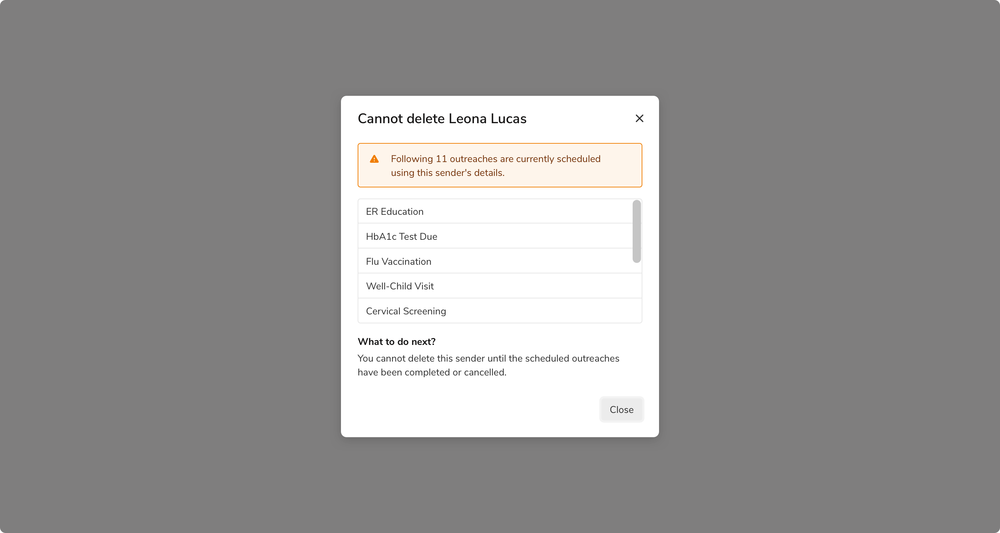
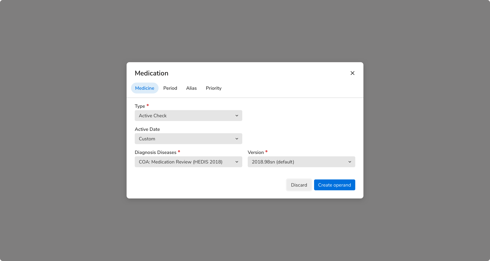
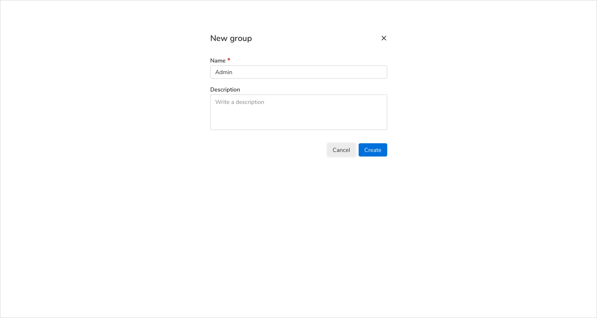
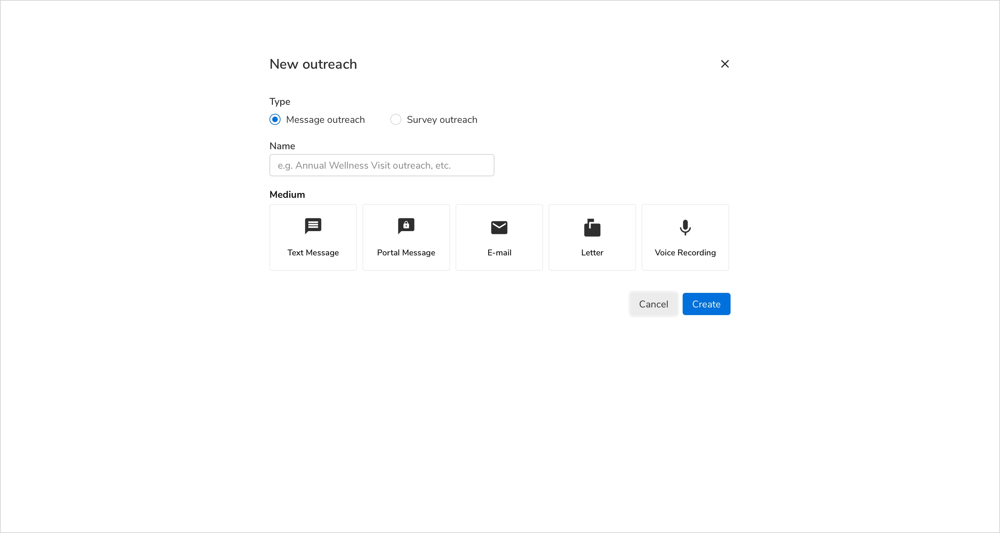
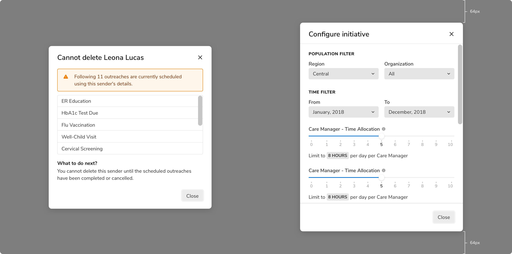
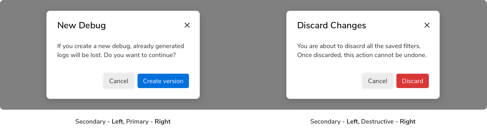
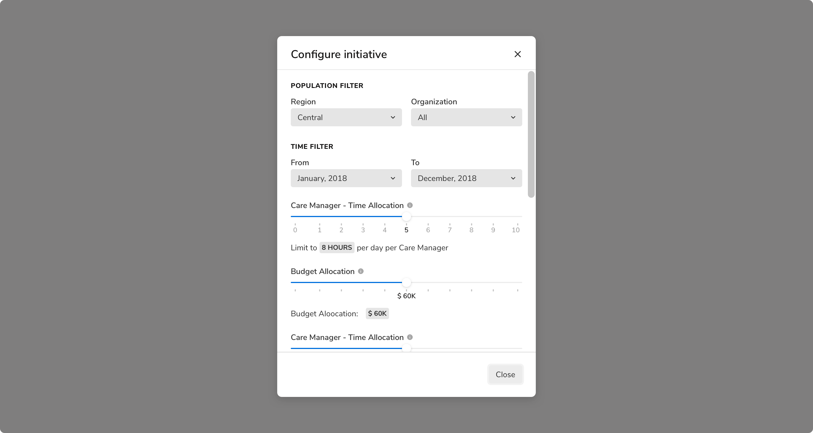

Modals are used to present information, critical alerts, and confirmations to the users. Occasionally they can contain short forms to input data from users. 
They are presented on top of a translucent overlay to maintain context with the background content and hence preventing users from interacting with the background.

If the information or interactions are more complex, consider using a side sheet.

### Types
 

#### Standard modal
Standard modals appear in the center of the screen along with an overlay which prevents users from interacting with the background.
<Preview name="fullscreenmodal-customized" />

#### Full screen modal
Full screen modals cover the entire screen. They are used when you want the complete undivided attention of users. The prime use case is when the users create a new entity because in such cases the context with the content behind the modal is typically not required.

They should not be used for confirmations, critical alerts or to present information.
<Preview name="fullscreenmodal-customized" />

### Variants
#### Standard modal
##### Dialogs
Dialogs are used to convey information to users where interaction with that information is not required.
<Preview name="fullscreenmodal-customized" />

##### Alerts
Alerts are used to convey critical information before taking a destructive action such as delete, discard, deactivate, etc.
<Preview name="fullscreenmodal-customized" />

##### Confirmations
Confirmation dialogs are used to take confirmation from users before taking any important action.
<Preview name="fullscreenmodal-customized" />

##### Input modals
Input modals are used to present forms to users such as input fields, dropdowns, etc. 
<Preview name="fullscreenmodal-customized" />

### Sizes
#### Standard modal
Standard modal comes in **3 sizes** basis on the breakpoints -
<table style="width: 100%">
    <thead>
        <tr>
            <th align="left">Size</th>
            <th align="left">Breakpoint &#60; = small</th>
            <th align="left">Breakpoint = medium</th>
            <th align="left">Breakpoint = &#62; large</th>
        </tr>
    </thead>
    <tbody>
        <tr>
            <td>Small</td>
            <td>10 columns</td>
            <td>4 columns</td>
            <td>3 columns</td>
        </tr>
        <tr>
            <td>Medium</td>
            <td>10 columns</td>
            <td>6 columns</td>
            <td>4 columns</td>
        </tr>
        <tr>
            <td>Medium</td>
            <td>10 columns</td>
            <td>8 columns</td>
            <td>6 columns</td>
        </tr>
    </tbody>
</table>
 

**Note**: While designing, only design as per the large breakpoint case (width >= 992 pixels).

##### Small
 

 
 

##### Medium
 

 
 

##### Large
 

 
 

#### Full screen modal
The content of a full screen modal comes in **2 sizes** basis on the breakpoints -
<table style="width: 100%">
    <thead>
        <tr>
            <th align="left">Size</th>
            <th align="left">Breakpoint &#60; = small</th>
            <th align="left">Breakpoint = medium</th>
            <th align="left">Breakpoint = &#62; large</th>
        </tr>
    </thead>
    <tbody>
        <tr>
            <td>Default</td>
            <td>12 columns</td>
            <td>6 columns</td>
            <td>4 columns</td>
        </tr>
        <tr>
            <td>Large</td>
            <td>12 columns</td>
            <td>8 columns</td>
            <td>6 columns</td>
        </tr>
    </tbody>
</table>
 

**Note**: Content here refers to the section appearing in the center of the full screen modal.

##### Default
 

 
 

##### Large
 

 
 

### Usage
 

#### Positioning and scaling of modals
Modals are vertically center-aligned. They scale vertically in case the content is long enough, until reaching 64px from the screen’s top and bottom edge. In those cases, a scroll is introduced as well.

> A top and bottom margin of 64px allows to best utilize the space on the viewport and maximize the content area of the modal.

 
 

#### Default focus on secondary action
By default, the **secondary** action should be in its focused state when the modal appears. This helps to avoid the trigger of primary action (especially the delete action) by accidental pressing of Enter key.

 
 

#### The order of the action buttons
The primary and secondary actions appear at the bottom right in a modal. However, the order in which they appear has to be the same regardless of the nature of the primary action (create, delete, etc.). Listing primary actions last improves the flow, because the modal then [“ends” with its conclusion](https://www.nngroup.com/articles/ok-cancel-or-cancel-ok/). Also, keeping the order the same makes the position of actions predictable.

 
 

#### Using in conjunction with the message component
Message component can be used in the body of the modal in case the need arises. It should always **appear at the top** in the body section.

For example, this can be helpful when you want -
1. The users to be aware of the consequences their actions can have
2. To show a critical error, etc.

 
 

#### Dividers
The dividers in the header and the footer should **only** be shown when the content is scrollable.

 

 
 

#### Scrollable content
You should avoid adding scrollable content in a modal as they are meant to be used to convey concise information, alerts, and confirmations. But there can be cases when scrolling is unavoidable. 

Few points to keep in mind then -
* Scrolling becomes active only when the content overflows the modal i.e. the max height of the modal is achieved. Max height of a modal is the height of the screen with a margin of 64px from top and bottom.
* To indicate that the content can be scrolled, use a scrollbar and show the dividers in both the header and the footer component. This helps to convey that the header and the footer are fixed.
<Preview name="fullscreenmodal-customized" />

#### Closing the modal
Clicking outside the modal should **not** cancel the current process and close the modal by default. However, this behavior is configurable and can be turned **on** for dialogs only since they just present information and any sort of user interaction is not required there. Pressing **ESC** key on the keyboard does the same.
 

#### Using forms
Forms with simple inputs can be used inside a modal. For more complex forms and interactions, **side sheets** should be considered.
 

#### Steppers
Steppers can also be used in a modal as long as the content is concise and short. The rule of thumb is to use side sheets when the content is large and complex.

 
 

#### Full screen modals
 

##### Lifetime of a full screen modal
Full screen modal is initialized and displayed when a user clicks on a “Create …” entity button. It is de-initialized and closed as soon as that entity is created.
**DO NOT** use full screen modals for workflows involving multiple steps.

##### Two steps workflow - Back button
To maintain simplicity, full screen modals are only supposed to have 1 step. But even then, there can be cases when a two steps workflow is required in order to create an entity. In that case, the header of the full screen modal can be updated to include a back button.
<Preview name="fullscreenmodal-customized" />

##### Action buttons
Just like the default modals, the action buttons appear at the bottom right and follows the same order rules.

 
 

#### Scrolling behavior
Unlike default modals, the header and footer are **not fixed** in the full screen modals. So the content goes beneath the fold like this -
<Preview name="fullscreenmodal-customized" />