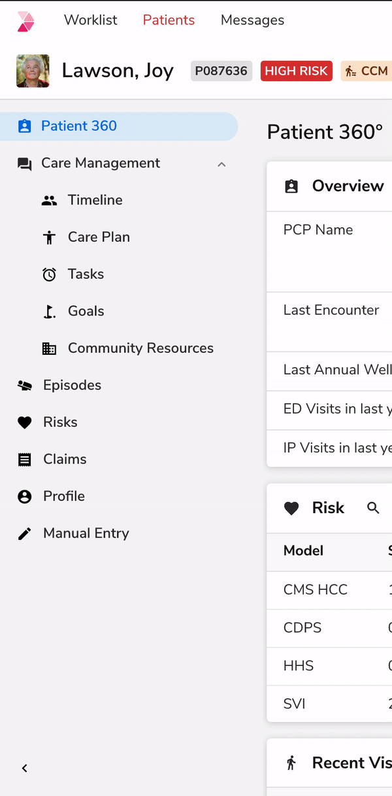
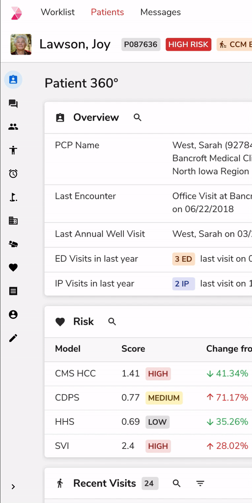
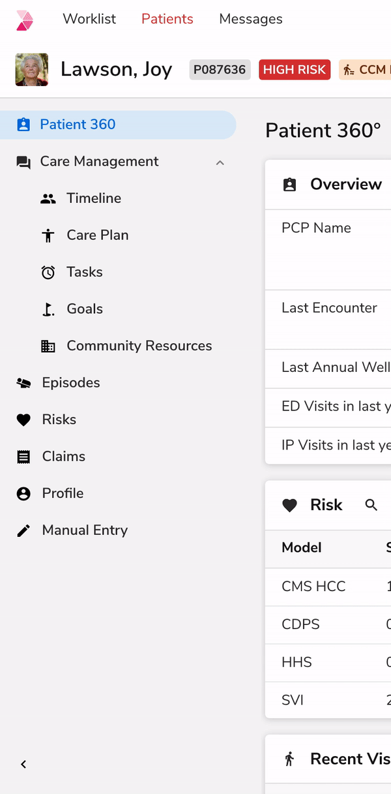
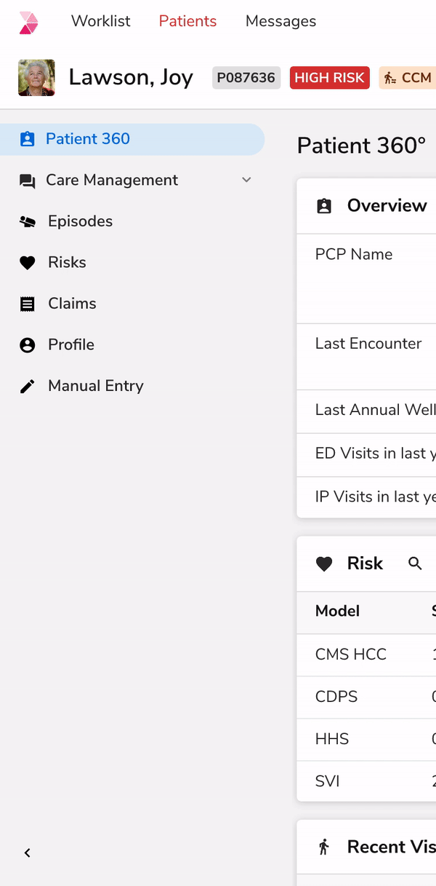
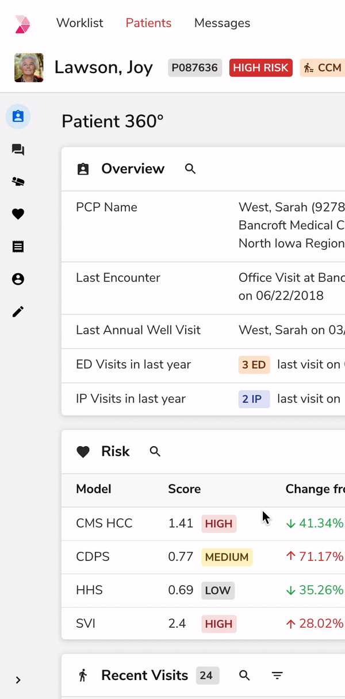
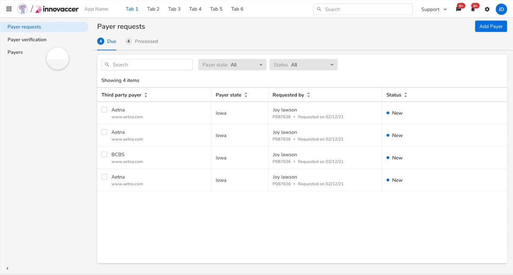

### Collapsing the Nav Panel

 
 

#### Panel

<table style="width: 100%">
  <tbody>
    <tr>
      <th style="width:33%; text-align: left;">Property</th>
      <th style="width:33%; text-align: left;">Initial state</th>
      <th style="width:33%; text-align: left;">Final state</th>
    </tr>
    <tr style="vertical-align: top">
      <td>Width</td>
      <td>256px</td>
      <td>40px</td>
    </tr>
    <tr style="vertical-align: top">
      <td>Toggle panel icon</td>
      <td>keyboard_arrow_left</td>
      <td>keyboard_arrow_right</td>
    </tr>
  </tbody>
</table>
 

**Curve**

<table style="width: 100%">
  <tbody>
    <tr>
      <td>Style of Motion</td>
      <td>Expressive motion</td>
    </tr>
    <tr style="vertical-align: top">
      <td>Easing</td>
      <td>Standard easing</td>
    </tr>
    <tr style="vertical-align: top">
      <td>Curve</td>
      <td>cubic-bezier(0.4, 0.14, 0.3, 1)</td>
    </tr>
    <tr style="vertical-align: top">
      <td>Duration</td>
      <td>240ms</td>
    </tr>
  </tbody>
</table>
 

 

#### Navigation Item

##### Icon (Parent Item)

<table style="width: 100%">
  <tbody>
    <tr>
      <th style="width:33%; text-align: left;">Property</th>
      <th style="width:33%; text-align: left;">Initial state</th>
      <th style="width:33%; text-align: left;">Final state</th>
    </tr>
    <tr style="vertical-align: top">
      <td>Position X</td>
      <td>16px</td>
      <td>12px</td>
    </tr>
  </tbody>
</table>
 

**Curve**

<table style="width: 100%">
  <tbody>
    <tr style="vertical-align: top">
      <td>Curve</td>
      <td>cubic-bezier(0.4, 0.14, 0.3, 1)</td>
    </tr>
    <tr style="vertical-align: top">
      <td>Duration</td>
      <td>240ms</td>
    </tr>
  </tbody>
</table>
 

 

##### Icon (Child Item)

<table style="width: 100%">
  <tbody>
    <tr>
      <th style="width:33%; text-align: left;">Property</th>
      <th style="width:33%; text-align: left;">Initial state</th>
      <th style="width:33%; text-align: left;">Final state</th>
    </tr>
    <tr style="vertical-align: top">
      <td>Position X</td>
      <td>40px</td>
      <td>12px</td>
    </tr>
  </tbody>
</table>
 

**Curve**

<table style="width: 100%">
  <tbody>
    <tr style="vertical-align: top">
      <td>Curve</td>
      <td>cubic-bezier(0.4, 0.14, 0.3, 1)</td>
    </tr>
    <tr style="vertical-align: top">
      <td>Duration</td>
      <td>240ms</td>
    </tr>
  </tbody>
</table>
 

 

##### Nav Label

<table style="width: 100%">
  <tbody>
    <tr>
      <th style="width:33%; text-align: left;">Property</th>
      <th style="width:33%; text-align: left;">Initial state</th>
      <th style="width:33%; text-align: left;">Final state</th>
    </tr>
    <tr style="vertical-align: top">
      <td>Opacity</td>
      <td>100</td>
      <td>0</td>
    </tr>
  </tbody>
</table>
 

**Curve**

<table style="width: 100%">
  <tbody>
    <tr style="vertical-align: top">
      <td>Curve</td>
      <td>cubic-bezier(0.4, 0.14, 0.3, 1)</td>
    </tr>
    <tr style="vertical-align: top">
      <td>Duration</td>
      <td>240ms</td>
    </tr>
  </tbody>
</table>
 
 

##### Selection Container

<table style="width: 100%">
  <tbody>
    <tr>
      <th style="width:33%; text-align: left;">Property</th>
      <th style="width:33%; text-align: left;">Initial state</th>
      <th style="width:33%; text-align: left;">Final state</th>
    </tr>
    <tr style="vertical-align: top">
      <td>Width</td>
      <td>258px</td>
      <td>28px</td>
    </tr>
    <tr style="vertical-align: top">
      <td>Position X</td>
      <td>0</td>
      <td>6</td>
    </tr>
    <tr style="vertical-align: top">
      <td>Corner Radius</td>
      <td>(0px ,16px ,16px ,0px)</td>
      <td>(16px ,16px ,16px ,16px)</td>
    </tr>
  </tbody>
</table>
 

**Curve**

<table style="width: 100%">
  <tbody>
    <tr style="vertical-align: top">
      <td>Curve</td>
      <td>cubic-bezier(0.4, 0.14, 0.3, 1)</td>
    </tr>
    <tr style="vertical-align: top">
      <td>Duration</td>
      <td>240ms</td>
    </tr>
  </tbody>
</table>
 
 

##### Item background

<table style="width: 100%">
  <tbody>
    <tr>
      <th style="width:33%; text-align: left;">Property</th>
      <th style="width:33%; text-align: left;">Initial state</th>
      <th style="width:33%; text-align: left;">Final state</th>
    </tr>
    <tr style="vertical-align: top">
      <td>Width</td>
      <td>256px</td>
      <td>40px</td>
    </tr>
  </tbody>
</table>
 

**Curve**

<table style="width: 100%">
  <tbody>
    <tr style="vertical-align: top">
      <td>Curve</td>
      <td>cubic-bezier(0.4, 0.14, 0.3, 1)</td>
    </tr>
    <tr style="vertical-align: top">
      <td>Duration</td>
      <td>240ms</td>
    </tr>
  </tbody>
</table>
 
 

### Expanding the Nav Panel

 
 

#### Panel

<table style="width: 100%">
  <tbody>
    <tr>
      <th style="width:33%; text-align: left;">Property</th>
      <th style="width:33%; text-align: left;">Initial state</th>
      <th style="width:33%; text-align: left;">Final state</th>
    </tr>
    <tr style="vertical-align: top">
      <td>Width</td>
      <td>40px</td>
      <td>256px</td>
    </tr>
    <tr style="vertical-align: top">
      <td>Toggle panel icon</td>
      <td>keyboard_arrow_right</td>
      <td>keyboard_arrow_left</td>
    </tr>
  </tbody>
</table>
 

**Curve**

<table style="width: 100%">
  <tbody>
    <tr>
      <td>Style of Motion</td>
      <td>Expressive motion</td>
    </tr>
    <tr style="vertical-align: top">
      <td>Easing</td>
      <td>Standard easing</td>
    </tr>
    <tr style="vertical-align: top">
      <td>Curve</td>
      <td>cubic-bezier(0.4, 0.14, 0.3, 1)</td>
    </tr>
    <tr style="vertical-align: top">
      <td>Duration</td>
      <td>240ms</td>
    </tr>
  </tbody>
</table>
 

 

#### Navigation Item

##### Icon (Parent Item)

<table style="width: 100%">
  <tbody>
    <tr>
      <th style="width:33%; text-align: left;">Property</th>
      <th style="width:33%; text-align: left;">Initial state</th>
      <th style="width:33%; text-align: left;">Final state</th>
    </tr>
    <tr style="vertical-align: top">
      <td>Position X</td>
      <td>12px</td>
      <td>16px</td>
    </tr>
  </tbody>
</table>
 

**Curve**

<table style="width: 100%">
  <tbody>
    <tr style="vertical-align: top">
      <td>Curve</td>
      <td>cubic-bezier(0.4, 0.14, 0.3, 1)</td>
    </tr>
    <tr style="vertical-align: top">
      <td>Duration</td>
      <td>240ms</td>
    </tr>
  </tbody>
</table>
 
 

##### Icon (Child Item)

<table style="width: 100%">
  <tbody>
    <tr>
      <th style="width:33%; text-align: left;">Property</th>
      <th style="width:33%; text-align: left;">Initial state</th>
      <th style="width:33%; text-align: left;">Final state</th>
    </tr>
    <tr style="vertical-align: top">
      <td>Width</td>
      <td>12px</td>
      <td>40px</td>
    </tr>
  </tbody>
</table>
 

**Curve**

<table style="width: 100%">
  <tbody>
    <tr style="vertical-align: top">
      <td>Curve</td>
      <td>cubic-bezier(0.4, 0.14, 0.3, 1)</td>
    </tr>
    <tr style="vertical-align: top">
      <td>Duration</td>
      <td>240ms</td>
    </tr>
  </tbody>
</table>
 
 

##### Nav Label

<table style="width: 100%">
  <tbody>
    <tr>
      <th style="width:33%; text-align: left;">Property</th>
      <th style="width:33%; text-align: left;">Initial state</th>
      <th style="width:33%; text-align: left;">Final state</th>
    </tr>
    <tr style="vertical-align: top">
      <td>Opacity</td>
      <td>0</td>
      <td>100</td>
    </tr>
  </tbody>
</table>
 

**Curve**

<table style="width: 100%">
  <tbody>
    <tr style="vertical-align: top">
      <td>Curve</td>
      <td>cubic-bezier(0.4, 0.14, 0.3, 1)</td>
    </tr>
    <tr style="vertical-align: top">
      <td>Duration</td>
      <td>240ms</td>
    </tr>
  </tbody>
</table>
 
 

##### Selection Container

<table style="width: 100%">
  <tbody>
    <tr>
      <th style="width:33%; text-align: left;">Property</th>
      <th style="width:33%; text-align: left;">Initial state</th>
      <th style="width:33%; text-align: left;">Final state</th>
    </tr>
    <tr style="vertical-align: top">
      <td>Width</td>
      <td>28px</td>
      <td>248px</td>
    </tr>
    <tr style="vertical-align: top">
      <td>Position X</td>
      <td>6</td>
      <td>0</td>
    </tr>
    <tr style="vertical-align: top">
      <td>Corner radius</td>
      <td>(16px ,16px ,16px ,16px)</td>
      <td>(0px ,16px ,16px ,0px)</td>
    </tr>
  </tbody>
</table>
 

**Curve**

<table style="width: 100%">
  <tbody>
    <tr style="vertical-align: top">
      <td>Curve</td>
      <td>cubic-bezier(0.4, 0.14, 0.3, 1)</td>
    </tr>
    <tr style="vertical-align: top">
      <td>Duration</td>
      <td>240ms</td>
    </tr>
  </tbody>
</table>
 
 

##### Item Background

<table style="width: 100%">
  <tbody>
    <tr>
      <th style="width:33%; text-align: left;">Property</th>
      <th style="width:33%; text-align: left;">Initial state</th>
      <th style="width:33%; text-align: left;">Final state</th>
    </tr>
    <tr style="vertical-align: top">
      <td>Width</td>
      <td>40px</td>
      <td>256px</td>
    </tr>
  </tbody>
</table>
 

**Curve**

<table style="width: 100%">
  <tbody>
    <tr style="vertical-align: top">
      <td>Curve</td>
      <td>cubic-bezier(0.4, 0.14, 0.3, 1)</td>
    </tr>
    <tr style="vertical-align: top">
      <td>Duration</td>
      <td>240ms</td>
    </tr>
  </tbody>
</table>
 
 

### Collapsing the Parent Item

 
 

#### Navigation Item

##### Child Item

<table style="width: 100%">
  <tbody>
    <tr>
      <th style="width:33%; text-align: left;">Property</th>
      <th style="width:33%; text-align: left;">Initial state</th>
      <th style="width:33%; text-align: left;">Final state</th>
    </tr>
    <tr style="vertical-align: top">
      <td>Opacity</td>
      <td>100</td>
      <td>0</td>
    </tr>
  </tbody>
</table>
 

**Curve**

<table style="width: 100%">
  <tbody>
    <tr>
      <td>Style of Motion</td>
      <td>Productive motion</td>
    </tr>
    <tr style="vertical-align: top">
      <td>Easing</td>
      <td>Standard easing</td>
    </tr>
    <tr style="vertical-align: top">
      <td>Curve</td>
      <td>cubic-bezier(0.2, 0, 0.38, 0.9)</td>
    </tr>
    <tr style="vertical-align: top">
      <td>Duration</td>
      <td>240ms</td>
    </tr>
  </tbody>
</table>
 

 

### Expanding the Parent Item

 
 

#### Navigation Item

##### Child Item

<table style="width: 100%">
  <tbody>
    <tr>
      <th style="width:33%; text-align: left;">Property</th>
      <th style="width:33%; text-align: left;">Initial state</th>
      <th style="width:33%; text-align: left;">Final state</th>
    </tr>
    <tr style="vertical-align: top">
      <td>Opacity</td>
      <td>0</td>
      <td>100</td>
    </tr>
  </tbody>
</table>
 

**Curve**

<table style="width: 100%">
  <tbody>
    <tr>
      <td>Style of Motion</td>
      <td>Productive motion</td>
    </tr>
    <tr style="vertical-align: top">
      <td>Easing</td>
      <td>Standard easing</td>
    </tr>
    <tr style="vertical-align: top">
      <td>Curve</td>
      <td>cubic-bezier(0.2, 0, 0.38, 0.9)</td>
    </tr>
    <tr style="vertical-align: top">
      <td>Duration</td>
      <td>240ms</td>
    </tr>
  </tbody>
</table>
 

 

### Hovering on Collapsed Panel

 
 

#### Panel

<table style="width: 100%">
  <tbody>
    <tr>
      <th style="width:33%; text-align: left;">Property</th>
      <th style="width:33%; text-align: left;">Initial state</th>
      <th style="width:33%; text-align: left;">Final state</th>
    </tr>
    <tr style="vertical-align: top">
      <td>Width</td>
      <td>40px</td>
      <td>256px</td>
    </tr>
    <tr style="vertical-align: top">
      <td>Toggle Panel Icon</td>
      <td>keyboard_arrow_right</td>
      <td>keyboard_arrow_left</td>
    </tr>
  </tbody>
</table>
 

**Curve**

<table style="width: 100%">
  <tbody>
    <tr>
      <td>Style of Motion</td>
      <td>Expressive motion</td>
    </tr>
    <tr style="vertical-align: top">
      <td>Easing</td>
      <td>Standard easing</td>
    </tr>
    <tr style="vertical-align: top">
      <td>Curve</td>
      <td>cubic-bezier(0.4, 0.14, 0.3, 1)</td>
    </tr>
    <tr style="vertical-align: top">
      <td>Duration</td>
      <td>240ms</td>
    </tr>
  </tbody>
</table>
 

 

#### Navigation Item

##### Icons

<table style="width: 100%">
  <tbody>
    <tr>
      <th style="width:33%; text-align: left;">Property</th>
      <th style="width:33%; text-align: left;">Initial state</th>
      <th style="width:33%; text-align: left;">Final state</th>
    </tr>
    <tr style="vertical-align: top">
      <td>position X</td>
      <td>12px</td>
      <td>16px</td>
    </tr>
  </tbody>
</table>
 

**Curve**

<table style="width: 100%">
  <tbody>
    <tr style="vertical-align: top">
      <td>Curve</td>
      <td>cubic-bezier(0.4, 0.14, 0.3, 1)</td>
    </tr>
    <tr style="vertical-align: top">
      <td>Duration</td>
      <td>240ms</td>
    </tr>
  </tbody>
</table>
 
 

##### Nav Label

<table style="width: 100%">
  <tbody>
    <tr>
      <th style="width:33%; text-align: left;">Property</th>
      <th style="width:33%; text-align: left;">Initial state</th>
      <th style="width:33%; text-align: left;">Final state</th>
    </tr>
    <tr style="vertical-align: top">
      <td>Opacity</td>
      <td>0</td>
      <td>100</td>
    </tr>
  </tbody>
</table>
 

**Curve**

<table style="width: 100%">
  <tbody>
    <tr style="vertical-align: top">
      <td>Curve</td>
      <td>cubic-bezier(0.4, 0.14, 0.3, 1)</td>
    </tr>
    <tr style="vertical-align: top">
      <td>Duration</td>
      <td>240ms</td>
    </tr>
  </tbody>
</table>
 
 

##### Selection Container

<table style="width: 100%">
  <tbody>
    <tr>
      <th style="width:33%; text-align: left;">Property</th>
      <th style="width:33%; text-align: left;">Initial state</th>
      <th style="width:33%; text-align: left;">Final state</th>
    </tr>
    <tr style="vertical-align: top">
      <td>Width</td>
      <td>28px</td>
      <td>248px</td>
    </tr>
    <tr style="vertical-align: top">
      <td>Position X</td>
      <td>6px</td>
      <td>0px</td>
    </tr>
    <tr style="vertical-align: top">
      <td>Corner radius</td>
      <td>(16px, 16px, 16px, 16px)</td>
      <td>(0px, 16px, 16px, 0px)</td>
    </tr>
  </tbody>
</table>
 

**Curve**

<table style="width: 100%">
  <tbody>
    <tr style="vertical-align: top">
      <td>Curve</td>
      <td>cubic-bezier(0.4, 0.14, 0.3, 1)</td>
    </tr>
    <tr style="vertical-align: top">
      <td>Duration</td>
      <td>240ms</td>
    </tr>
  </tbody>
</table>
 
 

##### Item background

<table style="width: 100%">
  <tbody>
    <tr>
      <th style="width:33%; text-align: left;">Property</th>
      <th style="width:33%; text-align: left;">Initial state</th>
      <th style="width:33%; text-align: left;">Final state</th>
    </tr>
    <tr style="vertical-align: top">
      <td>Width</td>
      <td>40px</td>
      <td>256px</td>
    </tr>
  </tbody>
</table>
 

**Curve**

<table style="width: 100%">
  <tbody>
    <tr style="vertical-align: top">
      <td>Curve</td>
      <td>cubic-bezier(0.4, 0.14, 0.3, 1)</td>
    </tr>
    <tr style="vertical-align: top">
      <td>Duration</td>
      <td>240ms</td>
    </tr>
  </tbody>
</table>
 
 

### Navigating to another item

 
 

##### Source item

<table style="width: 100%">
  <tbody>
    <tr>
      <th style="width:33%; text-align: left;">Property</th>
      <th style="width:33%; text-align: left;">Initial state</th>
      <th style="width:33%; text-align: left;">Final state</th>
    </tr>
    <tr style="vertical-align: top">
      <td>State</td>
      <td>$Active</td>
      <td>$Default</td>
    </tr>
  </tbody>
</table>
 

**Curve**

<table style="width: 100%">
  <tbody>
    <tr style="vertical-align: top">
      <td>Curve</td>
      <td>cubic-bezier(0.2, 0, 0.38, 0.9)</td>
    </tr>
    <tr style="vertical-align: top">
      <td>Duration</td>
      <td>120ms</td>
    </tr>
  </tbody>
</table>
 
 

##### Destination item

<table style="width: 100%">
  <tbody>
    <tr>
      <th style="width:33%; text-align: left;">Property</th>
      <th style="width:33%; text-align: left;">Initial state</th>
      <th style="width:33%; text-align: left;">Final state</th>
    </tr>
    <tr style="vertical-align: top">
      <td>State</td>
      <td>$Default</td>
      <td>$Active</td>
    </tr>
  </tbody>
</table>
 

**Curve**

<table style="width: 100%">
  <tbody>
    <tr style="vertical-align: top">
      <td>Curve</td>
      <td>cubic-bezier(0.2, 0, 0.38, 0.9)</td>
    </tr>
    <tr style="vertical-align: top">
      <td>Duration</td>
      <td>120ms</td>
    </tr>
    <tr style="vertical-align: top">
      <td>Initial delay</td>
      <td>120ms</td>
    </tr>
  </tbody>
</table>
 
 

##### Source body

<table style="width: 100%">
  <tbody>
    <tr>
      <th style="width:33%; text-align: left;">Property</th>
      <th style="width:33%; text-align: left;">Initial state</th>
      <th style="width:33%; text-align: left;">Final state</th>
    </tr>
    <tr style="vertical-align: top">
      <td>Opacity</td>
      <td>100</td>
      <td>0</td>
    </tr>
    <tr style="vertical-align: top">
      <td>Realtive psoition Y</td>
      <td>0px</td>
      <td>-8px</td>
    </tr>
  </tbody>
</table>
 

**Curve**

<table style="width: 100%">
  <tbody>
    <tr style="vertical-align: top">
      <td>Curve</td>
      <td>cubic-bezier(0.4, 0.14, 1, 1)</td>
    </tr>
    <tr style="vertical-align: top">
      <td>Duration</td>
      <td>240ms</td>
    </tr>
  </tbody>
</table>
 
 

##### Destination body

<table style="width: 100%">
  <tbody>
    <tr>
      <th style="width:33%; text-align: left;">Property</th>
      <th style="width:33%; text-align: left;">Initial state</th>
      <th style="width:33%; text-align: left;">Final state</th>
    </tr>
    <tr style="vertical-align: top">
      <td>Opacity</td>
      <td>0</td>
      <td>100</td>
    </tr>
    <tr style="vertical-align: top">
      <td>Realtive psoition X</td>
      <td>+8px</td>
      <td>0px</td>
    </tr>
  </tbody>
</table>
 

**Curve**

<table style="width: 100%">
  <tbody>
    <tr style="vertical-align: top">
      <td>Curve</td>
      <td>cubic-bezier(0, 0, 0.3, 1)</td>
    </tr>
    <tr style="vertical-align: top">
      <td>Duration (for movement)</td>
      <td>240ms</td>
    </tr>
    <tr style="vertical-align: top">
      <td>Duration (for opacity)</td>
      <td>160ms</td>
    </tr>
    <tr style="vertical-align: top">
      <td>Initial delay</td>
      <td>240ms</td>
    </tr>
  </tbody>
</table>
 
 
