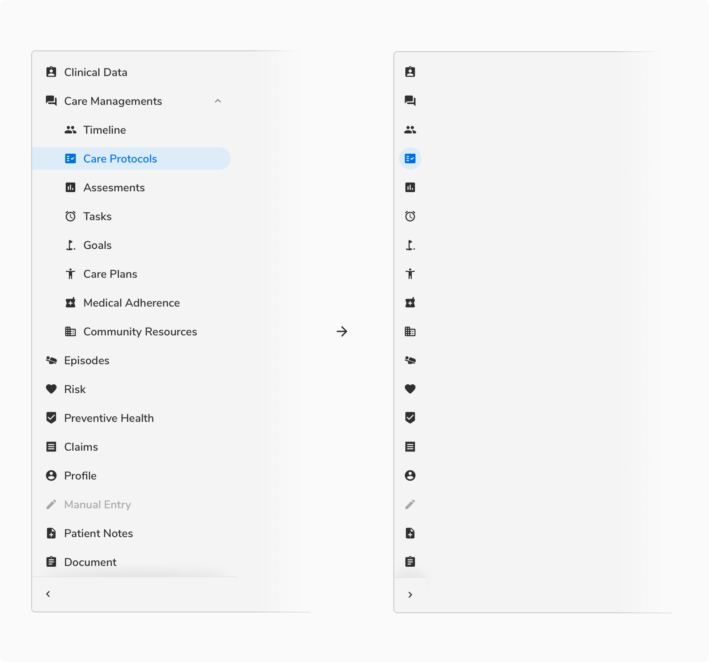
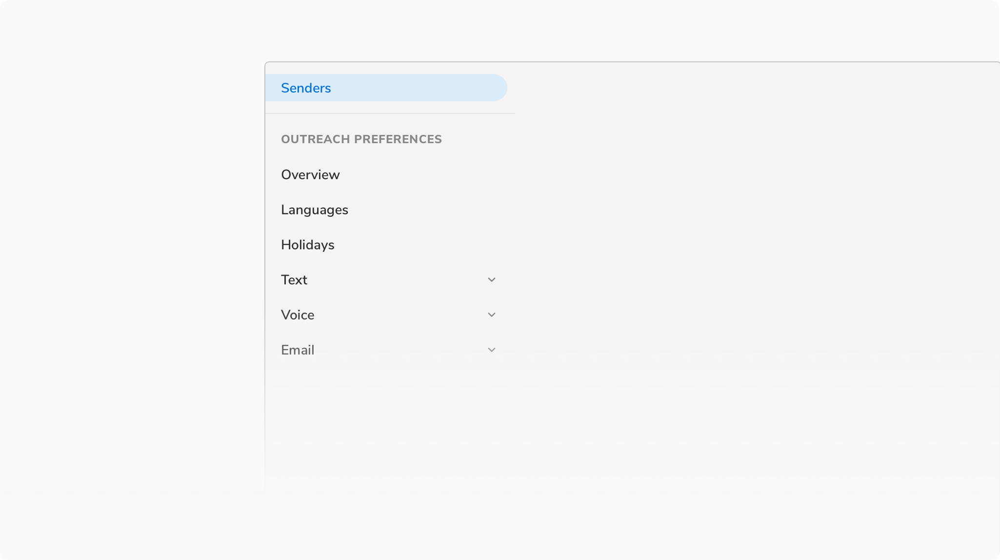
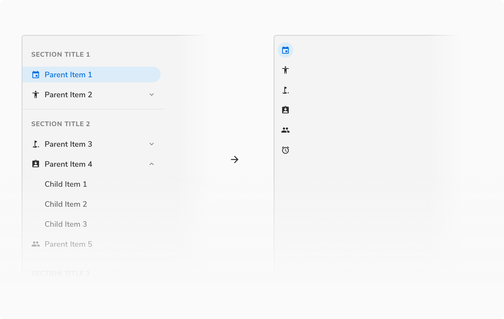
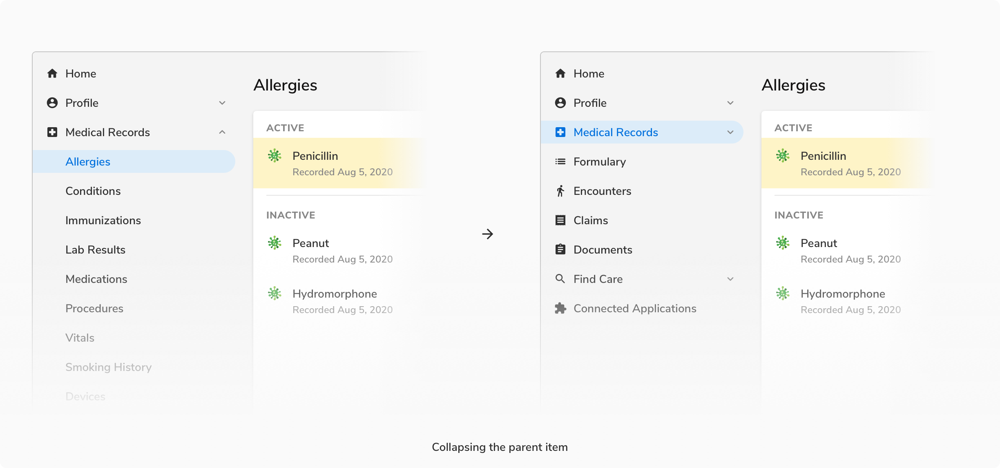
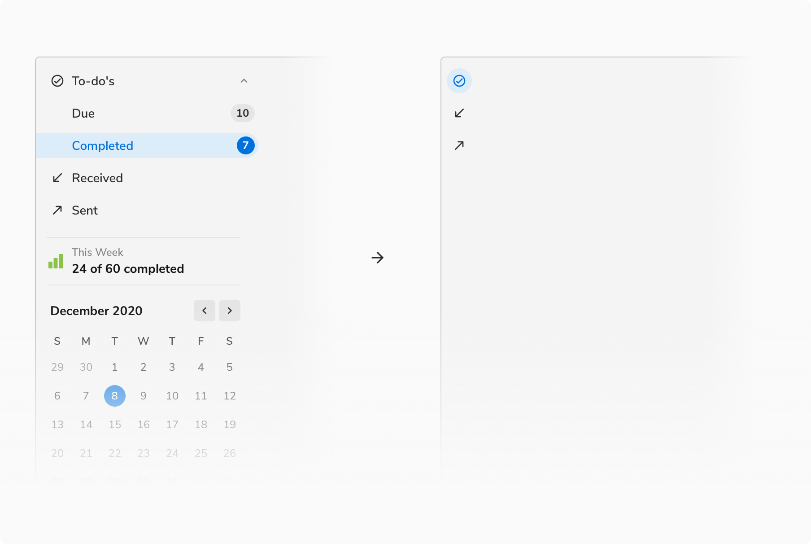

Vertical navigation helps the users to quickly move among different pages in a module just like the horizontal navigation. The key difference here is that the navigation items are laid out vertically and hence there is virtually no limit on the number of navigation items to be displayed.

### Types

 

#### Flat

<Preview name='components-verticalnav-flat-edged-vertical-navigation'/>

#### Rounded

Rounded variant comes handy when the navigation is not at the extreme left. Hence the left part of the selected navigation item is rounded and not flat.

<Preview name='components-verticalnav-round-edged-vertical-navigation'/>

### Properties
<table style="width: 100%">
  <tr>
    <th style="width:33%; text-align: left;">Property</th>
    <th style="width:33%; text-align: left;">Value(s)</th>
    <th style="width:33%; text-align: left;">Default value</th>
  </tr>
  <tr style="vertical-align: top">
    <td>Width of panel</td>
    <td>256px</td>
    <td>-</td>
  </tr>
  <tr style="vertical-align: top">
    <td>Height (of a nav item)</td>
    <td>36px</td>
    <td>-</td>
  </tr>
  <tr style="vertical-align: top">
    <td>Width (of a nav item)</td>
    <td>Auto</td>
    <td>-</td>
  </tr>
  <tr style="vertical-align: top">
    <td>Panel collapse/expand action icon</td>
    <td>keyboard_arrow_left/ keyboard_arrow_right icon</td>
    <td>-</td>
  </tr>
  <tr style="vertical-align: top">
    <td>Section <em>(optional)</em></td>
    <td>&#60;section title&#62;</td>
    <td>-</td>
  </tr>
  <tr style="vertical-align: top">
    <td>Icon <em>(optional)</em></td>
    <td>&#60;icon name&#62;</td>
    <td>-</td>
  </tr>
  <tr style="vertical-align: top">
    <td>Icon size</td>
    <td>16x16px</td>
    <td>-</td>
  </tr>
  <tr style="vertical-align: top">
    <td>Count (in parent)* <em>(optional)</em></td>
    <td>&#60;count&#62;</td>
    <td>-</td>
  </tr>
  <tr style="vertical-align: top">
    <td>Count (in child) <em>(optional)</em></td>
    <td>&#60;count&#62;</td>
    <td>-</td>
  </tr>
</table>
 

**Note**: Count in parent item is supported only when it does not have children.

 
 

### Usage

 

#### Maximum levels

To reduce the unnecessary visual clutter, a maximum of two levels are supported in the vertical navigation. If more than two levels are needed, one can use tabs, horizontal navigation, or secondary navigation inside the page.

 

#### Collapsing a panel

 

##### Parent Item - Without Icons

The panel cannot be collapsed when the parent items do not have icons.

 
 

##### Parent Item - With Icons

 

 
 

##### Child Item - Without Icons

In this case, the panel will collapse to the icons of the parent items. In the collapsed view, the parent having the selected child will be shown as active.

 
 

##### Child Item - With Icons

The icons of children will be visible in the collapsed panel only if the parent was initially expanded.

 
 

#### Hover on collapsed panel

Hovering over the collapsed panel expands it in overlay mode.

<Preview name='verticalnav-hoverable-vertical-navigation'/>

#### Scrolling when the nav overflows

The toggle panel button is differentiated with a shadow and a divider if the content inside the nav panel becomes scrollable.

 
 

#### Grouping

It is possible to group navigation items into categories. Grouping is restricted to the parent level, to keep the navigation simple.

##### Parent Item - Without Icons

**Example 1:**

As the parent items do not have icons, the panel will be non-collapsible.

 

**Example 2:**

As the parent items do not have icons, the panel will be non-collapsible.

 
 

##### Parent Item - With Icons

In this case, the section title and the subsequent divider will disappear when the panel is collapsed.

 
 

#### Secondary nav panel

The width of the nav items here will be decided on the basis of the grid that the particular screen size supports.

Just like the primary navigation panel, the secondary navigation panel also supports up to two levels of navigation.

The secondary panel will be non-collapsible for all the cases.

 

##### Inside a Card

If the secondary navigation panel is used inside a card, the nav items used will be having a flat left edge.
<Preview name='verticalnav-secondary-vertical-navigation'/>

##### Floating Panel

If the secondary navigation panel is floating, the nav items used will be having rounded edges.
<Preview name='verticalnav-round-edged-vertical-navigation'/>

**Note:** The width of nav items here is derived based on the grid.

 

####  Expand/Collapse Parent Item

Clicking over the collapsed parent item for the first time will expand the particular parent item. Clicking again will collapse the parent item.

**Note**: If a parent item having an active child is collapsed then after collapsing, the parent will be in the active state.

 

#### Custom Panel

The navigation panel can be customized to accommodate content other than the navigation items. In case of collapsing such panel, only the collapsed navigation items will be shown.

 
 

#### Dynamically adding a new item

Navigation items can be added dynamically to the panel on the go. Add item component always appears in the bottom.

 
 