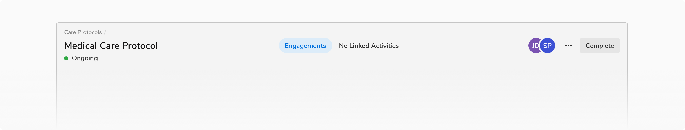
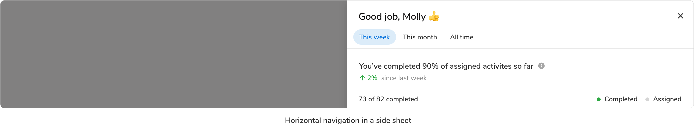

Horizontal navigation helps the users to quickly move among different pages in a module. It is typically found at the top of a section/page e.g. in the page header.

### Variants
 

#### Default

This variant consists only of a label.

<Preview name='horizontalnav-default-horizontal-navigation'/>

#### With Icon

This variant consists of an icon and a label.

<Preview name='horizontalnav-horizontal-navigation-with-icon'/>

#### With Count

This variant consists of the pill component and a label. The pill component helps display the count involved in a navigation item.

<Preview name='horizontalnav-horizontal-navigation-with-count'/>

### Properties

 

<Card shadow='none'>
  <Table
    showMenu={false}
    separator={true}
    data={[
      {
        Property: 'Height of a nav item',
        Value: '32px',
        Configurable: '❌',
      },
      {
        Property: 'Corner radius of the item',
        Value: '16px',
        Configurable: '❌',
      },
      {
        Property: 'Margin for the item (top, right, bottom, left)',
        Value: '0px, 1px, 0px, 1px',
        Configurable: '❌',
      },
      {
        Property: 'Spacing between nav items',
        Value: '0px',
        Configurable: '❌',
      },
      {
        Property: 'Maximum no. of nav items',
        Value: '4',
        Configurable: '❌',
      },
      {
        Property: 'Maximum value of count',
        Value: '99+',
        Configurable: '❌',
      },
    ]}
    schema={[
      {
        name: 'Property',
        displayName: 'Property',
        width: '33%',
        sorting: false,
        separator: true,
      },
      {
        name: 'Value',
        displayName: 'Value',
        width: '33%',
        sorting: false,
        separator: true
        
      },
      {
        name: 'Configurable',
        displayName: 'Configurable?',
        width: '33%',
        sorting: false,
        separator: true
      },
    ]}
    withHeader={false}
  />
</Card>
 
 

### Usage

 

#### Alignment

Horizontal navigation at the top of a section or page can have one of the following two alignment options:

-   Center Aligned
-   Left Aligned

 

##### Center Aligned

Use this type of alignment when there are no space constraints.

 
 

##### Left Aligned

Use this type of alignment when there is a space constraint. Often times there is not much space available in a component e.g. in modals, side sheets, etc. In such cases, horizontal navigation comes just below the header.

<Preview name='horizontalnav-left-aligned-navigation-tabs'/>

 
 