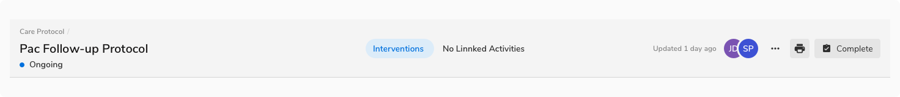
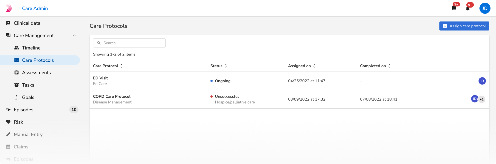
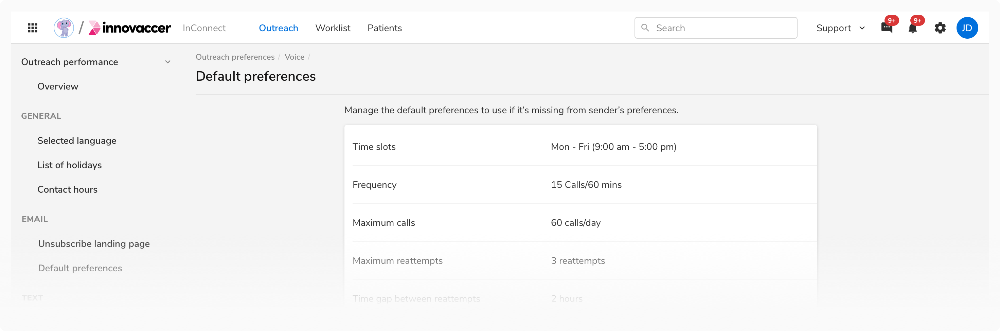

Page headers act as the entry point for a page and house few key points for navigation. They help users know what the entire page is all about and what actions can be taken. They also help the users become aware of their current location with respect to the rest of the application using breadcrumbs.

### Type
Page header comes in **2 types** basis on what level of navigation they are being used -

#### Level 0
Level 0 page header is used at the topmost level in the hierarchy of pages where a resource table or a list generally exists. This table or list is usually a guiding path to go inside a particular page, navigating down the hierarchy.
<Preview name="pageheader-level-0-with-navigation" />

#### Level 1
Level 1 header comes next in the navigation hierarchy. Users typically arrive here from a table or list present in Level 0. Hence, this header replaces the Level 0 header in the view.

This header stays the same in structure when a user navigates further down to subsequent levels i.e. Level 2, Level 3, and so on.
<Preview name="pageheader-level-1-with-stepper" />

### Variants
Page header comes in **3 variants** - with navigation, with tabs and with steppers. Steppers are not required in Level 0 typically since the process of creating an entity lies in Level 1 and beyond.

#### With navigation
Both Level 0 and Level 1 page headers can accommodate horizontal navigation which allows users to navigate through the different sub-pages easily. Any variant of horizontal navigation (with icon & with count) can be used here.

##### Level 0
<Preview name="pageheader-level-0-with-navigation" />

##### Level 1
<Preview name="pageheader-level-1-with-navigation" />

#### With tabs
Both Level 0 and Level 1 page headers can accommodate tabs right beneath the page title to segregate the related content.

##### Level 0
<Preview name="pageheader-level-0-with-filter" />

##### Level 1
<Preview name="pageheader-level-1-with-filter" />

#### With steppers
In order to show a multi-step process, page headers can accommodate steppers inside them.  

While using steppers, the actions in the header can be dynamic. The primary action can be 'Next' except for the last step where the primary action can be 'Continue' or 'Finish'.

Generally, steppers are not required at Level 0 since the process of creating an entity lies in Level 1 and beyond. But if needed, steppers can replace the center-aligned navigation tabs in headers in Level 0 as well.

##### Level 1
<Preview name="pageheader-level-1-with-stepper" />

### Properties
<table style="width: 100%">
  <tr>
    <th style="width:33%; text-align: left;">Property</th>
    <th style="width:33%; text-align: left;">Value(s)</th>
    <th style="width:33%; text-align: left;">Default value</th>
  </tr>
  <tr style="vertical-align: top">
    <td>Page title</td>
    <td>&#60;title&#62;</td>
    <td>-</td>
  </tr>
  <tr style="vertical-align: top">
    <td>Add-on <em>(optional)</em></td>
    <td>
        <ul>
            <li>Navigation</li>
            <li>Tabs</li>
            <li>Steppers</li>
        </ul>
    </td>
    <td>-</td>
  </tr>
  <tr style="vertical-align: top">
    <td>Divider <em>(optional)</em></td>
    <td>Horizontal divider</td>
    <td>-</td>
  </tr>
</table>
 

### Usage
#### Level 2 and beyond
Page header can show multiple levels of hierarchy using different levels of breadcrumbs within the header in Level 1. Other components remain the same as in the Level 1 header.

 

#### Responsiveness
By default, only the tabs appear beneath the page title. But if there is a width constraint, navigation can also be adjusted beneath the page title as well.

**Note**: Avoid using steppers when there is a width constraint as entity creation doesn’t usually take place in such conditions.

##### A full width page header

 

##### Same header when there is width constraint

 

#### Dividers
Divider in a page header is optional to use.

However, it is recommended to not use a divider if the content below is in a card like container stretching to the full width of the page header as it is already creating an optical division in this case.

 

##### Indentation
Indented dividers should be used if the page header is not covering the full width of the screen e.g. when there is a sidebar.

 