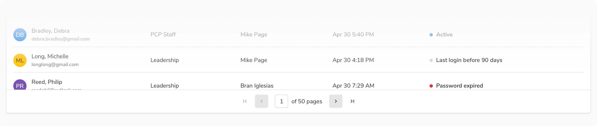
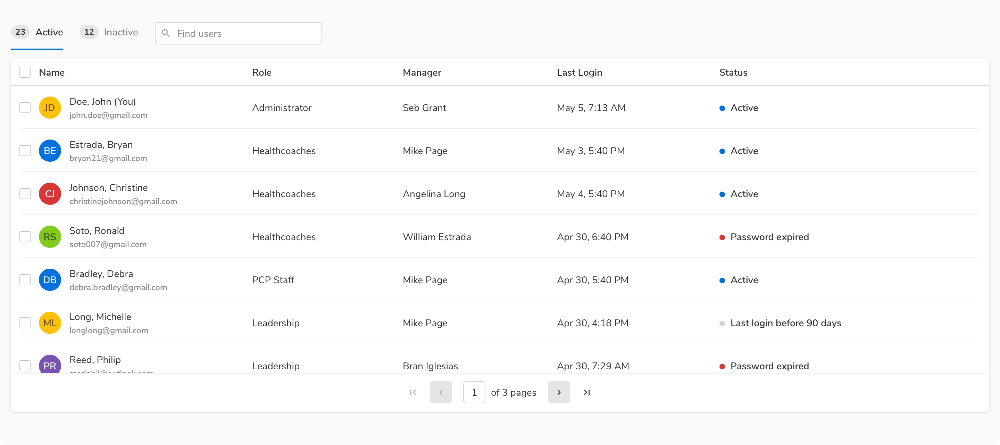
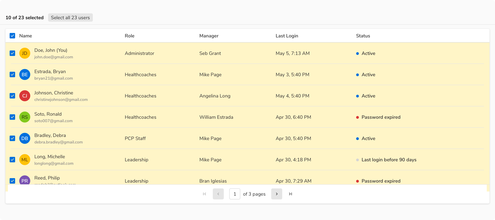

### Variants

 

#### Basic

The simplest form of pagination which lets the user jump to the previous or the next page on demand.

<Preview name='components-pagination-basic-pagination'/>

#### With Jump

Jump pagination lets the users jump to a specific page by entering the page number. Use this type when the users can have a rough estimate of finding the required data on a certain page.

<Preview name='components-pagination-pagination-with-jump'/>

### Properties
<table style="width: 100%">
  <tr>
    <th style="width:33%; text-align: left;">Property</th>
    <th style="width:33%; text-align: left;">Value(s)</th>
    <th style="width:33%; text-align: left;">Default value</th>
  </tr>
  <tr style="vertical-align: top">
    <td>Current page</td>
    <td>&#60;current page&#62;</td>
    <td>-</td>
  </tr>
  <tr style="vertical-align: top">
    <td>Total pages</td>
    <td>&#60;total pages&#62;</td>
    <td>-</td>
  </tr>
</table>
 

### Usage

 

#### Position of Pagination

Pagination control usually appears inside a card with a table or list. It is horizontally aligned to the center of the container. It is fixed at the bottom of the card.

 

#### Pagination vs Infinite Scroll

Use pagination over infinite scroll so that the user can navigate to an item’s detail page and return back to the same page.

#### Selection with pagination

When using pagination, the "Select all" control should select only the visible items. 

 

However, there is an option present to select all the items.

 

For more info - check selection in a Table.
