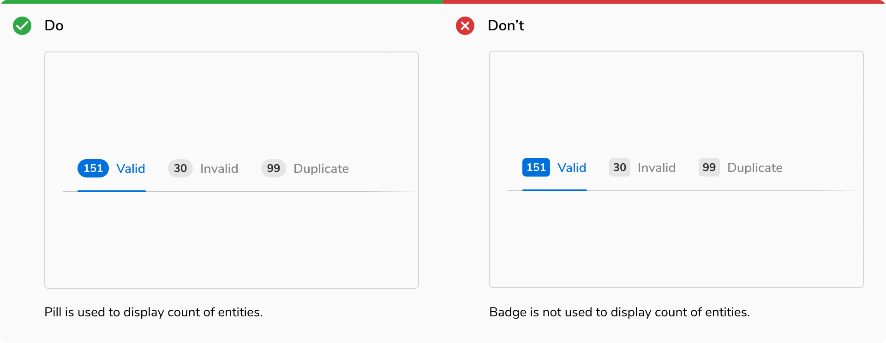

Pill is used to highlight number of items. For status and text, use a Badge. 

### Appearances

 

#### Solid

Solid Pill is used to highlight number of items in reference to a particular component so that the component gets recognized easily. eg Pill over the notification icon.

<Preview name='components-pills-alert--alert'/>

#### Subtle

Subtle Pill is used when many pills are used in reference to a group of components. In that case, solid pills become a bit overwhelming. eg Pills in vertical navigation items.

#### Subtle style
Subtle style is favorable when a lot of pills have to be used to show count against entities. In that case, solid style becomes a bit overwhelming e.g. count in vertical navigation items.
<Preview name='components-pills-subtle-alert--subtle-alert'/>
 

### Structure
 
 

 

<table style="width: 100%">
 <tbody>
   <tr>
     <th style="width:50%; text-align: left;">Property</th>
     <th style="width:50%; text-align: left;">Value(s)</th>
   </tr>
   <tr style="vertical-align: top">
      <td>Height</td>
      <td>20 px</td>
   </tr>
   <tr style="vertical-align: top">
      <td>Max width</td>
      <td>160 px</td>
   </tr>
   <tr style="vertical-align: top">
      <td>Corner radius</td>
      <td>10 px</td>
   </tr><tr style="vertical-align: top">
      <td>Padding <em>(top, right, bottom, left)</em></td>
      <td>2px, 6px, 2px, 6px</td>
   </tr>
 </tbody>
</table>
 

### Configurations

 

<table style="width: 100%">
  <tbody>
    <tr>
      <th style="width:33%; text-align: left;">Property</th>
      <th style="width:33%; text-align: left;">Value(s)</th>
      <th style="width:33%; text-align: left;">Default value</th>
    </tr>
    <tr style="vertical-align: top">
      <td>Appearance</td>
      <td>
        <ul>
            <li>Jal</li>
            <li>Stone</li>
            <li>Neem</li>
            <li>Haldi</li>
            <li>Mirch</li>
            <li>Tawak</li>
            <li>Nimbu</li>
            <li>Neel</li>
            <li>Jamun</li>
        </ul>
      </td>
      <td>Stone</td>
    </tr>
    <tr style="vertical-align: top">
      <td>Subtle</td>
      <td>
          <ul>
              <li>True</li>
              <li>False</li>
          </ul>
      </td>
      <td>False</td>
    </tr>
  </tbody>
</table>
 

### Usage

 

#### Pills vs Badges

Pills are used to display count of entities while badges are used for tagging entities.

 
 