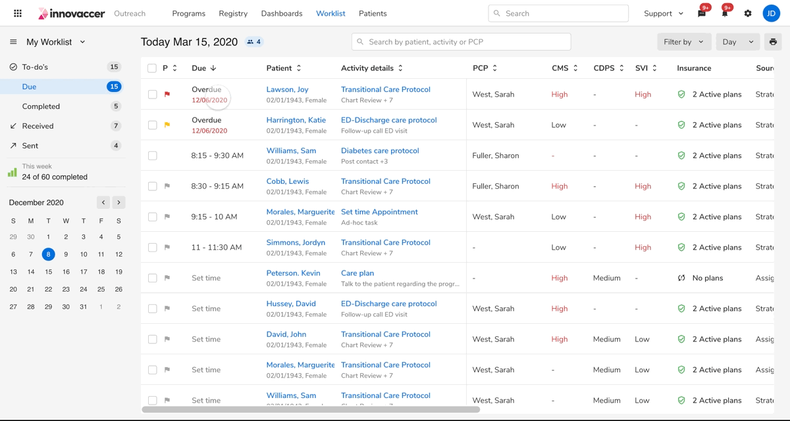
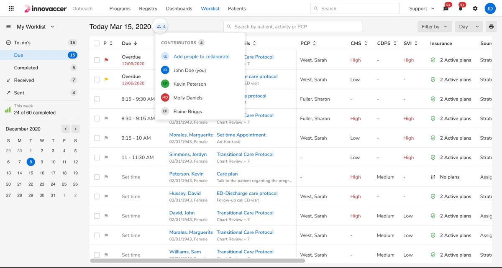

## Opening popover

 
 

#### Popover

<table style="width: 100%">
  <tbody>
    <tr>
      <th style="width:33%; text-align: left;">Property</th>
      <th style="width:33%; text-align: left;">Initial state</th>
      <th style="width:33%; text-align: left;">Final state</th>
    </tr>
    <tr style="vertical-align: top">
      <td>Height</td>
      <td>0px</td>
      <td>height</td>
    </tr>
  </tbody>
</table>
 

**Curve**

<table style="width: 100%">
  <tbody>
    <tr>
      <td style="width:50%; text-align: left;">Curve</td>
      <td style="width:50%; text-align: left;">cubic-bezier(0, 0, 0.38, 0.9)</td>
    </tr>
    <tr style="vertical-align: top">
      <td>Duration</td>
      <td>120ms</td>
    </tr>
    <tr style="vertical-align: top">
      <td>Initial delay</td>
      <td>80ms</td>
    </tr>
  </tbody>
</table>
 
 

## Closing popover

 
 

#### Popover

<table style="width: 100%">
  <tbody>
    <tr>
      <th style="width:33%; text-align: left;">Property</th>
      <th style="width:33%; text-align: left;">Initial state</th>
      <th style="width:33%; text-align: left;">Final state</th>
    </tr>
    <tr style="vertical-align: top">
      <td>Height</td>
      <td>height</td>
      <td>0px</td>
    </tr>
  </tbody>
</table>
 

**Curve**

<table style="width: 100%">
  <tbody>
    <tr>
      <td style="width:50%; text-align: left;">Curve</td>
      <td style="width:50%; text-align: left;">cubic-bezier(0.2, 0, 1, 0.9)</td>
    </tr>
    <tr style="vertical-align: top">
      <td>Duration</td>
      <td>120ms</td>
    </tr>
    <tr style="vertical-align: top">
      <td>Initial delay</td>
      <td>80ms</td>
    </tr>
  </tbody>
</table>
 
 
