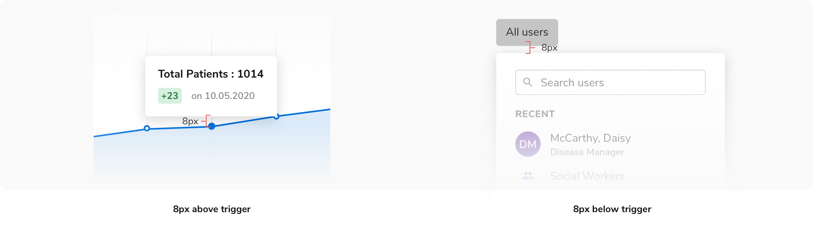
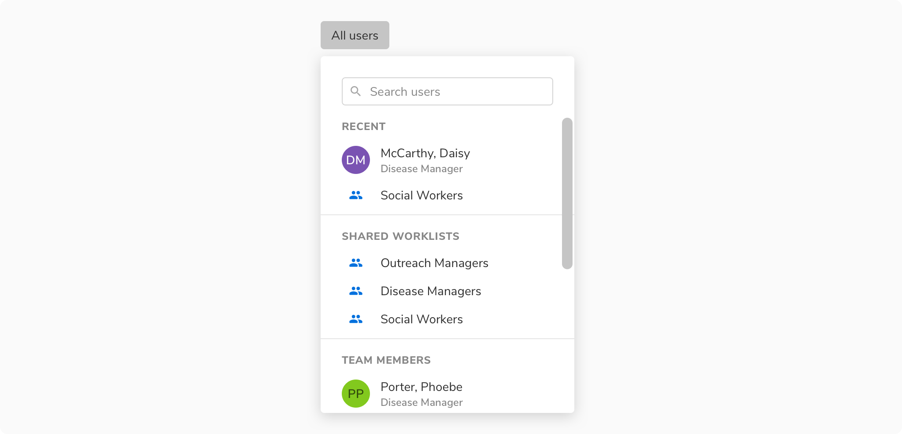

### Appearance

 

#### Light

<Preview name='components-popover-light-popover--light-popover'/> 

#### Dark

<Preview name='components-popover-dark-popover--dark-popover'/> 

### Properties
<table style="width: 100%">
  <tbody>
    <tr>
      <th style="width:33%; text-align: left;">Property</th>
      <th style="width:33%; text-align: left;">Value(s)</th>
      <th style="width:33%; text-align: left;">Default value</th>
    </tr>
    <tr style="vertical-align: top">
      <td>Position</td>
      <td>
        <ul>
            <li>Top</li>
            <li>Right</li>
            <li>Bottom</li>
            <li>Left</li>
            <li>Top start</li>
            <li>Top end</li>
            <li>Bottom start</li>
            <li>Bottom end</li>
        </ul>
      </td>
      <td>Bottom</td>
    </tr>
    <tr style="vertical-align: top">
      <td>Appearance</td>
      <td>
          <ul>
              <li>Light</li>
              <li>Dark</li>
          </ul>
      </td>
      <td>Light</td>
    </tr>
    <tr style="vertical-align: top">
      <td>Corner radius</td>
      <td>4px</td>
      <td>-</td>
    </tr>
    <tr style="vertical-align: top">
      <td>Shadow</td>
      <td>Shadow 30</td>
      <td>-</td>
    </tr>
  </tbody>
</table>
 

### Usage

 

#### Positioning of Popover

Popovers appear either 8px above or 8px below their trigger.

The **preferred and default side is the bottom**. Popovers use smart positioning if there is not enough space in the designated direction.

 

#### Popover as tooltip

 

 
 

#### Popover as a floating component

 

 
 

#### Popover with actions

<Preview name='components-popover-popover-with-action--popover-with-action'/> 

#### Popover with inputs

<Preview name='components-popover-popover-with-input--popover-with-input'/>  

#### Popover as a dropdown

 

 
 

#### Popover as a menu

 

 
 
